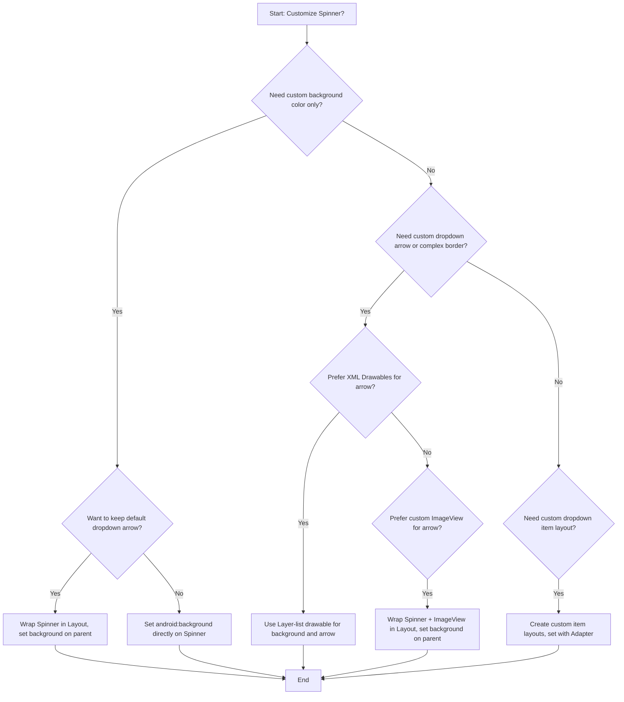

# Customize Android Spinner Background and Dropdown Arrow

Android Spinners are essential UI elements for selecting a value from a set. Customizing their appearance, especially the background and dropdown arrow, can be tricky. This guide explores several approaches to achieve a custom look for your Android Spinners, addressing common issues like the disappearance of the dropdown arrow when setting a background.

## Quick Answer

To quickly change the Spinner's background color without losing the dropdown arrow, wrap the `Spinner` inside a `FrameLayout` or `RelativeLayout` and apply the background to the parent layout. For more advanced customization, including a custom dropdown arrow, use XML drawables or a combination of `Spinner` and `ImageView` within a parent layout.

```xml
<!-- Simple background color change without losing arrow -->
<FrameLayout
    android:layout_width="wrap_content"
    android:layout_height="wrap_content"
    android:background="#FF0000"> <!-- Apply background to parent -->

    <Spinner
        android:id="@+id/mySpinner"
        android:layout_width="wrap_content"
        android:layout_height="wrap_content"
        android:background="@android:color/transparent" /> <!-- Keep Spinner background transparent -->
</FrameLayout>
```

## Choose Your Method

The best approach for customizing your Android Spinner depends on your specific needs and the complexity of the design.




## Table of Contents
1.  Quick Answer
2.  Choose Your Method
3.  Direct Background Color (Loses Arrow)
4.  Wrapping Spinner in a Layout (Retains Arrow)
5.  Custom Background with XML Drawables (Layer-List)
6.  Custom Dropdown Arrow with ImageView
7.  Customizing Dropdown Item Layouts
8.  Using 9-Patch Drawables for Dropdown Panel
9.  Common Problems & Solutions
10. Summary

## 3. Direct Background Color (Loses Arrow)

The simplest way to change the background of a Spinner is by setting the `android:background` attribute directly in your XML layout. However, a common side effect of this method is that the default dropdown arrow often disappears.

```xml
<Spinner
    android:id="@+id/spnIncredientone"
    android:layout_width="fill_parent"
    android:layout_height="wrap_content"
    android:background="#FFC107" <!-- Your desired hex color code -->
    android:prompt="@string/selectmixture" />
```

You can also set the background color for the dropdown menu itself using `android:popupBackground`.

```xml
<Spinner
    android:id="@+id/mySpinner"
    android:layout_width="wrap_content"
    android:layout_height="wrap_content"
    android:background="#FFC107"
    android:popupBackground="#8BC34A" /> <!-- Background for the dropdown list -->
```

This method is suitable if you don't need the default dropdown arrow or plan to implement a custom one separately.

## 4. Wrapping Spinner in a Layout (Retains Arrow)

To change the visual background of the Spinner while preserving its default dropdown arrow, a common and effective technique is to wrap the `Spinner` inside another layout (like `FrameLayout` or `RelativeLayout`) and apply the background to the parent layout. The `Spinner` itself should have a transparent background.

```xml
<FrameLayout
    android:layout_width="match_parent"
    android:layout_height="wrap_content"
    android:layout_marginLeft="5dip"
    android:layout_marginRight="5dip"
    android:background="@drawable/custom_spinner_container_bg"> <!-- Custom background for the container -->

    <Spinner
        android:id="@+id/spnIncredientone"
        android:layout_width="match_parent"
        android:layout_height="wrap_content"
        android:background="@android:color/transparent" <!-- Keep Spinner background transparent -->
        android:prompt="@string/selectmixture" />
</FrameLayout>
```

And `res/drawable/custom_spinner_container_bg.xml` could be a simple shape drawable:

```xml
<?xml version="1.0" encoding="utf-8"?>
<shape xmlns:android="http://schemas.android.com/apk/res/android"
    android:shape="rectangle">
    <corners android:radius="5dp" />
    <solid android:color="#E0E0E0" /> <!-- Light gray background -->
    <stroke
        android:width="1dp"
        android:color="#BDBDBD" /> <!-- Gray border -->
</shape>
```

This approach effectively separates the visual background from the Spinner's internal rendering, allowing the default arrow to remain visible.

## 5. Custom Background with XML Drawables (Layer-List)

For more intricate designs, you can create a custom XML drawable using a `layer-list` to combine a background shape with a programmatically drawn dropdown arrow. This gives you full control over the appearance without relying on external image assets for the arrow.

First, define your custom drawable (e.g., `res/drawable/spinner_bg.xml`):

```xml
<?xml version="1.0" encoding="utf-8"?>
<layer-list xmlns:android="http://schemas.android.com/apk/res/android">
    <!-- Item 1: Main background shape -->
    <item>
        <shape android:shape="rectangle">
            <solid android:color="#BBDEFB" /> <!-- Your desired background color -->
            <corners android:radius="8dp" />
            <stroke android:width="1dp" android:color="#90CAF9" />
        </shape>
    </item>

    <!-- Item 2: Custom dropdown arrow (drawn using rotated rectangles) -->
    <item android:gravity="center_vertical|right" android:right="12dp">
        <layer-list>
            <!-- Part 1: Rotated square for the arrow tip -->
            <item android:width="12dp" android:height="12dp" android:gravity="center" android:bottom="10dp">
                <rotate
                    android:fromDegrees="45"
                    android:toDegrees="45"
                    android:pivotX="50%"
                    android:pivotY="50%">
                    <shape android:shape="rectangle">
                        <solid android:color="#2196F3" /> <!-- Arrow color -->
                        <stroke android:color="#1976D2" android:width="1dp" />
                    </shape>
                </rotate>
            </item>
            <!-- Part 2: Rectangle to cut off the top of the square, forming a triangle -->
            <item android:width="30dp" android:height="10dp" android:bottom="21dp" android:gravity="center">
                <shape android:shape="rectangle">
                    <solid android:color="#BBDEFB" /> <!-- Match background color to hide part of the square -->
                </shape>
            </item>
        </layer-list>
    </item>
</layer-list>
```

Then, apply this drawable to your Spinner:

```xml
<Spinner
    android:id="@+id/myCustomSpinner"
    android:layout_width="match_parent"
    android:layout_height="wrap_content"
    android:background="@drawable/spinner_bg"
    android:paddingRight="30dp" /> <!-- Add padding to prevent text overlapping the arrow -->
```

This method offers a high degree of customization directly within XML, making it scalable and resolution-independent. Remember to adjust `paddingRight` on the Spinner to ensure the text doesn't overlap the custom arrow.

## 6. Custom Dropdown Arrow with ImageView

If you prefer using an actual image asset for your dropdown arrow or need more flexibility than XML drawables provide, you can combine a `Spinner` with an `ImageView` within a parent layout.

First, place your custom arrow image (e.g., `ic_arrow_drop_down_black_24dp.xml` or a PNG) in your `res/drawable` or `res/mipmap` folder.

Then, structure your layout like this:

```xml
<RelativeLayout
    android:layout_width="match_parent"
    android:layout_height="wrap_content"
    android:background="@drawable/spinner_border" <!-- Custom border/background for the whole component -->
    android:orientation="horizontal">

    <Spinner
        android:id="@+id/spinner2"
        android:layout_width="match_parent"
        android:layout_height="wrap_content"
        android:layout_centerVertical="true"
        android:background="@android:color/transparent" <!-- Spinner itself is transparent -->
        android:gravity="center_vertical"
        android:paddingLeft="10dp"
        android:spinnerMode="dropdown" />

    <ImageView
        android:layout_width="wrap_content"
        android:layout_height="wrap_content"
        android:layout_alignParentRight="true"
        android:layout_centerVertical="true"
        android:layout_marginRight="8dp"
        android:src="@drawable/ic_arrow_drop_down_black_24dp" /> <!-- Your custom arrow image -->
</RelativeLayout>
```

And `res/drawable/spinner_border.xml` for the container background:

```xml
<?xml version="1.0" encoding="utf-8"?>
<shape xmlns:android="http://schemas.android.com/apk/res/android">
    <solid android:color="#FFFFFF" />
    <corners android:radius="5dp" />
    <stroke
        android:width="1dp"
        android:color="#CCCCCC" />
</shape>
```

This method gives you precise control over the arrow's appearance and position, as it's a separate `ImageView`.

## 7. Customizing Dropdown Item Layouts

Beyond the Spinner's main background, you might want to customize the appearance of the items in the dropdown list. This requires creating custom layout files for the individual items and then setting them in your `ArrayAdapter`.

First, create a layout for the selected item displayed in the Spinner (e.g., `res/layout/spinner_item.xml`):

```xml
<?xml version="1.0" encoding="utf-8"?>
<TextView xmlns:android="http://schemas.android.com/apk/res/android"
    android:id="@android:id/text1"
    android:layout_width="match_parent"
    android:layout_height="wrap_content"
    android:textSize="18sp"
    android:textColor="#3F51B5"
    android:padding="10dp"
    android:gravity="center_vertical"
    android:singleLine="true"
    android:ellipsize="marquee" />
```

Next, create a layout for the items in the dropdown list (e.g., `res/layout/spinner_dropdown_item.xml`):

```xml
<?xml version="1.0" encoding="utf-8"?>
<CheckedTextView xmlns:android="http://schemas.android.com/apk/res/android"
    android:id="@android:id/text1"
    style="?android:attr/spinnerDropDownItemStyle"
    android:singleLine="true"
    android:layout_width="match_parent"
    android:layout_height="wrap_content"
    android:ellipsize="marquee"
    android:textColor="#000000"
    android:padding="10dp"
    android:background="#F0F0F0" />
```

Finally, in your Java/Kotlin code, set these custom layouts to your `ArrayAdapter`:

```java
// In your Activity or Fragment
Spinner spinner = findViewById(R.id.mySpinner);
String[] items = {"Option 1", "Option 2", "Option 3"};

ArrayAdapter<String> adapter = new ArrayAdapter<>(this,
        R.layout.spinner_item, // Layout for the selected item in the Spinner
        items);

adapter.setDropDownViewResource(R.layout.spinner_dropdown_item); // Layout for items in the dropdown list
spinner.setAdapter(adapter);
```

This allows you to control the text size, color, padding, and background of both the selected item and the dropdown list items.

## 8. Using 9-Patch Drawables for Dropdown Panel

While the original question mentioned issues with 9-patch images for the main Spinner background, they are highly effective for customizing the `popupBackground` (the background of the dropdown list itself). A 9-patch drawable allows you to define how an image should be stretched and where content should be placed, ensuring it scales correctly without distortion.

1.  **Create a 9-patch image:** Use the Android Studio 9-Patch editor or an online tool to create a `.9.png` file (e.g., `res/drawable/menu_dropdown_panel.9.png`). This image should define stretchable areas and padding for your dropdown background.
    

2.  **Apply to Spinner:** Set the `android:popupBackground` attribute to your 9-patch drawable.

```xml
<Spinner
    android:id="@+id/spinner"
    android:layout_width="wrap_content"
    android:layout_height="wrap_content"
    android:background="@color/white" <!-- Main spinner background -->
    android:spinnerMode="dropdown"
    android:popupBackground="@drawable/menu_dropdown_panel" /> <!-- 9-patch for dropdown list -->
```

This ensures your dropdown list background scales correctly across different screen densities and sizes, providing a polished look.

## 9. Common Problems & Solutions

### Problem: Dropdown Arrow Disappears When Setting `android:background`
**Cause:** When you directly set `android:background` on a `Spinner`, it often overrides the default styling, including the arrow.
**Solution:**
*   **Wrap in a Layout:** Place the `Spinner` inside a `FrameLayout` or `RelativeLayout` and apply the custom background to the parent layout. Set `android:background="@android:color/transparent"` on the `Spinner` itself.
*   **Custom Drawable with Arrow:** Use a `layer-list` drawable that includes both your desired background and a programmatically drawn arrow (as shown in Section 5).
*   **Custom ImageView Arrow:** Place an `ImageView` next to the `Spinner` within a parent layout to serve as the arrow (as shown in Section 6).

### Problem: Spinner Looks Too Big or Distorted
**Cause:** Incorrectly sized or defined 9-patch images, or fixed dimensions that don't scale well.
**Solution:**
*   **Review 9-patch:** Ensure your 9-patch drawable has correctly defined stretchable areas and content padding. Use the 9-Patch editor in Android Studio to visualize how it will stretch.
*   **Layout Dimensions:** Use `wrap_content` or `match_parent` for `layout_width` and `layout_height` where appropriate, and avoid hardcoding dimensions unless necessary.
*   **Padding:** Adjust `android:padding` on the Spinner or its container to control its size relative to its content.

### Problem: Dropdown List Background is Plain White/Black
**Cause:** The `android:popupBackground` is not set or is set to a simple color.
**Solution:**
*   **Set `android:popupBackground`:** Use a custom drawable (e.g., a shape drawable or a 9-patch) for `android:popupBackground` to style the dropdown list.

## Summary

Customizing the Android Spinner's background and dropdown arrow can significantly enhance your app's UI. While directly setting `android:background` can remove the default arrow, several robust solutions exist:

*   **For simple background colors while retaining the default arrow:** Wrap the `Spinner` in a `FrameLayout` or `RelativeLayout` and apply the background to the parent, keeping the `Spinner` itself transparent.
*   **For custom borders and programmatically drawn arrows:** Utilize `layer-list` XML drawables.
*   **For image-based custom arrows:** Combine a transparent `Spinner` with an `ImageView` within a parent layout.
*   **For styling the dropdown list items:** Create custom `TextView` or `CheckedTextView` layouts and apply them via the `ArrayAdapter`.
*   **For scalable dropdown panel backgrounds:** Employ 9-patch drawables with `android:popupBackground`.

By choosing the appropriate method, you can achieve a fully customized Spinner that seamlessly integrates with your app's design language.

---

## Image Generation Prompts

**PLACEHOLDER-1:** A decision tree diagram in a clean, modern style. The root node is "Customize Android Spinner?". Branches lead to questions like "Need custom background color only?", "Want to keep default dropdown arrow?", "Need custom dropdown arrow or complex border?", "Prefer XML Drawables for arrow?", "Prefer custom ImageView for arrow?", "Need custom dropdown item layout?". Leaf nodes are actions like "Wrap Spinner in Layout, set background on parent", "Set android:background directly on Spinner", "Use Layer-list drawable for background and arrow", "Wrap Spinner + ImageView in Layout, set background on parent", "Create custom item layouts, set with Adapter". Use distinct colors for nodes and arrows.

**PLACEHHER-2:** A visual representation of an Android Spinner. The Spinner itself has a transparent background, but it is contained within a `FrameLayout` which has a light gray background with rounded corners and a subtle gray border. A default Android dropdown arrow is visible on the right side of the Spinner. The Spinner displays "Select an Option".

**PLACEHOLDER-3:** An Android Spinner with a custom background and a custom dropdown arrow. The background is a light blue rectangle with rounded corners and a darker blue border. The dropdown arrow is a solid dark blue triangle, positioned on the right side of the spinner, created using XML shapes (rotated rectangles). The Spinner displays "Custom Item".

**PLACEHOLDER-4:** An Android Spinner component. The Spinner itself has a transparent background. It is placed inside a `RelativeLayout` which has a white background with rounded corners and a light gray border. To the right of the Spinner, within the same `RelativeLayout`, there is a distinct `ImageView` displaying a standard black downward-pointing arrow icon. The Spinner displays "Choose Value".

**PLACEHOLDER-5:** A screenshot or illustration of the Android Studio 9-Patch editor. Show a `.9.png` image being edited, with green lines indicating stretchable areas and black lines indicating content padding. The image itself should be a simple rectangle with a border, demonstrating how it would stretch to form a dropdown background.