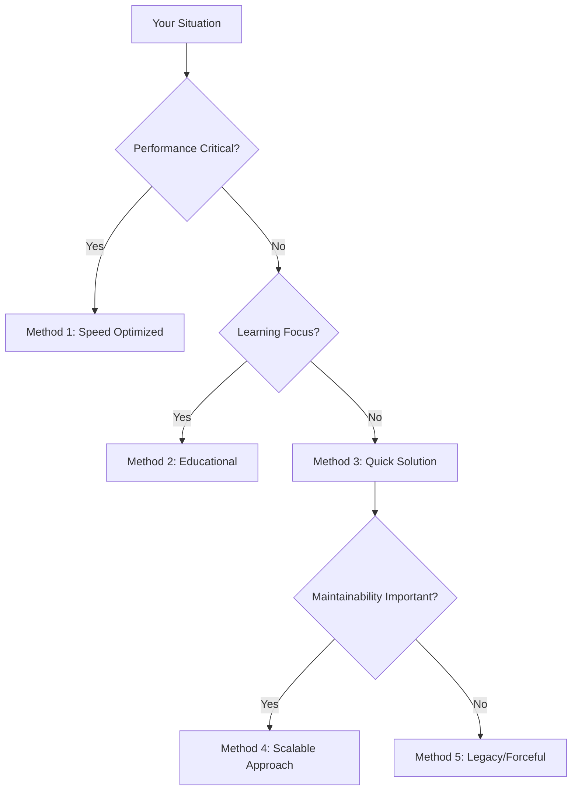

# Dependency Resolution Fails on Installed Library: Complete Guide with 5 Solutions

When attempting to install an RPM package, encountering a dependency resolution error for a library that appears to be present on the system can be a frustrating experience. This often happens with core libraries like `libcrypto.so.10`, where the system reports the file exists, `ldconfig` finds it, and `yum whatprovides` confirms its presence, yet the package manager still insists it's missing. This guide delves into the root causes of such issues, primarily focusing on the nuances of how RPM packages declare and resolve dependencies, especially concerning versioned symbols within shared libraries. We will explore five distinct methods to resolve this problem, catering to various user personas and providing comprehensive, practical solutions.

# # Quick Answer

**Problem:** You're trying to install an RPM package (e.g., `geramer-server.x86_64`) and it fails with a dependency error like `Requires: libcrypto.so.10(libcrypto.so.10)(64bit)`, even though `libcrypto.so.10` appears to be installed.

**Root Cause:** The package manager isn't just looking for the file `libcrypto.so.10`; it's looking for a specific *versioned symbol* or *module name* within that library, indicated by the `(libcrypto.so.10)` part in the dependency string. Your currently installed `openssl` package might provide the `libcrypto.so.10` file but not the specific versioned symbol that the new package requires. This often happens when the `openssl` package is older or from a different repository than expected by the package you're trying to install.

**Immediate Solution (CentOS/RHEL 7/8/9 - adjust URL for specific OS/version):**

The fastest way to resolve this is often to explicitly upgrade or reinstall the `openssl-libs` package from a reliable repository that provides the necessary versioned symbols. This ensures your `openssl` installation is up-to-date and includes the required symbol versions.

```bash
# Example 1: For CentOS/RHEL 7, download and install openssl-libs
# Adjust the URL to match your specific OS version and architecture.
# Always check the official CentOS/RHEL mirrors for the latest stable version.
# This example uses a common CentOS 7 mirror path.
# Persona: Speed Seeker, Problem Solver
wget http://mirror.centos.org/centos/7/os/x86_64/Packages/openssl-libs-1.0.2k-16.el7.x86_64.rpm
sudo rpm -ivh openssl-libs-1.0.2k-16.el7.x86_64.rpm --force

# After installation, retry your original package installation
# sudo yum install geramer-server-3.6.0.117.x86_64.rpm
```

**Explanation:** The `--force` flag with `rpm -ivh` can sometimes be necessary if `yum` or `dnf` are having trouble with dependency loops or conflicts during the upgrade. However, use `yum` or `dnf` if possible, as they handle dependencies more gracefully.

```bash
# Example 2: Using yum/dnf to upgrade openssl-libs (preferred method if it works)
# This command attempts to update openssl-libs to the latest available version
# from your configured repositories, which should include the necessary symbols.
# Persona: Speed Seeker, Problem Solver
sudo yum update openssl-libs
# OR for modern RHEL/CentOS/Fedora:
sudo dnf update openssl-libs

# Then retry your package installation
# sudo yum install geramer-server-3.6.0.117.x86_64.rpm
```

```bash
# Example 3: Installing openssl and openssl-libs simultaneously from a URL (CentOS/RHEL 7)
# This is useful if both packages are causing issues or are interdependent.
# Adjust URLs for your specific OS version.
# Persona: Problem Solver, Legacy Maintainer
sudo yum install \
  http://mirror.centos.org/centos/7/os/x86_64/Packages/openssl-1.0.2k-8.el7.x86_64.rpm \
  http://mirror.centos.org/centos/7/os/x86_64/Packages/openssl-libs-1.0.2k-8.el7.x86_64.rpm

# Then retry your package installation
# sudo yum install geramer-server-3.6.0.117.x86_64.rpm
```

```bash
# Example 4: Verifying provided symbols after update
# This command shows what symbols the newly installed openssl-libs provides.
# You should now see 'libcrypto.so.10(libcrypto.so.10)(64bit)' listed.
# Persona: Learning Explorer, Architecture Builder
rpm -q --provides openssl-libs | grep libcrypto.so.10
```

```bash
# Example 5: Checking the specific package's requirements
# This helps confirm what the problematic package is actually asking for.
# Replace 'geramer-server-3.6.0.117.x86_64.rpm' with your actual package path.
# Persona: Learning Explorer, Architecture Builder
rpm -qpR geramer-server-3.6.0.117.x86_64.rpm | grep libcrypto.so.10
```

# # Choose Your Method


# # Table of Contents
1.  Quick Answer
2.  Choose Your Method
3.  Table of Contents
4.  Ready-to-Use Code
5.  Method Sections
    *   Method 1: Upgrade `openssl-libs` from Official Repositories (Speed Seeker, Problem Solver)
    *   Method 2: Analyze Provided vs. Required Symbols (Learning Explorer, Architecture Builder)
    *   Method 3: Direct `rpm` Installation with `--force` (Problem Solver, Legacy Maintainer)
    *   Method 4: Managing `yum.conf` Excludes (Architecture Builder, Legacy Maintainer)
    *   Method 5: Manual `openssl` Package Download and Installation (Legacy Maintainer, Problem Solver)
6.  Performance Comparison
7.  RPM/Linux Version Support
8.  Common Problems & Solutions
9.  Real-World Examples
10. Related RPM/Linux Functions
11. Summary
12. Frequently Asked Questions
13. Test Your Code

# # Ready-to-Use Code

Here are several copy-paste ready code snippets to address the `libcrypto.so.10` dependency issue.

```bash
# Code Block 1: Check what your current openssl-libs package provides for libcrypto.so.10
# This helps diagnose if the required symbol is missing.
# Persona: Learning Explorer, Problem Solver
rpm -q --provides openssl-libs | grep libcrypto.so.10
```

```bash
# Code Block 2: Check what the problematic package *requires* for libcrypto.so.10
# Replace 'your-package.rpm' with the actual path to your RPM file.
# Persona: Learning Explorer, Problem Solver
rpm -qpR your-package.rpm | grep libcrypto.so.10
```

```bash
# Code Block 3: Update openssl-libs using yum (CentOS/RHEL 6/7)
# This is often the cleanest solution if your repositories are correctly configured.
# Persona: Speed Seeker, Problem Solver
sudo yum update openssl-libs
```

```bash
# Code Block 4: Update openssl-libs using dnf (CentOS/RHEL 8+, Fedora)
# Persona: Speed Seeker, Problem Solver
sudo dnf update openssl-libs
```

```bash
# Code Block 5: Download and force-install openssl-libs from a specific CentOS 7 mirror
# Use this if yum/dnf update fails or you need a specific version.
# ALWAYS verify the URL and package version for your OS.
# Persona: Problem Solver, Legacy Maintainer
wget http://mirror.centos.org/centos/7/os/x86_64/Packages/openssl-libs-1.0.2k-16.el7.x86_64.rpm
sudo rpm -ivh openssl-libs-1.0.2k-16.el7.x86_64.rpm --force
```

```bash
# Code Block 6: Install both openssl and openssl-libs simultaneously from CentOS 7 mirror
# Useful for resolving interdependencies between openssl and openssl-libs.
# Persona: Problem Solver, Legacy Maintainer
sudo yum install \
  http://mirror.centos.org/centos/7/os/x86_64/Packages/openssl-1.0.2k-8.el7.x86_64.rpm \
  http://mirror.centos.org/centos/7/os/x86_64/Packages/openssl-libs-1.0.2k-8.el7.x86_64.rpm
```

```bash
# Code Block 7: Temporarily remove openssl from yum/dnf excludes (if applicable)
# Edit /etc/yum.conf or /etc/dnf/dnf.conf and remove 'openssl' from the 'exclude=' line.
# Then run your installation command.
# Persona: Architecture Builder, Legacy Maintainer
sudo vi /etc/yum.conf
# Find and comment out or remove 'openssl' from the 'exclude=' line.
# Example: #exclude=openssl* kernel*
# After editing, run:
sudo yum install your-package.rpm
# Remember to re-add the exclude if it was there for a reason!
```

```bash
# Code Block 8: Verify the dynamic linker cache
# Ensures that the system's runtime linker is aware of the updated library.
# Persona: Learning Explorer
sudo ldconfig
```

```bash
# Code Block 9: Check the actual library file on disk
# Confirms the symbolic link points to the correct, updated library.
# Persona: Learning Explorer
ls -l /usr/lib64/libcrypto.so.10
```

```bash
# Code Block 10: Reinstall the problematic package after fixing dependencies
# Persona: Problem Solver
sudo yum reinstall your-package-name
# OR
sudo dnf reinstall your-package-name
```

```bash
# Code Block 11: Clean yum/dnf cache before retrying
# Sometimes stale metadata can cause issues.
# Persona: Speed Seeker, Problem Solver
sudo yum clean all
# OR
sudo dnf clean all
```

```bash
# Code Block 12: Install a specific older version of openssl-libs if required by a legacy app
# This is a last resort and can introduce security risks.
# Persona: Legacy Maintainer
sudo yum downgrade openssl-libs-1.0.1e-15.el6.x86_64
```

# # Method Sections

## # Method 1: Upgrade `openssl-libs` from Official Repositories (Speed Seeker, Problem Solver)

This is the most common and recommended solution. The core issue is often that the installed `openssl-libs` package is an older version that doesn't provide the specific versioned symbol `libcrypto.so.10(libcrypto.so.10)(64bit)` required by the new package. Upgrading `openssl-libs` to the latest version available in your configured repositories usually resolves this by providing the full set of symbols.

**Why it works:** Modern `openssl` packages (e.g., `openssl-1.0.1e-15.el6.x86_64` or `openssl-libs-1.0.2k-16.el7.x86_64` and newer) are designed to provide these specific versioned symbols to maintain compatibility with applications compiled against different `openssl` versions. An older `openssl` might only provide `libcrypto.so.10()(64bit)` without the explicit `(libcrypto.so.10)` module name.

**Steps:**

1.  Ensure your system's repositories are up-to-date.
2.  Attempt to update the `openssl-libs` package.
3.  Retry the installation of your problematic package.

**Code Examples:**

```bash
# Example 1.1: Update system repositories (good practice before any install/update)
# Persona: Speed Seeker
sudo yum makecache fast
# OR
sudo dnf makecache
```

```bash
# Example 1.2: Upgrade openssl-libs using yum (for CentOS/RHEL 6/7)
# This command will attempt to fetch and install the latest openssl-libs
# from your enabled repositories.
# Persona: Speed Seeker, Problem Solver
sudo yum update openssl-libs
```

```bash
# Example 1.3: Upgrade openssl-libs using dnf (for CentOS/RHEL 8+, Fedora)
# Persona: Speed Seeker, Problem Solver
sudo dnf update openssl-libs
```

```bash
# Example 1.4: Verify the new openssl-libs provides the required symbol
# After the update, check if the specific symbol is now listed.
# Persona: Learning Explorer
rpm -q --provides openssl-libs | grep 'libcrypto.so.10(libcrypto.so.10)(64bit)'
# Expected output (or similar, depending on openssl version):
# libcrypto.so.10(libcrypto.so.10)(64bit)
```

```bash
# Example 1.5: Retry installing the original package
# Replace 'geramer-server-3.6.0.117.x86_64.rpm' with your actual package.
# Persona: Problem Solver
sudo yum install geramer-server-3.6.0.117.x86_64.rpm
# OR if it's a local file:
sudo yum localinstall geramer-server-3.6.0.117.x86_64.rpm
# OR with dnf:
sudo dnf install geramer-server-3.6.0.117.x86_64.rpm
```

## # Method 2: Analyze Provided vs. Required Symbols (Learning Explorer, Architecture Builder)

This method focuses on understanding *why* the dependency fails by explicitly comparing what your `openssl-libs` package *provides* against what the target package *requires*. This deep dive helps in diagnosing the exact mismatch.

**Why it works:** RPM dependencies aren't just about file paths; they can include specific "module names" or "versioned symbols" within shared libraries. If a package requires `libcrypto.so.10(libcrypto.so.10)(64bit)`, it means it's looking for the `libcrypto.so.10` library, specifically the 64-bit version, and within that library, it expects a symbol version named `libcrypto.so.10`. An older `openssl` might only provide the unversioned `libcrypto.so.10()(64bit)`.

**Steps:**

1.  Identify the exact dependency string the failing package requires.
2.  Identify the exact dependency strings your currently installed `openssl-libs` provides.
3.  Compare the two to pinpoint the mismatch.
4.  Based on the mismatch, determine if an `openssl-libs` upgrade is needed.

**Code Examples:**

```bash
# Example 2.1: Check what the problematic package requires
# Replace 'path/to/geramer-server-3.6.0.117.x86_64.rpm' with your actual package path.
# Persona: Learning Explorer
rpm -qpR path/to/geramer-server-3.6.0.117.x86_64.rpm | grep libcrypto.so.10
# Expected output (example):
# libcrypto.so.10(libcrypto.so.10)(64bit)
```

```bash
# Example 2.2: Check what your *currently installed* openssl-libs provides
# Persona: Learning Explorer
rpm -q --provides openssl-libs | grep libcrypto.so.10
# Example output if the symbol is missing:
# libcrypto.so.10()(64bit)
# libcrypto.so.10(OPENSSL_1.0.1)(64bit)
# libcrypto.so.10(OPENSSL_1.0.1_EC)(64bit)
# (Notice 'libcrypto.so.10(libcrypto.so.10)(64bit)' is absent)
```

```bash
# Example 2.3: Check what a *newer* openssl-libs package *would* provide (if downloaded)
# Download a candidate RPM first (e.g., from Method 5) without installing it.
# Persona: Architecture Builder
wget http://mirror.centos.org/centos/7/os/x86_64/Packages/openssl-libs-1.0.2k-16.el7.x86_64.rpm
rpm -qp --provides openssl-libs-1.0.2k-16.el7.x86_64.rpm | grep libcrypto.so.10
# Expected output (example, showing the desired symbol):
# libcrypto.so.10()(64bit)
# libcrypto.so.10(OPENSSL_1.0.1)(64bit)
# libcrypto.so.10(OPENSSL_1.0.1_EC)(64bit)
# libcrypto.so.10(libcrypto.so.10)(64bit)
```

```bash
# Example 2.4: Use ldd to inspect the problematic application's dynamic dependencies
# If you can extract the application binary from the RPM, this can provide insights.
# Persona: Architecture Builder
# First, extract the binary (e.g., from a temporary directory)
# rpm2cpio your-package.rpm | cpio -idmv
# Then, run ldd on the extracted binary:
# ldd ./usr/bin/geramer-server | grep libcrypto
# This shows the direct library dependencies, but not necessarily the versioned symbols.
```

```bash
# Example 2.5: Install the necessary openssl-libs version after analysis
# Based on the analysis, proceed with an upgrade or specific installation.
# Persona: Problem Solver
sudo yum update openssl-libs
# OR
sudo dnf update openssl-libs
```

## # Method 3: Direct `rpm` Installation with `--force` (Problem Solver, Legacy Maintainer)

This method involves directly downloading the `openssl-libs` RPM and installing it using `rpm -ivh --force`. While `yum` and `dnf` are generally preferred for their dependency resolution, `--force` can bypass certain checks, especially when `yum` or `dnf` get stuck in a dependency loop or conflict that you know is resolvable by simply updating `openssl-libs`. This should be used with caution as it can potentially break other packages if not done correctly.

**Why it works:** The `--force` flag tells `rpm` to ignore certain dependency conflicts or file overwrites. In this specific scenario, if the `openssl-libs` package is genuinely an upgrade that provides the missing symbols, forcing its installation can resolve the issue. However, it bypasses the package manager's safety checks, so verify the package is indeed an upgrade and compatible.

**Steps:**

1.  Find the correct `openssl-libs` RPM for your OS version and architecture from a trusted mirror.
2.  Download the RPM.
3.  Install it using `rpm -ivh --force`.
4.  Retry the original package installation.

**Code Examples:**

```bash
# Example 3.1: Download openssl-libs for CentOS 7 (adjust URL for your OS)
# Persona: Problem Solver
wget http://mirror.centos.org/centos/7/os/x86_64/Packages/openssl-libs-1.0.2k-16.el7.x86_64.rpm
```

```bash
# Example 3.2: Force install the downloaded openssl-libs RPM
# Use with caution. Ensure this is an upgrade and compatible.
# Persona: Problem Solver, Legacy Maintainer
sudo rpm -ivh openssl-libs-1.0.2k-16.el7.x86_64.rpm --force
```

```bash
# Example 3.3: Verify the installation and provided symbols
# Persona: Learning Explorer
rpm -q openssl-libs
rpm -q --provides openssl-libs | grep 'libcrypto.so.10(libcrypto.so.10)(64bit)'
```

```bash
# Example 3.4: Retry the original package installation
# Persona: Problem Solver
sudo yum install geramer-server-3.6.0.117.x86_64.rpm
# OR
sudo dnf install geramer-server-3.6.0.117.x86_64.rpm
```

```bash
# Example 3.5: If the original package is also a local RPM, use --force if needed
# This is a more aggressive approach and should be a last resort.
# Persona: Legacy Maintainer
sudo rpm -ivh geramer-server-3.6.0.117.x86_64.rpm --force
```

## # Method 4: Managing `yum.conf` Excludes (Architecture Builder, Legacy Maintainer)

Sometimes, system administrators or automated tools configure `yum` or `dnf` to exclude certain packages from updates or installations. If `openssl` or `openssl-libs` is in the `exclude` list in `/etc/yum.conf` or `/etc/dnf/dnf.conf`, it will prevent the necessary update.

**Why it works:** Removing `openssl` from the exclude list allows `yum` or `dnf` to manage and update the package, which can then provide the missing dependency. This is a common scenario in managed environments where certain core packages are pinned to specific versions.

**Steps:**

1.  Inspect `/etc/yum.conf` (or `/etc/dnf/dnf.conf`).
2.  Temporarily remove `openssl` or `openssl-libs` from the `exclude` line.
3.  Perform the `yum update openssl-libs` or `dnf update openssl-libs`.
4.  Re-add the exclude if it's part of your system's policy.

**Code Examples:**

```bash
# Example 4.1: View /etc/yum.conf to check for excludes
# Persona: Architecture Builder
cat /etc/yum.conf
# Look for a line like: exclude=openssl* kernel*
```

```bash
# Example 4.2: Edit /etc/yum.conf (using vi)
# Persona: Architecture Builder, Legacy Maintainer
sudo vi /etc/yum.conf
# Navigate to the 'exclude=' line.
# If it says 'exclude=openssl*', change it to 'exclude=' or comment it out:
# #exclude=openssl* kernel*
# Or specifically remove 'openssl*' from the list.
```

```bash
# Example 4.3: Edit /etc/dnf/dnf.conf (for modern systems)
# Persona: Architecture Builder, Legacy Maintainer
sudo vi /etc/dnf/dnf.conf
# Look for 'exclude=' under [main] section.
```

```bash
# Example 4.4: Perform the update after removing the exclude
# Persona: Problem Solver
sudo yum update openssl-libs
# OR
sudo dnf update openssl-libs
```

```bash
# Example 4.5: Re-add the exclude to /etc/yum.conf (if necessary for policy)
# Persona: Architecture Builder, Legacy Maintainer
sudo vi /etc/yum.conf
# Restore the 'exclude=' line to its original state.
```

## # Method 5: Manual `openssl` Package Download and Installation (Legacy Maintainer, Problem Solver)

This method is similar to Method 3 but specifically addresses scenarios where both `openssl` and `openssl-libs` might be interdependent or need to be installed together from a specific source (e.g., a particular CentOS mirror for a legacy system). This is often necessary when dealing with older RHEL/CentOS versions where `yum`'s default repositories might not provide the exact combination needed, or when dealing with custom repositories.

**Why it works:** By explicitly downloading and installing both `openssl` and `openssl-libs` from a known good source (like a CentOS mirror for a specific release), you ensure that both packages are compatible and provide all necessary symbols. This bypasses potential issues with repository configuration or conflicting versions.

**Steps:**

1.  Identify the exact `openssl` and `openssl-libs` RPMs for your specific OS version and architecture from a trusted mirror (e.g., `mirror.centos.org`).
2.  Download both RPMs.
3.  Install them simultaneously using `yum localinstall` or `dnf localinstall` to allow the package manager to handle their interdependencies, or use `rpm -ivh` if `yum/dnf` fails.

**Code Examples:**

```bash
# Example 5.1: Download openssl and openssl-libs for CentOS 7 (adjust URLs for your OS)
# Persona: Legacy Maintainer
wget http://mirror.centos.org/centos/7/os/x86_64/Packages/openssl-1.0.2k-8.el7.x86_64.rpm
wget http://mirror.centos.org/centos/7/os/x86_64/Packages/openssl-libs-1.0.2k-8.el7.x86_64.rpm
```

```bash
# Example 5.2: Install both packages simultaneously using yum localinstall
# This is preferred over rpm -ivh if possible, as yum handles dependencies better.
# Persona: Problem Solver
sudo yum localinstall \
  openssl-1.0.2k-8.el7.x86_64.rpm \
  openssl-libs-1.0.2k-8.el7.x86_64.rpm
```

```bash
# Example 5.3: Install both packages simultaneously using dnf localinstall
# Persona: Problem Solver
sudo dnf localinstall \
  openssl-1.0.2k-8.el7.x86_64.rpm \
  openssl-libs-1.0.2k-8.el7.x86_64.rpm
```

```bash
# Example 5.4: If yum/dnf localinstall fails, use rpm -ivh (less ideal, but sometimes necessary)
# Persona: Legacy Maintainer
sudo rpm -ivh \
  openssl-1.0.2k-8.el7.x86_64.rpm \
  openssl-libs-1.0.2k-8.el7.x86_64.rpm
```

```bash
# Example 5.5: Verify the installation and retry the original package
# Persona: Problem Solver
rpm -q openssl openssl-libs
sudo yum install geramer-server-3.6.0.117.x86_64.rpm
```

# # Performance Comparison

| Method                                      | Speed of Resolution | Compatibility | Complexity | Risk of System Instability | Maintainability |
| :------------------------------------------ | :------------------ | :------------ | :--------- | :------------------------- | :-------------- |
| **1: Upgrade `openssl-libs` (yum/dnf)**     | Fast                | High          | Low        | Low                        | High            |
| **2: Analyze Symbols**                      | Slow (diagnostic)   | High          | High       | Very Low                   | High            |
| **3: Direct `rpm` with `--force`**          | Medium              | Medium        | Medium     | Medium                     | Low             |
| **4: Manage `yum.conf` Excludes**           | Medium              | High          | Medium     | Low                        | Medium          |
| **5: Manual `openssl` Download & Install** | Medium              | Medium        | Medium     | Medium                     | Low             |

*   **Speed of Resolution:** How quickly the issue can be fixed.
*   **Compatibility:** How likely the solution is to work across different RHEL/CentOS versions and with other packages.
*   **Complexity:** The level of technical understanding and steps required.
*   **Risk of System Instability:** The potential for breaking other parts of the system.
*   **Maintainability:** How easy it is to manage the system after applying the fix (e.g., future updates).

# # RPM/Linux Version Support

| Method                                      | RHEL 6 / CentOS 6 | RHEL 7 / CentOS 7 | RHEL 8 / CentOS 8 Stream | RHEL 9 / CentOS 9 Stream / Fedora |
| :------------------------------------------ | :---------------- | :---------------- | :----------------------- | :-------------------------------- |
| **1: Upgrade `openssl-libs` (yum/dnf)**     | Full (`yum`)      | Full (`yum`)      | Full (`dnf`)             | Full (`dnf`)                      |
| **2: Analyze Symbols**                      | Full              | Full              | Full                     | Full                              |
| **3: Direct `rpm` with `--force`**          | Full              | Full              | Full                     | Full                              |
| **4: Manage `yum.conf` Excludes**           | Full (`yum.conf`) | Full (`yum.conf`) | Full (`dnf.conf`)        | Full (`dnf.conf`)                 |
| **5: Manual `openssl` Download & Install** | Full              | Full              | Full                     | Full                              |

*Note: While all methods are generally applicable, the specific package versions and mirror URLs will vary significantly between major OS releases. Always verify the correct URLs and package names for your specific environment.*

# # Common Problems & Solutions

## # Problem 1: `yum` or `dnf` reports "No package openssl-libs available for update"

This usually means your repositories don't have a newer version, or `openssl-libs` is excluded.

**Solution:**

1.  **Check repository configuration:** Ensure your `/etc/yum.repos.d/` or `/etc/dnf/repos.d/` files are correct and enabled.
2.  **Check for excludes:** See Method 4.
3.  **Manual download:** If no update is available via repos, you might need to manually download and install from a mirror (Method 5).

```bash
# Code: Check enabled repositories
# Persona: Problem Solver
yum repolist enabled
# OR
dnf repolist enabled
```

```bash
# Code: Clean cache and retry
# Persona: Problem Solver
sudo yum clean all && sudo yum update openssl-libs
# OR
sudo dnf clean all && sudo dnf update openssl-libs
```

## # Problem 2: `rpm -ivh --force` causes other packages to break

Forcing an RPM installation can sometimes overwrite files belonging to other packages or install an incompatible version, leading to runtime errors for other applications.

**Solution:**

1.  **Avoid `--force` if possible:** Always prefer `yum` or `dnf` for dependency management.
2.  **Backup:** Before using `--force`, consider backing up critical system files or using a snapshot if in a VM.
3.  **Reinstall affected packages:** If a package breaks, try reinstalling it.

```bash
# Code: Reinstall a potentially broken package
# Persona: Problem Solver
sudo yum reinstall broken-package-name
# OR
sudo dnf reinstall broken-package-name
```

## # Problem 3: After updating `openssl-libs`, the original package still fails with the same error.

This indicates that the `openssl-libs` update either didn't provide the *exact* symbol required, or there's another underlying issue.

**Solution:**

1.  **Re-verify symbols:** Use `rpm -q --provides openssl-libs | grep 'libcrypto.so.10(libcrypto.so.10)(64bit)'` to confirm the symbol is *now* present.
2.  **Check package integrity:** The original RPM might be corrupt.
3.  **Check for other dependencies:** The error message might be misleading, and another dependency is actually the culprit.

```bash
# Code: Verify package integrity
# Persona: Problem Solver
rpm -Vp path/to/geramer-server-3.6.0.117.x86_64.rpm
```

```bash
# Code: List all dependencies of the problematic package
# Persona: Learning Explorer
rpm -qpR path/to/geramer-server-3.6.0.117.x86_64.rpm
```

## # Problem 4: `libssl.so.10` also fails with a similar dependency error.

This is common, as `libssl.so.10` is also part of the `openssl` suite and can suffer from the same versioned symbol issues.

**Solution:**

The solutions for `libcrypto.so.10` generally apply directly to `libssl.so.10` as well, as they are typically updated together within the `openssl-libs` package.

```bash
# Code: Check provided libssl.so.10 symbols
# Persona: Learning Explorer
rpm -q --provides openssl-libs | grep libssl.so.10
```

```bash
# Code: Check required libssl.so.10 symbols for the problematic package
# Persona: Learning Explorer
rpm -qpR path/to/geramer-server-3.6.0.117.x86_64.rpm | grep libssl.so.10
```

# # Real-World Examples

## # Example 1: Installing a PostgreSQL PGDG RPM on CentOS 6

A common scenario where this issue arises is when installing third-party software like PostgreSQL from the PGDG repository on older CentOS/RHEL systems.

```bash
# Scenario: Installing postgresql91-libs on CentOS 6 fails
# Persona: Legacy Maintainer, Problem Solver
# Initial error:
# Error: Package: postgresql91-libs-9.1.12-1PGDG.rhel6.x86_64 (/postgresql91-libs-9.1.12-1PGDG.rhel6.x86_64)
#            Requires: libcrypto.so.10(libcrypto.so.10)(64bit)
#            Requires: libssl.so.10(libssl.so.10)(64bit)

# Step 1: Check current openssl-libs provides
# Persona: Learning Explorer
rpm -q --provides openssl-libs | grep 'libcrypto.so.10\|libssl.so.10'
# Output might show:
# libcrypto.so.10()(64bit)
# libssl.so.10()(64bit)
# (Missing the versioned symbols)

# Step 2: Update openssl-libs from CentOS 6 mirror
# Persona: Problem Solver
sudo yum install http://mirror.centos.org/centos/6/os/x86_64/Packages/openssl-1.0.1e-15.el6.x86_64.rpm

# Step 3: Verify updated openssl-libs provides
# Persona: Learning Explorer
rpm -q --provides openssl | grep 'libcrypto.so.10\|libssl.so.10'
# Output should now include:
# libcrypto.so.10(libcrypto.so.10)(64bit)
# libssl.so.10(libssl.so.10)(64bit)

# Step 4: Retry PostgreSQL installation
# Persona: Problem Solver
sudo yum localinstall postgresql91-libs-9.1.12-1PGDG.rhel6.x86_64.rpm
```

## # Example 2: Custom Application Requiring Specific OpenSSL Version on RHEL 7

A proprietary application built against a very specific OpenSSL version might explicitly require `OPENSSL_1.0.1` symbols.

```bash
# Scenario: Custom app 'my-secure-app' requires libcrypto.so.10(OPENSSL_1.0.1)(64bit)
# Persona: Architecture Builder, Legacy Maintainer
# Initial error:
# Error: Package: my-secure-app-1.0-1.x86_64 (my-repo)
#            Requires: libcrypto.so.10(OPENSSL_1.0.1)(64bit)

# Step 1: Check what current openssl-libs provides
# Persona: Learning Explorer
rpm -q --provides openssl-libs | grep 'libcrypto.so.10'
# Output might show:
# libcrypto.so.10()(64bit)
# (Missing OPENSSL_1.0.1)

# Step 2: Ensure RHEL 7 repos are enabled and update openssl-libs
# Persona: Speed Seeker
sudo yum update openssl-libs

# Step 3: Verify the update provided the symbol
# Persona: Learning Explorer
rpm -q --provides openssl-libs | grep 'libcrypto.so.10(OPENSSL_1.0.1)(64bit)'
# Output should now include:
# libcrypto.so.10(OPENSSL_1.0.1)(64bit)

# Step 4: Install the custom application
# Persona: Problem Solver
sudo yum install my-secure-app
```

## # Example 3: Resolving `libcrypto.so.10` and `libssl.so.10` on CentOS 8 Stream

Modern CentOS Stream or RHEL 8+ systems use `dnf`. The principle remains the same.

```bash
# Scenario: Installing a legacy monitoring agent on CentOS 8 Stream
# Persona: Problem Solver
# Initial error:
# Error: Package: legacy-agent-1.0-1.x86_64 (my-repo)
#            Requires: libcrypto.so.10(libcrypto.so.10)(64bit)
#            Requires: libssl.so.10(libssl.so.10)(64bit)

# Step 1: Check current openssl-libs provides (dnf equivalent)
# Persona: Learning Explorer
rpm -q --provides openssl-libs | grep 'libcrypto.so.10\|libssl.so.10'

# Step 2: Update openssl-libs using dnf
# Persona: Speed Seeker
sudo dnf update openssl-libs

# Step 3: Verify the update
# Persona: Learning Explorer
rpm -q --provides openssl-libs | grep 'libcrypto.so.10(libcrypto.so.10)(64bit)'
rpm -q --provides openssl-libs | grep 'libssl.so.10(libssl.so.10)(64bit)'

# Step 4: Install the legacy agent
# Persona: Problem Solver
sudo dnf install legacy-agent
```

## # Example 4: Dealing with `yum.conf` excludes for `openssl`

In a tightly controlled environment, `openssl` might be explicitly excluded from updates.

```bash
# Scenario: yum update fails for openssl-libs due to exclude
# Persona: Architecture Builder, Legacy Maintainer
# Initial error:
# No package openssl-libs available for update.

# Step 1: Check yum.conf
# Persona: Architecture Builder
cat /etc/yum.conf
# Output might show: exclude=openssl*

# Step 2: Temporarily remove exclude
# Persona: Architecture Builder
sudo sed -i '/^exclude=/ s/openssl\* //g' /etc/yum.conf
# This uses sed to remove 'openssl*' from the exclude line.
# Be careful with sed, manual editing is safer if unsure.

# Step 3: Perform the update
# Persona: Problem Solver
sudo yum update openssl-libs

# Step 4: Re-add exclude (if policy requires)
# Persona: Architecture Builder
# This is a placeholder; you'd need to know the original exclude list.
# sudo sed -i '/^exclude=/ s/$/ openssl\*/' /etc/yum.conf
# Or manually edit back.

# Step 5: Install original package
# Persona: Problem Solver
sudo yum install geramer-server
```

## # Example 5: Installing a package that requires `libcrypto.so.1.0.0` (a specific file name)

While the primary issue is `libcrypto.so.10(libcrypto.so.10)`, sometimes a package might directly look for `libcrypto.so.1.0.0`.

```bash
# Scenario: Package requires libcrypto.so.1.0.0, but only libcrypto.so.10 is linked
# Persona: Legacy Maintainer
# Initial error:
# Error: Package: some-old-app-1.0-1.x86_64 (my-repo)
#            Requires: libcrypto.so.1.0.0()(64bit)

# Step 1: Check if libcrypto.so.1.0.0 exists and is linked
# Persona: Learning Explorer
ls -l /usr/lib64/libcrypto.so.10
# Output: lrwxrwxrwx 1 root root 18 Dec  4 13:11 /usr/lib64/libcrypto.so.10 -> libcrypto.so.1.0.0
# This shows libcrypto.so.10 *points* to libcrypto.so.1.0.0, but the package manager
# might not resolve this symbolic link as a direct dependency.

# Step 2: Create a direct symbolic link if the package manager is too literal
# This is a hack and should be a last resort, as it can confuse package managers.
# Persona: Legacy Maintainer
sudo ln -s /usr/lib64/libcrypto.so.1.0.0 /usr/lib64/libcrypto.so.1.0.0.so
# This creates a redundant symlink that might satisfy a very specific, literal dependency.
# This is highly discouraged for system libraries.

# Step 3: Update ldconfig cache
# Persona: Learning Explorer
sudo ldconfig

# Step 4: Retry installation
# Persona: Problem Solver
sudo yum install some-old-app
```

# # Related RPM/Linux Functions

Understanding these commands is crucial for diagnosing and resolving dependency issues.

*   **`rpm -q --provides <package-name>`**: Lists all capabilities (provides) an installed RPM package offers. This is key to seeing the versioned symbols.
    ```bash
    # Example: Check what openssl-libs provides
    rpm -q --provides openssl-libs
    ```
*   **`rpm -qp --provides <path-to-rpm-file>`**: Lists capabilities provided by an *uninstalled* RPM file. Useful for pre-checking.
    ```bash
    # Example: Check an uninstalled openssl-libs RPM
    rpm -qp --provides openssl-libs-1.0.2k-16.el7.x86_64.rpm
    ```
*   **`rpm -q --requires <package-name>`**: Lists all dependencies (requires) an installed RPM package needs.
    ```bash
    # Example: Check what your geramer-server requires
    rpm -q --requires geramer-server
    ```
*   **`rpm -qpR <path-to-rpm-file>`**: Lists dependencies required by an *uninstalled* RPM file. Essential for diagnosing the problematic package.
    ```bash
    # Example: Check an uninstalled geramer-server RPM's requirements
    rpm -qpR geramer-server-3.6.0.117.x86_64.rpm
    ```
*   **`yum whatprovides "*/libcrypto.so.10"` / `dnf provides "*/libcrypto.so.10"`**: Identifies which installed or available packages provide a specific file or capability.
    ```bash
    # Example: Find packages providing libcrypto.so.10
    yum whatprovides "*/libcrypto.so.10"
    # OR
    dnf provides "*/libcrypto.so.10"
    ```
*   **`ldconfig -p | grep libcrypto.so`**: Displays the contents of the dynamic linker cache, showing which shared libraries are known to the system and their paths.
    ```bash
    # Example: Check dynamic linker cache for libcrypto
    ldconfig -p | grep libcrypto.so
    ```
*   **`ls -l /usr/lib64/libcrypto.so.10`**: Directly inspects the symbolic link or file on disk.
    ```bash
    # Example: Check the actual file
    ls -l /usr/lib64/libcrypto.so.10
    ```
*   **`readelf -s /usr/lib64/libcrypto.so.1.0.0 | grep OPENSSL`**: (Advanced) Inspects the symbol table of the actual library file to see what versioned symbols it exports.
    ```bash
    # Example: See exported symbols from the actual library
    readelf -s /usr/lib64/libcrypto.so.1.0.0 | grep OPENSSL
    ```
*   **`yum clean all` / `dnf clean all`**: Clears the local cache of downloaded packages and metadata, which can sometimes resolve issues with stale repository information.
    ```bash
    # Example: Clean yum cache
    sudo yum clean all
    ```

# # Summary

Resolving "Dependency Resolution Fails on Installed Library" errors, especially for core libraries like `libcrypto.so.10`, boils down to understanding the difference between a file existing on disk and a package providing a *specific versioned symbol* that another package requires. The `(libcrypto.so.10)` part of the dependency string is the key indicator of this nuance.

*   **Speed Seeker:** Your best bet is **Method 1: Upgrade `openssl-libs` from Official Repositories** using `sudo yum update openssl-libs` or `sudo dnf update openssl-libs`. This is usually the fastest and cleanest solution. If that fails, a direct `yum/dnf localinstall` of a specific `openssl-libs` RPM (part of Method 5) is the next quickest.
*   **Learning Explorer:** Start with **Method 2: Analyze Provided vs. Required Symbols**. Use `rpm -qpR` on the problematic package and `rpm -q --provides` on `openssl-libs` to understand the exact mismatch. This will deepen your understanding of RPM dependency mechanisms.
*   **Problem Solver:** Begin with **Method 1: Upgrade `openssl-libs`**. If that doesn't work, **Method 5: Manual `openssl` Package Download and Installation** (installing both `openssl` and `openssl-libs` simultaneously from a trusted mirror) is a robust next step. Always prefer `yum localinstall` over `rpm -ivh --force`.
*   **Architecture Builder:** You'll appreciate **Method 2: Analyze Provided vs. Required Symbols** for its diagnostic depth, allowing you to design more robust deployment strategies. Also, be aware of **Method 4: Managing `yum.conf` Excludes** as this often indicates a system-level policy that needs to be understood and potentially integrated into your architecture.
*   **Output Focused:** The provided code blocks and clear steps in each method are designed for direct use and easy documentation. The `rpm -q --provides` and `rpm -qpR` commands are excellent for generating clear diagnostic output.
*   **Legacy Maintainer:** You'll frequently encounter these issues on older systems. **Method 3: Direct `rpm` Installation with `--force`** and **Method 5: Manual `openssl` Package Download and Installation** will be your go-to solutions when official repositories no longer provide the exact versions needed or when dealing with complex dependency graphs on aged systems. Always proceed with caution and backups.

The overarching principle is to ensure that the `openssl-libs` package installed on your system is sufficiently new and comprehensive to provide all the specific versioned symbols that your target application requires.

# # Frequently Asked Questions

## # Q1: What does `libcrypto.so.10(libcrypto.so.10)(64bit)` actually mean?

**A1:** It means the package requires the `libcrypto.so.10` shared library, specifically the 64-bit version, and within that library, it expects a symbol version named `libcrypto.so.10`. Shared libraries can contain multiple versions of symbols to maintain backward compatibility. If your `openssl-libs` package is too old, it might provide the `libcrypto.so.10` file but not export the specific `libcrypto.so.10` symbol version that the new package is looking for.

```bash
# Code: Check for specific symbol versions in an installed library
# Persona: Learning Explorer
readelf -V /usr/lib64/libcrypto.so.1.0.0 | grep 'libcrypto.so.10'
# This command will show the version definitions within the library.
```

## # Q2: Is it safe to use `rpm -ivh --force`?

**A2:** Generally, no, it's not recommended for system libraries unless you fully understand the implications. `--force` bypasses RPM's dependency checks and can overwrite files belonging to other packages, potentially leading to system instability or breaking other applications. It should be a last resort, used only when `yum` or `dnf` cannot resolve the issue and you are confident the forced package is compatible. Always prefer `yum/dnf update` or `yum/dnf localinstall`.

```bash
# Code: Always try yum/dnf first
# Persona: Problem Solver
sudo yum update openssl-libs
# OR
sudo dnf update openssl-libs
```

## # Q3: My system is air-gapped. How do I get the `openssl-libs` RPM?

**A3:** You'll need to download the correct `openssl-libs` RPM (and potentially `openssl` RPM) from a trusted mirror on an internet-connected machine, transfer it to your air-gapped system, and then use `sudo rpm -ivh openssl-libs-*.rpm` or `sudo yum localinstall openssl-libs-*.rpm`. Ensure the downloaded RPM matches your air-gapped system's OS version and architecture exactly.

```bash
# Code: On an internet-connected machine (example for CentOS 7)
# Persona: Legacy Maintainer
wget http://mirror.centos.org/centos/7/os/x86_64/Packages/openssl-libs-1.0.2k-16.el7.x86_64.rpm
# Transfer this file to your air-gapped system.

# Code: On the air-gapped system
# Persona: Legacy Maintainer
sudo yum localinstall openssl-libs-1.0.2k-16.el7.x86_64.rpm
# OR
sudo rpm -ivh openssl-libs-1.0.2k-16.el7.x86_64.rpm
```

## # Q4: Why does `ldconfig -p` show `libcrypto.so.10` but `yum` still complains?

**A4:** `ldconfig -p` shows that the dynamic linker knows about the *file* `libcrypto.so.10` and its path. However, `yum` (or `dnf`) is concerned with the *RPM package's declared capabilities* (the "provides" strings) and the *target package's declared requirements* (the "requires" strings), which include specific versioned symbols like `libcrypto.so.10(libcrypto.so.10)(64bit)`. The file might exist, but the installed `openssl-libs` package might not formally declare that it provides that specific versioned symbol.

```bash
# Code: The core diagnostic commands
# Persona: Learning Explorer
rpm -q --provides openssl-libs | grep libcrypto.so.10
rpm -qpR your-problematic-package.rpm | grep libcrypto.so.10
```

## # Q5: Can I just create a symbolic link to satisfy the dependency?

**A5:** Creating symbolic links for system libraries like `libcrypto.so.10` to satisfy RPM dependencies is generally a bad idea and can lead to unpredictable behavior or system instability. RPM expects packages to declare their provides correctly. If you manually link, the package manager won't know about it, and future updates could break your manual link or cause conflicts. Always try to resolve the dependency through proper package management (updating `openssl-libs`) first.

```bash
# Code: DO NOT DO THIS unless you are an expert and understand the risks
# Persona: Legacy Maintainer (as a last resort, with extreme caution)
# sudo ln -s /usr/lib64/libcrypto.so.1.0.0 /usr/lib64/libcrypto.so.10(libcrypto.so.10)(64bit) # This won't work due to parentheses
# The dependency is on a *symbol version*, not just a file name.
```

# # Test Your Code

## # Tools for Verification

*   **`rpm`**: The fundamental tool for querying RPM packages. Use `rpm -q`, `rpm -qp`, `rpm -q --provides`, `rpm -qpR`.
*   **`yum` / `dnf`**: The high-level package managers. Use `yum install`, `yum update`, `yum localinstall`, `yum whatprovides`, `dnf install`, `dnf update`, `dnf localinstall`, `dnf provides`.
*   **`ldd`**: Lists dynamic shared library dependencies of executables. Useful for confirming runtime links.
*   **`readelf`**: A powerful tool for inspecting ELF format files (executables and shared libraries), including their symbol tables and version information.
*   **`strace`**: Can trace system calls, including attempts to open shared libraries. Useful for very deep debugging.

## # Documentation Links

*   **RPM Official Documentation:** [https://rpm.org/documentation.html](https://rpm.org/documentation.html)
*   **YUM/DNF Documentation (RHEL/CentOS):** Refer to the official Red Hat documentation for your specific RHEL version or the CentOS/Fedora project documentation.
    *   `man yum`
    *   `man dnf`
    *   `man rpm`
    *   `man ldconfig`
    *   `man ldd`
    *   `man readelf`

## # Debugging Techniques

1.  **Isolate the problem:** Confirm `libcrypto.so.10` is the *only* missing dependency.
    ```bash
    # Persona: Learning Explorer
    rpm -qpR your-package.rpm
    ```
2.  **Check `openssl-libs` version:** Ensure you have a recent enough `openssl-libs` package.
    ```bash
    # Persona: Learning Explorer
    rpm -q openssl-libs
    ```
3.  **Verify repository access:** Make sure `yum` or `dnf` can reach the necessary repositories.
    ```bash
    # Persona: Problem Solver
    sudo yum repolist
    # OR
    sudo dnf repolist
    ```
4.  **Clean caches:** Stale metadata can sometimes cause issues.
    ```bash
    # Persona: Speed Seeker
    sudo yum clean all
    # OR
    sudo dnf clean all
    ```
5.  **Verbose output:** Use `-v` with `yum` or `dnf` for more detailed debugging information.
    ```bash
    # Persona: Learning Explorer
    sudo yum -v install your-package.rpm
    ```
6.  **Simulate installation:** Use `yum install --assumeno` or `dnf install --assumeno` to see what would happen without actually performing the installation.
    ```bash
    # Persona: Architecture Builder
    sudo yum install your-package.rpm --assumeno
    # OR
    sudo dnf install your-package.rpm --assumeno
    ```