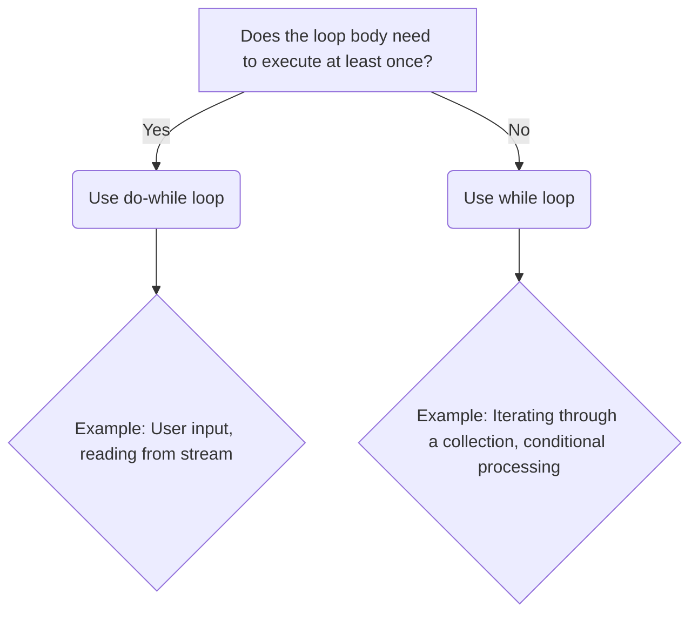

# When to Use a do-while Loop Over a while Loop in Java

While `while` loops are generally more common, `do-while` loops serve a specific and crucial purpose in programming: guaranteeing that the loop body executes at least once before the condition is evaluated. This fundamental difference makes `do-while` the preferred choice in scenarios where an initial execution is mandatory, regardless of the condition's initial state.

## Quick Answer

A `do-while` loop is better than a `while` loop when you need to ensure that the code block inside the loop is executed **at least once**, before the loop's continuation condition is checked.

```java
// Example: Prompting user input until valid data is received
String input;
do {
    System.out.print("Enter 'yes' or 'no': ");
    input = getUserInput(); // Assume this method gets input
} while (!input.equalsIgnoreCase("yes") && !input.equalsIgnoreCase("no"));
```

## Choose Your Method

Deciding between `while` and `do-while` hinges on whether the loop body *must* execute initially.



## Concept Explanation

The core distinction lies in the order of execution and condition checking:

*   **`while` loop**: The condition is evaluated *before* the loop body executes. If the condition is initially false, the loop body will never run.
*   **`do-while` loop**: The loop body executes *first*, and then the condition is evaluated. This guarantees at least one execution of the loop body.

This difference is critical when the condition itself depends on an action performed within the loop body.


## Real-World Examples

Here are practical scenarios where `do-while` loops are the more appropriate and often cleaner solution.

### 1. User Input Validation

When prompting a user for input, you always need to ask for input *at least once*, and then you check if the input is valid. If it's not, you prompt again.

```java
import java.util.Scanner;

public class UserInputExample {
    public static void main(String[] args) {
        Scanner scanner = new Scanner(System.in);
        int number;

        do {
            System.out.print("Please enter a positive number: ");
            while (!scanner.hasNextInt()) { // Input validation for non-integer
                System.out.println("Invalid input. Please enter an integer.");
                scanner.next(); // Consume the invalid input
            }
            number = scanner.nextInt();
        } while (number <= 0); // Condition: loop until a positive number is entered

        System.out.println("You entered: " + number);
        scanner.close();
    }
}
```
In this example, the prompt and input reading (`System.out.print` and `scanner.nextInt()`) *must* happen once before we can even evaluate if `number <= 0`.

### 2. Reading from a Stream/Socket

When reading data from an input stream or network socket, you typically need to attempt to read data *first*, and then check if the read operation was successful or if a specific termination sequence was found.

```java
import java.io.IOException;
import java.io.InputStream;

public class StreamReadExample {
    public static void readUntilTerminator(InputStream inputStream, byte terminator) throws IOException {
        int data;
        do {
            data = inputStream.read(); // Attempt to read a byte
            if (data == -1) { // End of stream
                System.out.println("End of stream reached.");
                break;
            }
            System.out.print((char) data); // Process the read data
        } while (data != terminator); // Condition: continue until terminator is found

        System.out.println("\nTerminator byte reached or stream ended.");
    }

    public static void main(String[] args) throws IOException {
        // Simulate an InputStream
        String simulatedData = "Hello World!\nThis is a test.\nEND";
        InputStream is = new java.io.ByteArrayInputStream(simulatedData.getBytes());

        System.out.println("Reading from stream until 'E':");
        readUntilTerminator(is, (byte) 'E'); // Read until 'E'
    }
}
```
Here, `inputStream.read()` must be called at least once to get the first byte before `data != terminator` can be checked.

### 3. Implementing a Game Loop (Simplified)

While full game loops are complex, a simplified version might use `do-while` if the game state needs to be updated and rendered *at least once* before checking for a "game over" condition.

```java
public class SimpleGameLoop {
    public static void main(String[] args) {
        boolean gameOver = false;
        int score = 0;

        do {
            // Game logic: update state, handle input, render
            System.out.println("Game running. Score: " + score);
            score += 10; // Simulate score increase
            
            // Simulate a condition for game over
            if (score >= 50) {
                gameOver = true;
            }
            
            try {
                Thread.sleep(500); // Simulate time passing
            } catch (InterruptedException e) {
                Thread.currentThread().interrupt();
            }

        } while (!gameOver); // Condition: continue as long as game is not over

        System.out.println("Game Over! Final Score: " + score);
    }
}
```
The game logic inside the loop *must* execute at least once to initialize the game state and potentially set `gameOver` to `true`.

### 4. Searching a Class Hierarchy

When searching for a field or method in a class and its superclasses, you need to check the current class *first*, and then move up the hierarchy.

```java
import java.lang.reflect.Field;

public class ClassHierarchySearch {

    public static Field searchFieldInHierarchy(Object obj, String fieldName) {
        Class<?> currentClass = obj.getClass();
        Field foundField = null;

        do {
            try {
                foundField = currentClass.getDeclaredField(fieldName);
                break; // Field found, exit loop
            } catch (NoSuchFieldException e) {
                currentClass = currentClass.getSuperclass(); // Move to superclass
            }
        } while (currentClass != null && currentClass != Object.class); // Stop at Object.class or null

        return foundField;
    }

    public static void main(String[] args) {
        class Animal {
            String species = "Unknown";
        }
        class Dog extends Animal {
            String name = "Buddy";
        }

        Dog myDog = new Dog();

        Field nameField = searchFieldInHierarchy(myDog, "name");
        if (nameField != null) {
            System.out.println("Found field: " + nameField.getName() + " in class: " + nameField.getDeclaringClass().getName());
        } else {
            System.out.println("Field 'name' not found.");
        }

        Field speciesField = searchFieldInHierarchy(myDog, "species");
        if (speciesField != null) {
            System.out.println("Found field: " + speciesField.getName() + " in class: " + speciesField.getDeclaringClass().getName());
        } else {
            System.out.println("Field 'species' not found.");
        }

        Field nonExistentField = searchFieldInHierarchy(myDog, "age");
        if (nonExistentField != null) {
            System.out.println("Found field: " + nonExistentField.getName());
        } else {
            System.out.println("Field 'age' not found.");
        }
    }
}
```
The `getDeclaredField` method is called on `currentClass` *before* checking if `currentClass` is `null` or `Object.class`.

## Common Problems & Solutions

### Problem: Infinite Loop
If the condition in a `do-while` loop never becomes false, it will result in an infinite loop. This is especially common if the loop body doesn't modify the variables used in the condition.

**Solution:** Always ensure that the loop body contains logic that will eventually make the `while` condition evaluate to `false`.

```java
// Bad: Infinite loop
// int i = 0;
// do {
//     System.out.println(i);
// } while (i < 5); // i never changes

// Good: Loop terminates
int i = 0;
do {
    System.out.println(i);
    i++; // i is incremented, eventually making i < 5 false
} while (i < 5);
```

### Problem: Unnecessary First Execution
Using `do-while` when the first execution might be harmful or unnecessary.

**Solution:** If there's a chance the loop body should *not* run even once, use a `while` loop.

```java
// Scenario: Process a list only if it's not empty
List<String> items = new ArrayList<>(); // Empty list

// Using do-while (bad here): will try to process an empty list once
// do {
//     // This code would run once even if items is empty, potentially causing errors
//     System.out.println("Processing item: " + items.get(0)); 
// } while (!items.isEmpty());

// Using while (correct): loop body won't execute if list is empty
while (!items.isEmpty()) {
    System.out.println("Processing item: " + items.remove(0));
}
System.out.println("List processed (or was empty).");
```

## Summary

The `do-while` loop is a specialized control flow statement in Java (and many other languages) that guarantees the execution of its body at least once. It is particularly useful in scenarios like user input validation, reading from streams, or any situation where an initial action must occur before a condition can be meaningfully checked. While less frequently used than `while` or `for` loops, understanding its specific use case is crucial for writing robust and idiomatic code.

---

## Image Generation Prompts

**PLACEHOLDER-1:** A clear, side-by-side flowchart comparing a `while` loop and a `do-while` loop.
**Left side (While Loop):** Start -> Condition Check (Diamond shape, "Condition?") -> If False, End. If True, Loop Body (Rectangle, "Execute Loop Body") -> Back to Condition Check.
**Right side (Do-While Loop):** Start -> Loop Body (Rectangle, "Execute Loop Body") -> Condition Check (Diamond shape, "Condition?") -> If False, End. If True, Back to Loop Body.
Use distinct colors for each loop type. Label the paths clearly (e.g., "True", "False"). The key difference should be visually emphasized: `while` checks first, `do-while` executes first.