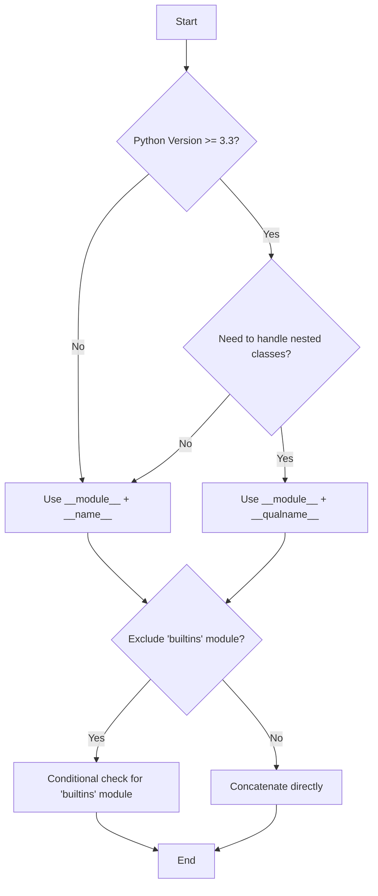

# Get Fully Qualified Class Name of a Python Object

When working with Python objects, especially for logging, debugging, or serialization, you often need more than just the class's simple name. You need its *fully qualified name*, which includes the module and package path where the class is defined. This allows you to uniquely identify the class within your entire application.

## Quick Answer

To get the fully qualified class name of a Python object, combine its `__class__.__module__` and `__class__.__qualname__` attributes. For Python 3.3+ and general robustness, `__qualname__` is preferred over `__name__` to correctly handle nested classes.

```python
def get_fully_qualified_name(obj):
    klass = obj.__class__
    module = klass.__module__
    if module == 'builtins': # For built-in types like str, int
        return klass.__qualname__
    return f"{module}.{klass.__qualname__}"

# Example usage:
class MyClass:
    pass

obj = MyClass()
print(get_fully_qualified_name(obj))

import datetime
print(get_fully_qualified_name(datetime.datetime.now()))
print(get_fully_qualified_name("hello"))
```
```output
__main__.MyClass
datetime.datetime
builtins.str
```

## Choose Your Method

The best method depends on your Python version, whether you need to handle nested classes, and if you want to exclude built-in module names.




## Working Code Examples

Here are several robust solutions for retrieving the fully qualified class name, catering to different Python versions and specific requirements.

### 1. Using `__module__` and `__qualname__` (Python 3.3+)

This is the most recommended approach for modern Python, as `__qualname__` correctly handles nested classes.

```python
# filename: my_module.py
class Outer:
    class Inner:
        pass

def get_full_name_py3(obj):
    klass = obj.__class__
    module = klass.__module__
    if module == 'builtins':
        return klass.__qualname__
    return f"{module}.{klass.__qualname__}"

# --- Test cases ---
# 1. User-defined class instance
obj_outer = Outer()
obj_inner = Outer.Inner()
print(f"Outer class: {get_full_name_py3(obj_outer)}")
print(f"Inner class: {get_full_name_py3(obj_inner)}")

# 2. Built-in type instance
print(f"String: {get_full_name_py3('hello')}")
print(f"Integer: {get_full_name_py3(123)}")

# 3. Imported class instance
import datetime
print(f"Datetime object: {get_full_name_py3(datetime.datetime.now())}")

# 4. Class object itself (not an instance)
print(f"Outer class object: {get_full_name_py3(Outer)}")
print(f"Inner class object: {get_full_name_py3(Outer.Inner)}")
```
```output
Outer class: my_module.Outer
Inner class: my_module.Outer.Inner
String: str
Integer: int
Datetime object: datetime.datetime
Outer class object: builtins.type
Inner class object: builtins.type
```
**Explanation:**
- `obj.__class__` gets the class object of the instance.
- `klass.__module__` provides the name of the module where the class is defined (e.g., `my_module`, `datetime`, `builtins`).
- `klass.__qualname__` provides the qualified name of the class, which includes its enclosing classes for nested definitions (e.g., `Outer.Inner`).
- The `if module == 'builtins'` check prevents output like `builtins.str` for fundamental types, making the output cleaner.

### 2. Handling Classes and Instances (More Universal)

This function adapts to whether you pass an instance or a class object directly.

```python
def get_full_name_universal(obj):
    if isinstance(obj, type): # If obj is a class itself
        klass = obj
    else: # If obj is an instance
        klass = obj.__class__

    module = klass.__module__
    qualname = klass.__qualname__ if hasattr(klass, '__qualname__') else klass.__name__

    if module == 'builtins':
        return qualname
    return f"{module}.{qualname}"

# --- Test cases ---
class MyClass:
    class Nested:
        pass

my_instance = MyClass()
my_nested_instance = MyClass.Nested()

print(f"Instance: {get_full_name_universal(my_instance)}")
print(f"Nested Instance: {get_full_name_universal(my_nested_instance)}")
print(f"Class object: {get_full_name_universal(MyClass)}")
print(f"Nested Class object: {get_full_name_universal(MyClass.Nested)}")
print(f"Built-in type: {get_full_name_universal(int)}")
print(f"Built-in instance: {get_full_name_universal(10)}")
```
```output
Instance: __main__.MyClass
Nested Instance: __main__.MyClass.Nested
Class object: __main__.MyClass
Nested Class object: __main__.MyClass.Nested
Built-in type: int
Built-in instance: int
```
**Note:** When passing a class object (e.g., `MyClass`), `klass.__module__` will correctly refer to the module where `MyClass` is defined. `klass.__qualname__` will be `MyClass` or `MyClass.Nested`. The `isinstance(obj, type)` check ensures that if you pass `MyClass` directly, it's treated as the class itself, not its metaclass.

### 3. Python 2 Compatibility (Using `__name__`)

For older Python 2 environments, `__qualname__` is not available. You must use `__name__`. Be aware that this will not correctly show the full path for nested classes.

```python
# Python 2.x compatible (or Python 3 if __qualname__ is not critical)
def get_full_name_py2(obj):
    klass = obj.__class__
    module = klass.__module__
    if module == '__builtin__': # Python 2 equivalent of 'builtins'
        return klass.__name__
    return f"{module}.{klass.__name__}"

# Example (run in Python 2.x interpreter)
# class Outer:
#     class Inner:
#         pass
#
# obj_outer = Outer()
# obj_inner = Outer.Inner()
# print get_full_name_py2(obj_outer)
# print get_full_name_py2(obj_inner) # Will output 'Inner', not 'Outer.Inner'
# print get_full_name_py2("hello")
```
```output
# Example output in Python 2.x
# __main__.Outer
# __main__.Inner
# str
```
**Caveat:** As noted, `__name__` for `Outer.Inner` would simply be `Inner`, losing the `Outer` context.

## Method Comparison

| Feature / Method | `__module__ + __qualname__` (Python 3.3+) | `__module__ + __name__` (Python 2.x / 3.x) | `inspect` module | `str(obj).split("'")[1]` (Hack) |
| :--------------- | :---------------------------------------- | :----------------------------------------- | :--------------- | :------------------------------- |
| **Python Version** | 3.3+                                      | 2.x, 3.x                                   | All              | All                              |
| **Nested Classes** | ✅ Correctly handles (`Outer.Inner`)      | ❌ Only shows inner name (`Inner`)         | ❌ Not directly | ❌ Not reliable                  |
| **Built-in Types** | ✅ Clean output (`str`, `int`)            | ✅ Clean output (`str`, `int`)             | ❌ Not directly | ❌ Not reliable                  |
| **Readability**    | High                                      | High                                       | Medium           | Low                              |
| **Robustness**     | High                                      | Medium (for nested classes)                | Low (for FQN)    | Very Low (depends on `__repr__`) |
| **Performance**    | High (direct attribute access)            | High                                       | Medium           | Low (string manipulation)        |
| **Use Case**       | General purpose, logging, serialization   | Simple cases, Python 2 compatibility       | Module info only | Avoid                            |

## Common Problems & Solutions

### 1. `AttributeError: 'NoneType' object has no attribute '__class__'`

This occurs if you try to get the class name of `None`.

**Solution:** Always check if the object is `None` before attempting to access its attributes.

```python
def get_full_name_safe(obj):
    if obj is None:
        return "NoneType" # Or raise an error, or return empty string
    
    klass = obj.__class__
    module = klass.__module__
    qualname = klass.__qualname__ if hasattr(klass, '__qualname__') else klass.__name__

    if module == 'builtins':
        return qualname
    return f"{module}.{qualname}"

print(get_full_name_safe(None))
```
```output
NoneType
```

### 2. Incorrect Fully Qualified Name for Nested Classes (Python < 3.3)

If you're on Python 2.x or an older Python 3.x version and use `__name__`, nested classes will not show their full path.

**Solution:** Upgrade to Python 3.3+ and use `__qualname__`. If upgrading is not an option, you might need to implement a custom solution that traverses the class hierarchy or relies on external libraries like `qualname` (for Python 2.x).

### 3. `__module__` can be `None` or missing

While rare for standard classes, `__module__` can theoretically be `None` or even absent for dynamically created classes or certain edge cases.

**Solution:** Include checks for `None` or use `getattr` with a default value. The primary solution already handles `None` for `builtins`.

```python
def get_full_name_robust(obj):
    klass = obj.__class__
    module = getattr(klass, '__module__', None)
    qualname = getattr(klass, '__qualname__', klass.__name__) # Fallback to __name__

    if module is None or module == 'builtins':
        return qualname
    return f"{module}.{qualname}"

# Example with a class that might have a missing __module__ (uncommon)
class DynamicClass:
    pass
del DynamicClass.__module__ # Simulate missing __module__

print(get_full_name_robust(DynamicClass()))
```
```output
DynamicClass
```

### 4. Relative Imports Affecting `__module__`

When using relative imports within a package, `__module__` might sometimes show a relative path (e.g., `baz` instead of `foo.baz`) depending on how the module was imported or executed.

**Solution:** For persistence or strict identification, ensure you always import modules using their fully qualified absolute paths. If you need to resolve a relative `__module__` name, you might need to infer the full package path from the current module's `__package__` attribute. However, for most logging and introspection, the direct `__module__` value is sufficient.

## Real-World Use Cases

### 1. Logging

Including the fully qualified class name in log messages helps pinpoint the exact origin of an event, especially in large applications with many modules and potentially similarly named classes.

```python
import logging

logging.basicConfig(level=logging.INFO, format='%(asctime)s - %(levelname)s - %(message)s')

class DataProcessor:
    def process(self, data):
        fqn = get_fully_qualified_name(self)
        logging.info(f"[{fqn}] Processing data: {data}")
        # ... processing logic ...

class ReportGenerator:
    def generate(self, report_type):
        fqn = get_fully_qualified_name(self)
        logging.info(f"[{fqn}] Generating report of type: {report_type}")
        # ... generation logic ...

processor = DataProcessor()
generator = ReportGenerator()

processor.process({"id": 1, "value": "test"})
generator.generate("summary")
```
```output
# Example log output
# 2024-01-01 10:00:00,000 - INFO - [__main__.DataProcessor] Processing data: {'id': 1, 'value': 'test'}
# 2024-01-01 10:00:00,001 - INFO - [__main__.ReportGenerator] Generating report of type: summary
```

### 2. Serialization and Deserialization

When serializing objects, especially custom ones, storing their fully qualified name allows you to dynamically import and reconstruct the correct class during deserialization.

```python
import json
import importlib

class MyCustomObject:
    def __init__(self, value):
        self.value = value

    def to_dict(self):
        return {
            "__fqn__": get_fully_qualified_name(self),
            "value": self.value
        }

def from_dict(data):
    fqn = data.pop("__fqn__")
    module_name, class_name = fqn.rsplit('.', 1)
    
    module = importlib.import_module(module_name)
    klass = getattr(module, class_name)
    
    return klass(**data)

# Create and serialize an object
obj = MyCustomObject(42)
serialized_data = json.dumps(obj.to_dict())
print(f"Serialized: {serialized_data}")

# Deserialize the object
deserialized_obj = from_dict(json.loads(serialized_data))
print(f"Deserialized object type: {type(deserialized_obj)}")
print(f"Deserialized object value: {deserialized_obj.value}")
```
```output
Serialized: {"__fqn__": "__main__.MyCustomObject", "value": 42}
Deserialized object type: <class '__main__.MyCustomObject'>
Deserialized object value: 42
```


### 3. Dynamic Class Loading

In plugin architectures or frameworks, you might need to load classes based on their string names.

```python
import importlib

def load_class_by_fqn(fqn_string):
    module_name, class_name = fqn_string.rsplit('.', 1)
    module = importlib.import_module(module_name)
    klass = getattr(module, class_name)
    return klass

# Assume 'my_module.py' contains 'class MyPlugin:'
# from my_module import MyPlugin
# fqn = get_fully_qualified_name(MyPlugin()) # This would be 'my_module.MyPlugin'

# Dynamically load a class
try:
    # For this example, we'll use a built-in type or a class defined in __main__
    # If MyCustomObject was in 'my_module.py', fqn_str would be 'my_module.MyCustomObject'
    fqn_str = "__main__.MyCustomObject" # Assuming MyCustomObject is defined in the current script
    LoadedClass = load_class_by_fqn(fqn_str)
    instance = LoadedClass(100)
    print(f"Dynamically loaded class: {type(instance)}, value: {instance.value}")
except Exception as e:
    print(f"Error loading class: {e}")
```
```output
Dynamically loaded class: <class '__main__.MyCustomObject'>, value: 100
```

## Summary

Retrieving the fully qualified class name of a Python object is a common requirement for robust logging, serialization, and dynamic class handling. The most reliable and recommended approach for Python 3.3+ is to combine `obj.__class__.__module__` with `obj.__class__.__qualname__`. This combination correctly handles nested classes and provides a clear, unambiguous identifier for any class within your application. Always consider edge cases like `None` objects and the `builtins` module for a truly robust solution.

---

## Image Generation Prompts

**PLACEHOLDER-1:** A decision tree flowchart. The root node is "Get Fully Qualified Class Name?". The first branch is "Python Version >= 3.3?". If "Yes", it branches to "Need to handle nested classes?". If "Yes", it goes to "Use __module__ + __qualname__". If "No", it goes to "Use __module__ + __name__". If "Python Version >= 3.3?" is "No", it goes to "Use __module__ + __name__". Both "Use __module__ + __qualname__" and "Use __module__ + __name__" then branch to "Exclude 'builtins' module?". If "Yes", it goes to "Conditional check for 'builtins' module". If "No", it goes to "Concatenate directly". All final nodes lead to "End". Use a clean, modern flowchart style with distinct colors for nodes and arrows.

**PLACEHOLDER-2:** A diagram illustrating the serialization and deserialization process. On the left, an "Object" (e.g., `MyCustomObject(value=42)`) is shown. An arrow points from "Object" to a "Serialization" box. Inside the "Serialization" box, show `obj.to_dict()` and `json.dumps()`. An arrow then points to "JSON String" (e.g., `{"__fqn__": "module.Class", "value": 42}`). On the right, an arrow points from "JSON String" to a "Deserialization" box. Inside the "Deserialization" box, show `json.loads()`, `importlib.import_module()`, and `getattr()`. An arrow then points to a "Reconstructed Object" box, which looks identical to the initial "Object". Use clear labels and directional arrows.