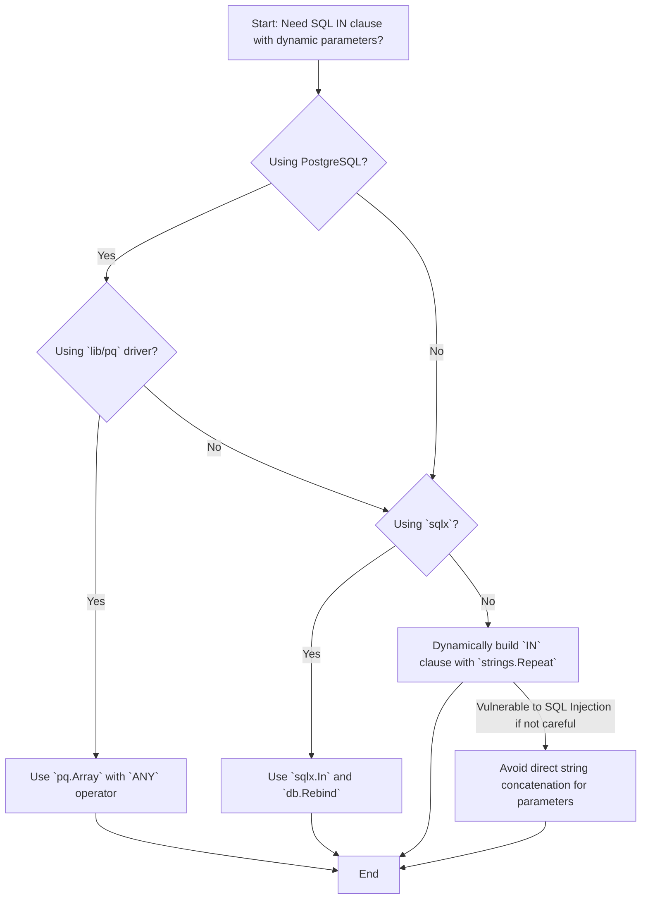

# Executing SQL IN Lookups in Go with Dynamic Parameters

When working with SQL databases in Go, a common requirement is to query for records where a column's value is present in a list of items, often referred to as an `IN` clause lookup. Directly passing a slice or array to a prepared statement's placeholder for an `IN` clause doesn't work as intuitively as one might expect with standard Go `database/sql` package. This guide explores various robust and safe methods to achieve this, focusing on solutions that prevent SQL injection and handle dynamic parameter lists.

## Quick Answer

The most robust and recommended way to handle `IN` clauses with dynamic parameters in Go, especially for PostgreSQL, is to use the `pq.Array` type with the `ANY` operator or leverage the `sqlx` library's `In` and `Rebind` functions for broader database compatibility.

For PostgreSQL with `pq.Array`:

```go
import (
	"database/sql"
	"fmt"
	"github.com/lib/pq" // For pq.Array
)

// Assume db is an *sql.DB connection
func queryWithPgArray(db *sql.DB, id int, otherFields []string) error {
	stmt, err := db.Prepare("SELECT * FROM awesome_table WHERE id = $1 AND other_field = ANY($2)")
	if err != nil {
		return fmt.Errorf("prepare statement failed: %w", err)
	}
	defer stmt.Close()

	rows, err := stmt.Query(id, pq.Array(otherFields))
	if err != nil {
		return fmt.Errorf("query failed: %w", err)
	}
	defer rows.Close()

	// Process rows...
	fmt.Println("Query successful with pq.Array")
	return nil
}
```

For general SQL databases using `sqlx`:

```go
import (
	"database/sql"
	"fmt"
	"github.com/jmoiron/sqlx" // For sqlx.In and sqlx.Rebind
)

// Assume db is an *sqlx.DB connection
func queryWithSqlxIn(db *sqlx.DB, id int, otherFields []int) error {
	query, args, err := sqlx.In("SELECT * FROM awesome_table WHERE id = ? AND other_field IN (?)", id, otherFields)
	if err != nil {
		return fmt.Errorf("sqlx.In failed: %w", err)
	}

	// Rebind for PostgreSQL ($1, $2, etc.) or other drivers
	query = db.Rebind(query)

	rows, err := db.Query(query, args...)
	if err != nil {
		return fmt.Errorf("query failed: %w", err)
	}
	defer rows.Close()

	// Process rows...
	fmt.Println("Query successful with sqlx.In")
	return nil
}
```

## Choose Your Method

The best approach depends on your database, whether you're using `sqlx`, and your performance/readability priorities.




## Table of Contents
1.  Quick Answer
2.  Choose Your Method
3.  Method 1: Using `pq.Array` with PostgreSQL's `ANY` Operator
4.  Method 2: Leveraging `sqlx.In` for Dynamic `IN` Clauses
5.  Method 3: Dynamically Building the `IN` Clause (Standard `database/sql`)
6.  Common Problems & Solutions
7.  Performance Considerations
8.  Summary

## Method 1: Using `pq.Array` with PostgreSQL's `ANY` Operator

For PostgreSQL users, the `github.com/lib/pq` driver offers a clean and efficient way to handle `IN` clauses by mapping Go slices directly to PostgreSQL array types. This method is type-safe and prevents SQL injection.

PostgreSQL's `ANY` operator can be used with an array to achieve the same result as an `IN` clause. For example, `other_field = ANY('{this,that}')` is equivalent to `other_field IN ('this', 'that')`.

### Implementation

```go
package main

import (
	"database/sql"
	"fmt"
	"log"

	"github.com/lib/pq" // Import the PostgreSQL driver
	_ "github.com/lib/pq" // Register the driver
)

// Example usage (assuming you have a PostgreSQL database running)
func main() {
	// Replace with your actual PostgreSQL connection string
	connStr := "user=postgres password=postgres dbname=testdb sslmode=disable"
	db, err := sql.Open("postgres", connStr)
	if err != nil {
		log.Fatalf("Error opening database: %v", err)
	}
	defer db.Close()

	err = db.Ping()
	if err != nil {
		log.Fatalf("Error connecting to database: %v", err)
	}
	fmt.Println("Successfully connected to PostgreSQL!")

	// Create a dummy table for demonstration
	_, err = db.Exec(`
		CREATE TABLE IF NOT EXISTS awesome_table (
			id SERIAL PRIMARY KEY,
			other_field TEXT
		);
		TRUNCATE TABLE awesome_table;
		INSERT INTO awesome_table (other_field) VALUES ('apple'), ('banana'), ('cherry'), ('date');
	`)
	if err != nil {
		log.Fatalf("Error setting up table: %v", err)
	}

	// Example 1: Query with string slice
	fmt.Println("\n--- Querying with string slice ---")
	otherFieldsStr := []string{"apple", "cherry"}
	rows, err := queryWithPgArray(db, 1, otherFieldsStr) // id=1 is arbitrary here, adjust as needed
	if err != nil {
		log.Printf("Error querying with string slice: %v", err)
	} else {
		printResults(rows)
	}

	// Example 2: Query with integer slice (if other_field was INTEGER)
	// For this example, other_field is TEXT, so this would fail or need type casting in SQL
	// If other_field was INTEGER, you'd use pq.Array([]int{...})
}

func queryWithPgArray(db *sql.DB, id int, otherFields []string) (*sql.Rows, error) {
	// Use $1 for the first parameter (id) and $2 for the array (otherFields)
	// The `ANY` operator checks if other_field is equal to any element in the array $2
	stmt, err := db.Prepare("SELECT id, other_field FROM awesome_table WHERE id > $1 AND other_field = ANY($2)")
	if err != nil {
		return nil, fmt.Errorf("prepare statement failed: %w", err)
	}
	defer stmt.Close() // Important: defer closing the statement

	// Pass the Go slice wrapped in pq.Array()
	rows, err := stmt.Query(0, pq.Array(otherFields)) // Using 0 for id > 0 to get all
	if err != nil {
		return nil, fmt.Errorf("query failed: %w", err)
	}
	return rows, nil
}

func printResults(rows *sql.Rows) {
	defer rows.Close()
	fmt.Println("Results:")
	for rows.Next() {
		var id int
		var otherField string
		if err := rows.Scan(&id, &otherField); err != nil {
			log.Printf("Error scanning row: %v", err)
			return
		}
		fmt.Printf("  ID: %d, Other Field: %s\n", id, otherField)
	}
	if err := rows.Err(); err != nil {
		log.Printf("Error iterating rows: %v", err)
	}
}
```

### Generated SQL

The `pq.Array` approach effectively translates your Go slice into a PostgreSQL array literal, which is then used with the `ANY` operator.

```sql
SELECT id, other_field FROM awesome_table WHERE id > 0 AND other_field = ANY('{"apple", "cherry"}');
```

## Method 2: Leveraging `sqlx.In` for Dynamic `IN` Clauses

The `jmoiron/sqlx` library is a popular extension to Go's `database/sql` package, providing convenient features like struct scanning and improved handling of dynamic queries. Its `sqlx.In` function is specifically designed for `IN` clauses with dynamic parameter lists.

`sqlx.In` takes a query string with a single `?` placeholder for the `IN` clause and a slice of values. It expands the `?` into a comma-separated list of `?` placeholders and returns the modified query string and the flattened arguments. For PostgreSQL, you then need to use `db.Rebind` to convert the `?` placeholders to `$1, $2, ...` style.

### Implementation

```go
package main

import (
	"database/sql"
	"fmt"
	"log"

	"github.com/jmoiron/sqlx" // Import sqlx
	_ "github.com/lib/pq"    // Register the PostgreSQL driver
)

// Assume AwesomeStruct matches your table structure
type AwesomeStruct struct {
	ID         int    `db:"id"`
	OtherField string `db:"other_field"`
}

func main() {
	// Replace with your actual PostgreSQL connection string
	connStr := "user=postgres password=postgres dbname=testdb sslmode=disable"
	db, err := sqlx.Connect("postgres", connStr) // Use sqlx.Connect
	if err != nil {
		log.Fatalf("Error opening database: %v", err)
	}
	defer db.Close()

	err = db.Ping()
	if err != nil {
		log.Fatalf("Error connecting to database: %v", err)
	}
	fmt.Println("Successfully connected to PostgreSQL with sqlx!")

	// Create a dummy table for demonstration
	_, err = db.Exec(`
		CREATE TABLE IF NOT EXISTS awesome_table (
			id SERIAL PRIMARY KEY,
			other_field TEXT
		);
		TRUNCATE TABLE awesome_table;
		INSERT INTO awesome_table (other_field) VALUES ('apple'), ('banana'), ('cherry'), ('date');
	`)
	if err != nil {
		log.Fatalf("Error setting up table: %v", err)
	}

	// Example 1: Query with string slice
	fmt.Println("\n--- Querying with string slice using sqlx.In ---")
	otherFieldsStr := []string{"apple", "cherry"}
	var resultsStr []AwesomeStruct
	err = queryWithSqlxIn(db, 0, otherFieldsStr, &resultsStr) // id > 0 to get all
	if err != nil {
		log.Printf("Error querying with string slice: %v", err)
	} else {
		fmt.Println("Results:")
		for _, res := range resultsStr {
			fmt.Printf("  ID: %d, Other Field: %s\n", res.ID, res.OtherField)
		}
	}

	// Example 2: Query with integer slice (if other_field was INTEGER)
	fmt.Println("\n--- Querying with integer slice (conceptual, assuming other_field is int) ---")
	// For this example, other_field is TEXT, so this would fail or need type casting in SQL
	// If other_field was INTEGER, you'd use []int{...}
	// ids := []int{1, 2, 3}
	// var resultsInt []AwesomeStruct
	// err = queryWithSqlxIn(db, 0, ids, &resultsInt)
	// if err != nil {
	// 	log.Printf("Error querying with int slice: %v", err)
	// } else {
	// 	fmt.Println("Results (int):", resultsInt)
	// }
}

func queryWithSqlxIn(db *sqlx.DB, id int, otherFields interface{}, dest interface{}) error {
	// The `IN (?)` placeholder will be expanded by sqlx.In
	// The first `?` is for `id`, the second `?` is for the `IN` clause
	query, args, err := sqlx.In("SELECT id, other_field FROM awesome_table WHERE id > ? AND other_field IN (?)", id, otherFields)
	if err != nil {
		return fmt.Errorf("sqlx.In failed: %w", err)
	}

	// Rebind the query for the specific database driver (e.g., PostgreSQL uses $1, $2, ...)
	query = db.Rebind(query)

	// Use db.Select for multiple rows or db.Get for a single row
	err = db.Select(dest, query, args...)
	if err != nil {
		return fmt.Errorf("query failed: %w", err)
	}
	return nil
}
```

### Generated SQL

`sqlx.In` transforms the query string and arguments. For `otherFields = []string{"apple", "cherry"}` and `id = 0`, the query becomes:

```sql
SELECT id, other_field FROM awesome_table WHERE id > $1 AND other_field IN ($2, $3)
```
And `args` would be `[0, "apple", "cherry"]`.

## Method 3: Dynamically Building the `IN` Clause (Standard `database/sql`)

If you're not using `sqlx` and your database driver doesn't support array types like `lib/pq` does, you can manually construct the `IN` clause. This involves generating the correct number of placeholders (`$1, $2, ...` for PostgreSQL or `?, ?, ...` for MySQL) and then passing the individual elements of your slice as separate arguments to `Query`.

This method requires careful handling to prevent SQL injection. **Never concatenate user-provided values directly into the SQL string.** Always use parameterized queries.

### Implementation

```go
package main

import (
	"database/sql"
	"fmt"
	"log"
	"strings"

	_ "github.com/lib/pq" // Register the PostgreSQL driver
)

func main() {
	// Replace with your actual PostgreSQL connection string
	connStr := "user=postgres password=postgres dbname=testdb sslmode=disable"
	db, err := sql.Open("postgres", connStr)
	if err != nil {
		log.Fatalf("Error opening database: %v", err)
	}
	defer db.Close()

	err = db.Ping()
	if err != nil {
		log.Fatalf("Error connecting to database: %v", err)
	}
	fmt.Println("Successfully connected to PostgreSQL!")

	// Create a dummy table for demonstration
	_, err = db.Exec(`
		CREATE TABLE IF NOT EXISTS awesome_table (
			id SERIAL PRIMARY KEY,
			other_field TEXT
		);
		TRUNCATE TABLE awesome_table;
		INSERT INTO awesome_table (other_field) VALUES ('apple'), ('banana'), ('cherry'), ('date');
	`)
	if err != nil {
		log.Fatalf("Error setting up table: %v", err)
	}

	fmt.Println("\n--- Querying with dynamically built IN clause ---")
	otherFields := []string{"banana", "date"}
	rows, err := queryDynamically(db, 0, otherFields) // id > 0 to get all
	if err != nil {
		log.Printf("Error querying dynamically: %v", err)
	} else {
		printResults(rows)
	}
}

func queryDynamically(db *sql.DB, id int, otherFields []string) (*sql.Rows, error) {
	if len(otherFields) == 0 {
		return nil, fmt.Errorf("otherFields slice cannot be empty for IN clause")
	}

	// Start with the fixed part of the query
	baseQuery := "SELECT id, other_field FROM awesome_table WHERE id > $1 AND other_field IN ("

	// Generate placeholders for the IN clause: $2, $3, ...
	// The first placeholder is $2 because $1 is for `id`
	placeholders := make([]string, len(otherFields))
	for i := range otherFields {
		placeholders[i] = fmt.Sprintf("$%d", i+2) // Start from $2
	}
	baseQuery += strings.Join(placeholders, ", ") + ")"

	// Combine all arguments: first `id`, then elements of `otherFields`
	args := make([]interface{}, len(otherFields)+1)
	args[0] = id // First argument is for $1
	for i, v := range otherFields {
		args[i+1] = v // Subsequent arguments for $2, $3, ...
	}

	stmt, err := db.Prepare(baseQuery)
	if err != nil {
		return nil, fmt.Errorf("prepare statement failed: %w", err)
	}
	defer stmt.Close()

	rows, err := stmt.Query(args...) // Pass all arguments
	if err != nil {
		return nil, fmt.Errorf("query failed: %w", err)
	}
	return rows, nil
}

func printResults(rows *sql.Rows) {
	defer rows.Close()
	fmt.Println("Results:")
	for rows.Next() {
		var id int
		var otherField string
		if err := rows.Scan(&id, &otherField); err != nil {
			log.Printf("Error scanning row: %v", err)
			return
		}
		fmt.Printf("  ID: %d, Other Field: %s\n", id, otherField)
	}
	if err := rows.Err(); err != nil {
		log.Printf("Error iterating rows: %v", err)
	}
}
```

### Generated SQL

For `otherFields = []string{"banana", "date"}` and `id = 0`, the generated query string would be:

```sql
SELECT id, other_field FROM awesome_table WHERE id > $1 AND other_field IN ($2, $3)
```
And the arguments passed to `Query` would be `[0, "banana", "date"]`.

## Common Problems & Solutions

### 1. SQL Injection Risk with String Concatenation
**Problem:** Directly concatenating user-provided values into the SQL query string (e.g., `query := "SELECT * FROM users WHERE id IN (" + strings.Join(ids, ",") + ")"`).
**Solution:** Always use parameterized queries. The methods above (`pq.Array`, `sqlx.In`, or dynamic placeholder generation) all use parameters, which are handled safely by the database driver.

### 2. Empty `IN` Clause List
**Problem:** If the slice for the `IN` clause is empty, the generated SQL might be `IN ()`, which is often a syntax error or returns no results.
**Solution:** Add a check for an empty slice and handle it explicitly. You might return an error, return an empty result set, or modify the query to avoid the `IN` clause entirely if it's optional.

```go
func querySafely(db *sql.DB, id int, otherFields []string) (*sql.Rows, error) {
    if len(otherFields) == 0 {
        // Handle empty list: e.g., return empty rows or an error
        return nil, fmt.Errorf("cannot query with empty IN clause list")
    }
    // ... proceed with one of the safe methods ...
    return nil, nil // Placeholder
}
```

### 3. Incorrect Placeholder Syntax
**Problem:** Mixing `?` (MySQL/SQLite) and `$N` (PostgreSQL) placeholders or getting the numbering wrong when dynamically generating them.
**Solution:**
*   Be consistent with your database's placeholder style.
*   When dynamically generating, ensure the numbering starts correctly (e.g., `$1` for the first parameter, `$2` for the second, etc.).
*   `sqlx.Rebind` helps abstract this for `sqlx` users.

### 4. Performance Overhead of Dynamic Query Generation
**Problem:** Repeatedly building the query string and preparing statements can incur a slight performance overhead if done in a tight loop.
**Solution:**
*   For `pq.Array` and `sqlx.In`, the overhead is minimal as the driver/library handles it efficiently.
*   For manual dynamic generation, if the `IN` list size varies significantly and queries are frequent, consider caching prepared statements or using a connection pool that handles statement caching. However, for most applications, the overhead is negligible compared to network latency and database processing.

## Performance Considerations

*   **`pq.Array` with `ANY` (PostgreSQL):** This is generally the most performant and idiomatic solution for PostgreSQL. The database is optimized to handle array types efficiently, and the query plan can often be better than a long `IN` list. It also reduces network traffic by sending the array as a single parameter.
*   **`sqlx.In`:** This method is highly recommended for its balance of safety, readability, and performance across various SQL databases. `sqlx` handles the query string manipulation and argument flattening efficiently. The `Rebind` step is fast.
*   **Manual Dynamic Generation:** While safe if implemented correctly, it involves string manipulation in Go, which is generally fast. The primary performance consideration here is the database's ability to optimize queries with very long `IN` lists. Some databases might struggle with extremely long `IN` lists (thousands of items), potentially leading to slower query planning or execution. In such cases, consider alternative strategies like temporary tables or batch processing.

## Summary

Executing SQL `IN` lookups with dynamic parameter lists in Go requires careful handling to ensure both correctness and security.

*   For **PostgreSQL**, the `pq.Array` type combined with the `ANY` operator offers the most direct, type-safe, and often most performant solution.
*   For a more general approach across different SQL databases, the `sqlx` library's `sqlx.In` and `db.Rebind` functions provide an excellent abstraction, handling placeholder expansion and rebinding automatically.
*   If you're restricted to the standard `database/sql` package and a driver without array support, you can dynamically construct the `IN` clause by generating the correct number of placeholders and passing individual slice elements as arguments. This method demands strict adherence to parameterized queries to prevent SQL injection.

Always prioritize parameterized queries over string concatenation to safeguard your application against vulnerabilities.

---

## Image Generation Prompts

**PLACEHOLDER-1:** A decision tree flowchart. The root node is "Need SQL IN clause with dynamic parameters?". Branches lead to "Using PostgreSQL?". If Yes, then "Using `lib/pq` driver?". If Yes, then "Use `pq.Array` with `ANY` operator". If No, then "Using `sqlx`?". If Yes, then "Use `sqlx.In` and `db.Rebind`". If No, then "Dynamically build `IN` clause with `strings.Repeat`". If "Dynamically build `IN` clause", add a warning branch "Vulnerable to SQL Injection if not careful" leading to "Avoid direct string concatenation for parameters". All end nodes should lead to "End". Use a clean, modern flowchart style with distinct colors for decision nodes and action nodes.