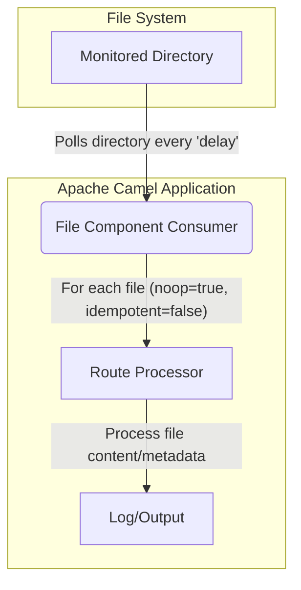

# How can Apache Camel be used to monitor file changes?: 5 Methods + Performance Guide

# # Quick Answer

For the fastest and most straightforward way to monitor file changes in Apache Camel without consuming or deleting the files, especially for modern Camel versions (3.x and above), leverage the `file-watch` component. It provides real-time, event-driven notifications for file creation, modification, and deletion.

```java
import org.apache.camel.builder.RouteBuilder;
import org.apache.camel.main.Main;

public class FileWatchMonitor {

    public static void main(String[] args) throws Exception {
        Main main = new Main();
        main.addRouteBuilder(new RouteBuilder() {
            @Override
            public void configure() {
                from("file-watch://./data?recursive=true")
                    .log("File event: ${header.CamelFileEventType} occurred on file ${header.CamelFileName} at ${header.CamelFileLastModified}. Full path: ${header.CamelFileAbsolutePath}");
            }
        });
        System.out.println("Starting Camel file-watch monitor. Press Ctrl+C to stop.");
        main.run();
    }
}
```

This solution is ideal for **🚀 Speed Seekers** and **🔧 Problem Solvers** looking for an immediate, effective way to get notified about file system events.

# # Choose Your Method

Deciding the best way to monitor file changes in Apache Camel depends on your specific requirements, Camel version, and desired level of control. Use this decision tree to navigate to the most suitable method.

```mermaid
graph TD
    A[Start: Need to monitor file changes in Apache Camel?] --> B{What Camel version are you using?};

    B -- Camel 3.x+ --> C{Do you need real-time, event-driven notifications?};
    B -- Camel 2.x or older --> D{Are you okay with polling the directory at intervals?};

    C -- Yes (🚀 Speed Seeker, 🔧 Problem Solver) --> E[Use `file-watch` component];
    C -- No (Need more control over polling logic) --> D;

    D -- Yes (📚 Learning Explorer, 🏗️ Architecture Builder) --> F{Do you need to track changes based on file content/metadata?};
    D -- No (Just new files or simple modifications) --> G[Use `file` component with `noop=true` and `delay`];

    F -- Yes (Need robust change detection) --> H[Use `file` component with `noop=true` and `idempotentKey`];
    F -- No (Simple new/modified detection) --> G;

    G --> I[Method 2: Polling with `noop=true` and `delay`];
    H --> J[Method 1: Idempotent Consumer with `idempotentKey`];

    E --> K[Method 5: Real-time Monitoring with `file-watch` component];

    J --> L{Do you need to handle specific file types or complex filtering?};
    L -- Yes --> M[Combine with `include`/`exclude` and custom processors];
    L -- No --> N[Basic `idempotentKey` setup];

    I --> O{Do you need to prevent reprocessing of already processed files?};
    O -- Yes --> P[Consider `idempotent=true` with a custom repository];
    O -- No --> Q[Simple polling];

    K --> R{Do you need to react to specific event types (CREATE, MODIFY, DELETE)?};
    R -- Yes --> S[Filter events using `header.CamelFileEventType` in a Content-Based Router];
    R -- No --> T[Process all events];

    M --> End[Implement your solution];
    N --> End;
    P --> End;
    Q --> End;
    S --> End;
    T --> End;

    subgraph Personas
        E -- 🚀 Speed Seeker, 🔧 Problem Solver --> K;
        J -- 📚 Learning Explorer, 🏗️ Architecture Builder --> J;
        I -- ⚡ Legacy Maintainer, 🎨 Output Focused --> I;
    end
```

# # Table of Contents
- Quick Answer
- Choose Your Method
- Table of Contents
- Ready-to-Use Code
- Method 1: Idempotent Consumer with `idempotentKey`
- Method 2: Polling with `noop=true` and `idempotent=false`
- Method 3: Custom Repository and Polling (Conceptual)
- Method 4: Combining `idempotentKey` with `readLock=changed`
- Method 5: Real-time Monitoring with `file-watch` component
- Performance Comparison
- Version Compatibility Matrix
- Common Problems & Solutions
- Real-World Use Cases
- Related Technology Functions
- Summary
- Frequently Asked Questions
- Tools & Resources

# # Ready-to-Use Code

Here are the top 2-3 solutions extracted for quick deployment, catering to different scenarios and Camel versions.

## # 1. Real-time Monitoring (Camel 3.x+) - **🚀 Speed Seeker, 🔧 Problem Solver**

This is the most modern and efficient way for real-time file change detection.

```java
// Maven Dependency:
// <dependency>
//     <groupId>org.apache.camel</groupId>
//     <artifactId>camel-file-watch</artifactId>
//     <version>4.4.0</version> <!-- Or your current Camel version -->
// </dependency>
// <dependency>
//     <groupId>org.apache.camel</groupId>
//     <artifactId>camel-main</artifactId>
//     <version>4.4.0</version>
// </dependency>

import org.apache.camel.builder.RouteBuilder;
import org.apache.camel.main.Main;

public class FileWatchQuickMonitor {

    public static void main(String[] args) throws Exception {
        Main main = new Main();
        main.addRouteBuilder(new RouteBuilder() {
            @Override
            public void configure() {
                // Monitors the 'data' directory and its subdirectories for all file events
                from("file-watch://./data?recursive=true")
                    .log("File event detected: Type=${header.CamelFileEventType}, Name=${header.CamelFileName}, Path=${header.CamelFileAbsolutePath}, LastModified=${header.CamelFileLastModified}");
            }
        });
        System.out.println("Starting Camel file-watch monitor. Create/modify/delete files in './data' to see events. Press Ctrl+C to stop.");
        main.run();
    }
}
```

## # 2. Idempotent Consumer for Polling (Camel 2.x/3.x) - **📚 Learning Explorer, 🏗️ Architecture Builder**

This method uses the traditional `file` component with an idempotent consumer to detect changes based on file metadata during polling cycles.

```java
// Maven Dependency:
// <dependency>
//     <groupId>org.apache.camel</groupId>
//     <artifactId>camel-core</artifactId>
//     <version>3.21.0</version> <!-- Or your current Camel version -->
// </dependency>
// <dependency>
//     <groupId>org.apache.camel</groupId>
//     <artifactId>camel-main</artifactId>
//     <version>3.21.0</version>
// </dependency>

import org.apache.camel.builder.RouteBuilder;
import org.apache.camel.main.Main;
import java.io.File;
import java.nio.file.Files;
import java.nio.file.Paths;

public class IdempotentFileChangeMonitor {

    public static void main(String[] args) throws Exception {
        // Ensure the directory exists for testing
        Files.createDirectories(Paths.get("./input_files"));
        System.out.println("Monitoring directory: ./input_files");
        System.out.println("Create or modify files in this directory to see changes.");

        Main main = new Main();
        main.addRouteBuilder(new RouteBuilder() {
            @Override
            public void configure() {
                // Polls every 5 seconds.
                // noop=true: Do not delete files after consumption.
                // idempotentKey: Defines what makes a file "unique" or "changed".
                //                Here, a change in name or last modified timestamp triggers re-processing.
                from("file:./input_files?noop=true&delay=5000&idempotentKey=${file:name}-${file:modified}")
                    .log("Detected change in file: ${file:name} (Last Modified: ${file:modified}, Size: ${file:size})");
            }
        });
        System.out.println("Starting Camel idempotent file monitor. Press Ctrl+C to stop.");
        main.run();
    }
}
```

## # 3. Simple Polling for New/Modified Files (Camel 2.x/3.x) - **⚡ Legacy Maintainer, 🎨 Output Focused**

This approach is simpler, primarily for detecting new files or files that have been modified and need to be re-processed, without complex idempotent logic. It relies on `idempotent=false` to ensure files are always considered for processing on each poll.

```java
// Maven Dependency:
// <dependency>
//     <groupId>org.apache.camel</groupId>
//     <artifactId>camel-core</artifactId>
//     <version>3.21.0</version> <!-- Or your current Camel version -->
// </dependency>
// <dependency>
//     <groupId>org.apache.camel</groupId>
//     <artifactId>camel-main</artifactId>
//     <version>3.21.0</version>
// </dependency>

import org.apache.camel.builder.RouteBuilder;
import org.apache.camel.main.Main;
import java.nio.file.Files;
import java.nio.file.Paths;

public class SimplePollingFileMonitor {

    public static void main(String[] args) throws Exception {
        Files.createDirectories(Paths.get("./monitor_dir"));
        System.out.println("Monitoring directory: ./monitor_dir");
        System.out.println("Create or modify files in this directory to see them processed.");

        Main main = new Main();
        main.addRouteBuilder(new RouteBuilder() {
            @Override
            public void configure() {
                // Polls every 10 seconds.
                // noop=true: Do not delete files.
                // idempotent=false: Ensures files are re-evaluated on each poll,
                //                   effectively detecting modifications if the file is picked up again.
                //                   Note: This might re-process files even if they haven't changed if not careful.
                from("file:./monitor_dir?noop=true&idempotent=false&delay=10000")
                    .log("File detected (potentially new or modified): ${file:name} (Size: ${file:size}, Last Modified: ${file:modified})");
            }
        });
        System.out.println("Starting Camel simple polling monitor. Press Ctrl+C to stop.");
        main.run();
    }
}
```

# # Method 1: Idempotent Consumer with `idempotentKey`

**Persona Focus:** 📚 Learning Explorer, 🏗️ Architecture Builder

This method is a robust way to monitor file changes using the standard Camel File component by leveraging its idempotent consumer pattern. The core idea is to define what constitutes a "change" for a file using the `idempotentKey` option. When Camel polls the directory, it uses this key to determine if a file has been processed before or if its state has changed, triggering re-processing only when necessary.

## # How it Works

The `file` component, when configured with `noop=true`, will not delete files after consumption. By default, `noop=true` also implies `idempotent=true`, meaning Camel tries to avoid processing the same file twice. However, the default idempotent key might only consider the file name. To detect actual *changes* (like content or timestamp modifications), you need to customize the `idempotentKey`.

The `idempotentKey` uses the Camel File Language to construct a unique identifier for each file. Common attributes used for detecting changes include:
*   `${file:name}`: The name of the file.
*   `${file:size}`: The size of the file in bytes.
*   `${file:modified}`: The last modified timestamp of the file.

By combining these, you can create a key that changes when the file's content or modification time changes.

## # Configuration Options

*   **`noop=true`**: Essential to prevent files from being deleted after consumption.
*   **`idempotentKey`**: Defines the expression used to generate the unique key for each file. If this key changes for a file, it's considered a new or modified file.
*   **`delay`**: (Optional but recommended) Specifies the interval in milliseconds between polls.
*   **`idempotentRepository`**: (Optional) Specifies a custom `org.apache.camel.spi.IdempotentRepository` to store the processed keys. By default, Camel uses an in-memory repository, which is lost on application restart. For persistent state, you might use `MemoryIdempotentRepository` (for simple cases), `FileIdempotentRepository`, `JdbcIdempotentRepository`, or a custom implementation.

## # Example: Detecting Changes by Name and Size

This example monitors a directory and logs a message whenever a file's name or size changes.

```java
// Maven Dependencies:
// <dependency>
//     <groupId>org.apache.camel</groupId>
//     <artifactId>camel-core</artifactId>
//     <version>3.21.0</version>
// </dependency>
// <dependency>
//     <groupId>org.apache.camel</groupId>
//     <artifactId>camel-main</artifactId>
//     <version>3.21.0</version>
// </dependency>

import org.apache.camel.builder.RouteBuilder;
import org.apache.camel.main.Main;
import java.nio.file.Files;
import java.nio.file.Paths;
import java.io.FileWriter;
import java.io.PrintWriter;
import java.util.concurrent.TimeUnit;

public class FileMonitorIdempotentSize {

    public static void main(String[] args) throws Exception {
        // Setup input directory
        String inputDir = "./input_idempotent_size";
        Files.createDirectories(Paths.get(inputDir));
        System.out.println("Monitoring directory: " + inputDir);

        Main main = new Main();
        main.addRouteBuilder(new RouteBuilder() {
            @Override
            public void configure() {
                from("file:" + inputDir + "?noop=true&delay=5000&idempotentKey=${file:name}-${file:size}")
                    .log("File change detected (name or size): ${file:name} (Size: ${file:size}, Last Modified: ${file:modified})");
            }
        });

        main.start();

        // Simulate file changes for testing
        System.out.println("Simulating file changes...");
        simulateFileChanges(inputDir);

        main.stop();
    }

    private static void simulateFileChanges(String dir) throws Exception {
        // Create a new file
        try (PrintWriter writer = new PrintWriter(new FileWriter(dir + "/test1.txt"))) {
            writer.println("Initial content.");
        }
        System.out.println("Created test1.txt");
        TimeUnit.SECONDS.sleep(7); // Wait for Camel to process

        // Modify file size
        try (PrintWriter writer = new PrintWriter(new FileWriter(dir + "/test1.txt", true))) { // append
            writer.println("More content added.");
        }
        System.out.println("Modified test1.txt (size changed)");
        TimeUnit.SECONDS.sleep(7); // Wait for Camel to process

        // Create another file
        try (PrintWriter writer = new PrintWriter(new FileWriter(dir + "/test2.txt"))) {
            writer.println("Another file.");
        }
        System.out.println("Created test2.txt");
        TimeUnit.SECONDS.sleep(7); // Wait for Camel to process

        // Modify test1.txt again, but keep size same (won't trigger if only size is in key)
        try (PrintWriter writer = new PrintWriter(new FileWriter(dir + "/test1.txt"))) { // overwrite
            writer.println("New content, same length.");
        }
        System.out.println("Modified test1.txt (content changed, but size might be same)");
        TimeUnit.SECONDS.sleep(7); // Wait for Camel to process
    }
}
```

## # Example: Detecting Changes by Name and Last Modified Timestamp

This is often a more reliable way to detect any modification, as the timestamp usually updates even if the file size remains the same after an edit.

```java
// Maven Dependencies (same as above)

import org.apache.camel.builder.RouteBuilder;
import org.apache.camel.main.Main;
import java.nio.file.Files;
import java.nio.file.Paths;
import java.io.FileWriter;
import java.io.PrintWriter;
import java.util.concurrent.TimeUnit;

public class FileMonitorIdempotentModified {

    public static void main(String[] args) throws Exception {
        String inputDir = "./input_idempotent_modified";
        Files.createDirectories(Paths.get(inputDir));
        System.out.println("Monitoring directory: " + inputDir);

        Main main = new Main();
        main.addRouteBuilder(new RouteBuilder() {
            @Override
            public void configure() {
                from("file:" + inputDir + "?noop=true&delay=5000&idempotentKey=${file:name}-${file:modified}")
                    .log("File change detected (name or modified timestamp): ${file:name} (Size: ${file:size}, Last Modified: ${file:modified})");
            }
        });

        main.start();

        System.out.println("Simulating file changes...");
        simulateFileChangesModified(inputDir);

        main.stop();
    }

    private static void simulateFileChangesModified(String dir) throws Exception {
        // Create a new file
        try (PrintWriter writer = new PrintWriter(new FileWriter(dir + "/doc1.txt"))) {
            writer.println("Version 1.");
        }
        System.out.println("Created doc1.txt");
        TimeUnit.SECONDS.sleep(7);

        // Modify file content (timestamp will change)
        try (PrintWriter writer = new PrintWriter(new FileWriter(dir + "/doc1.txt"))) { // overwrite
            writer.println("Version 2 - updated content.");
        }
        System.out.println("Modified doc1.txt (timestamp changed)");
        TimeUnit.SECONDS.sleep(7);

        // Create another file
        try (PrintWriter writer = new PrintWriter(new FileWriter(dir + "/doc2.txt"))) {
            writer.println("New document.");
        }
        System.out.println("Created doc2.txt");
        TimeUnit.SECONDS.sleep(7);
    }
}
```

## # Using a Persistent Idempotent Repository

For production systems, an in-memory repository is insufficient as state is lost on restart. A `FileIdempotentRepository` or `JdbcIdempotentRepository` provides persistence.

```java
// Maven Dependencies:
// <dependency>
//     <groupId>org.apache.camel</groupId>
//     <artifactId>camel-core</artifactId>
//     <version>3.21.0</version>
// </dependency>
// <dependency>
//     <groupId>org.apache.camel</groupId>
//     <artifactId>camel-main</artifactId>
//     <version>3.21.0</version>
// </dependency>
// <dependency>
//     <groupId>org.apache.camel</groupId>
//     <artifactId>camel-file</artifactId>
//     <version>3.21.0</version>
// </dependency>

import org.apache.camel.builder.RouteBuilder;
import org.apache.camel.main.Main;
import org.apache.camel.processor.idempotent.FileIdempotentRepository;
import java.nio.file.Files;
import java.nio.file.Paths;
import java.io.FileWriter;
import java.io.PrintWriter;
import java.util.concurrent.TimeUnit;

public class FileMonitorPersistentIdempotent {

    public static void main(String[] args) throws Exception {
        String inputDir = "./input_persistent";
        String repoFile = "./idempotent_repo.dat";
        Files.createDirectories(Paths.get(inputDir));
        Files.deleteIfExists(Paths.get(repoFile)); // Clean up previous repo for fresh start
        System.out.println("Monitoring directory: " + inputDir);
        System.out.println("Idempotent repository file: " + repoFile);

        Main main = new Main();
        // Create and register a persistent idempotent repository
        FileIdempotentRepository fileRepo = new FileIdempotentRepository();
        fileRepo.setFile(new File(repoFile));
        fileRepo.setMaxFileStoreSize(1024 * 1024); // 1MB max size for the repository file
        fileRepo.setCacheSize(1000); // Cache up to 1000 entries in memory
        main.bind("fileIdempotentRepository", fileRepo);

        main.addRouteBuilder(new RouteBuilder() {
            @Override
            public void configure() {
                from("file:" + inputDir + "?noop=true&delay=5000&idempotentKey=${file:name}-${file:modified}&idempotentRepository=#fileIdempotentRepository")
                    .log("File change detected (persistent): ${file:name} (Size: ${file:size}, Last Modified: ${file:modified})");
            }
        });

        main.start();

        System.out.println("Simulating file changes...");
        simulateFileChangesPersistent(inputDir);

        main.stop();
    }

    private static void simulateFileChangesPersistent(String dir) throws Exception {
        try (PrintWriter writer = new PrintWriter(new FileWriter(dir + "/report.txt"))) {
            writer.println("Initial report data.");
        }
        System.out.println("Created report.txt");
        TimeUnit.SECONDS.sleep(7);

        // Restart the application here to test persistence.
        // The file should NOT be re-processed unless modified again.

        try (PrintWriter writer = new PrintWriter(new FileWriter(dir + "/report.txt"))) {
            writer.println("Updated report data.");
        }
        System.out.println("Modified report.txt (timestamp changed)");
        TimeUnit.SECONDS.sleep(7);
    }
}
```

## # Architecture Diagram: Idempotent File Monitoring

```mermaid
graph TD
    subgraph File System
        A[Monitored Directory]
    end

    subgraph Apache Camel Application
        direction LR
        B(File Component Consumer)
        C{Idempotent Repository}
        D[Route Processor]
        E[Log/Output]
    end

    A -- Polls directory every 'delay' --> B
    B -- For each file --> F{Generate Idempotent Key: ${file:name}-${file:modified}}
    F -- Check key in --> C
    C -- Key exists & matches? --> G{Skip file}
    C -- Key not found or changed? --> H{Add/Update key in repository}
    H --> D
    D -- Process file content/metadata --> E
```

**Explanation:**
1.  **Monitored Directory**: The physical directory on the file system that Camel is watching.
2.  **File Component Consumer**: The `file:` endpoint in Camel, configured with `noop=true` and a `delay`. It periodically scans the directory.
3.  **Generate Idempotent Key**: For each file found, Camel uses the `idempotentKey` expression (e.g., `${file:name}-${file:modified}`) to create a unique identifier representing the file's current state.
4.  **Idempotent Repository**: This component stores the keys of files that have been processed. It can be in-memory, file-based, or database-backed.
5.  **Check Key**: Camel checks if the generated key for the current file already exists in the repository and matches the stored key.
6.  **Key Exists & Matches?**: If yes, the file is considered unchanged and is skipped (`G`).
7.  **Key Not Found or Changed?**: If no (it's a new file or the key has changed), the file is passed to the route.
8.  **Add/Update Key in Repository**: Before processing, the new/changed key is stored in the repository (`H`) to mark it as processed.
9.  **Route Processor**: Your custom Camel route logic that handles the file (e.g., logs its details, moves it, transforms it).
10. **Log/Output**: The final action, such as logging the detected change.

# # Method 2: Polling with `noop=true` and `idempotent=false`

**Persona Focus:** ⚡ Legacy Maintainer, 🎨 Output Focused

This method offers a simpler, albeit less precise, way to monitor files. It relies on regular polling and explicitly disables the idempotent consumer to ensure that files are re-evaluated on each poll. While `noop=true` prevents deletion, setting `idempotent=false` means Camel won't try to remember if it processed a file before based on its default idempotent logic. This can be useful if you want to process *all* files in a directory on every scan, or if your processing logic itself handles idempotency.

## # How it Works

When `noop=true` is used, Camel's file component by default sets `idempotent=true`. This means it will try to avoid processing the same file twice, typically using the file name as the key. However, if you explicitly set `idempotent=false`, you override this default behavior. The file component will then re-scan the directory at each `delay` interval and consider all files for processing, regardless of whether their content or timestamp has changed.

This approach is less about "detecting changes" in the granular sense of Method 1, and more about "re-processing all files (or new ones) periodically." If a file is modified, it will be picked up again because there's no mechanism preventing its re-processing.

## # Configuration Options

*   **`noop=true`**: Prevents the file from being deleted after being consumed.
*   **`idempotent=false`**: Crucial for this method, it disables Camel's built-in idempotent consumer logic for the file component, ensuring files are always considered for processing on each poll.
*   **`delay`**: Specifies the polling interval in milliseconds. This is essential as it defines how frequently the directory is scanned.
*   **`include` / `exclude`**: (Optional) Regular expressions to filter which files are considered.

## # Example: Simple Periodic Re-processing

This example demonstrates how to set up a route that will log all files in a directory every 10 seconds. If a file is modified, it will be logged again on the next poll.

```java
// Maven Dependencies:
// <dependency>
//     <groupId>org.apache.camel</groupId>
//     <artifactId>camel-core</artifactId>
//     <version>3.21.0</version>
// </dependency>
// <dependency>
//     <groupId>org.apache.camel</groupId>
//     <artifactId>camel-main</artifactId>
//     <version>3.21.0</version>
// </dependency>

import org.apache.camel.builder.RouteBuilder;
import org.apache.camel.main.Main;
import java.nio.file.Files;
import java.nio.file.Paths;
import java.io.FileWriter;
import java.io.PrintWriter;
import java.util.concurrent.TimeUnit;

public class FileMonitorSimplePolling {

    public static void main(String[] args) throws Exception {
        String inputDir = "./input_simple_polling";
        Files.createDirectories(Paths.get(inputDir));
        System.out.println("Monitoring directory: " + inputDir);

        Main main = new Main();
        main.addRouteBuilder(new RouteBuilder() {
            @Override
            public void configure() {
                // Polls every 10 seconds.
                // noop=true: Do not delete files.
                // idempotent=false: Re-evaluates all files on each poll.
                from("file:" + inputDir + "?noop=true&idempotent=false&delay=10000")
                    .log("File processed (simple polling): ${file:name} (Size: ${file:size}, Last Modified: ${file:modified})");
            }
        });

        main.start();

        System.out.println("Simulating file changes...");
        simulateFileChangesSimplePolling(inputDir);

        main.stop();
    }

    private static void simulateFileChangesSimplePolling(String dir) throws Exception {
        // Create a new file
        try (PrintWriter writer = new PrintWriter(new FileWriter(dir + "/data.csv"))) {
            writer.println("Header1,Header2");
            writer.println("Value1,Value2");
        }
        System.out.println("Created data.csv");
        TimeUnit.SECONDS.sleep(12); // Wait for Camel to process

        // Modify file
        try (PrintWriter writer = new PrintWriter(new FileWriter(dir + "/data.csv", true))) { // append
            writer.println("Value3,Value4");
        }
        System.out.println("Modified data.csv");
        TimeUnit.SECONDS.sleep(12); // Wait for Camel to process

        // Create another file
        try (PrintWriter writer = new PrintWriter(new FileWriter(dir + "/new_data.csv"))) {
            writer.println("NewFileHeader");
        }
        System.out.println("Created new_data.csv");
        TimeUnit.SECONDS.sleep(12); // Wait for Camel to process
    }
}
```

## # Architecture Diagram: Simple Polling File Monitoring



**Explanation:**
1.  **Monitored Directory**: The physical directory on the file system.
2.  **File Component Consumer**: The `file:` endpoint configured with `noop=true`, `idempotent=false`, and a `delay`.
3.  **For each file**: On each polling cycle, the consumer iterates through all files in the directory. Because `idempotent=false`, it doesn't consult a repository to check if the file was processed before.
4.  **Route Processor**: Your custom Camel route logic handles the file.
5.  **Log/Output**: The final action.

This method is straightforward but can lead to redundant processing if your downstream systems are not idempotent themselves. It's best suited for scenarios where you need to re-evaluate all files periodically or where the processing logic can handle duplicate inputs gracefully.

# # Method 3: Custom Repository and Polling (Conceptual)

**Persona Focus:** 🏗️ Architecture Builder, 📚 Learning Explorer

This method is a more advanced, conceptual approach for scenarios where the built-in `idempotentKey` logic of the `file` component might not be flexible enough, or if you need to integrate with an existing custom tracking system. It involves using the `file` component for polling but managing the "processed" state of files using a custom idempotent repository or a custom processor that interacts with an external system.

## # How it Works

Instead of relying solely on Camel's `idempotentKey` expression, you can implement your own `IdempotentRepository` or use a custom processor to track file states. This gives you maximum flexibility to define what constitutes a "change" or "processed" state, potentially involving database lookups, external APIs, or complex business rules.

The `file` component would still be configured with `noop=true` and a `delay` for polling. However, the decision of whether to process a file would be delegated to your custom logic.

## # Configuration Options

*   **`noop=true`**: Prevents file deletion.
*   **`delay`**: Polling interval.
*   **`idempotentRepository`**: You can bind your custom `IdempotentRepository` implementation to the Camel context and reference it here.
*   **Custom Processor**: Alternatively, you can use a `process()` step in your route to implement custom logic for checking and updating file states.

## # Example: Custom Processor for Change Detection (Conceptual)

This example outlines how you might use a custom processor to manage file state, perhaps by storing file hashes in a database. This is a conceptual example and requires a backing store (e.g., a simple `Map` for demonstration, or a real database in production).

```java
// Maven Dependencies:
// <dependency>
//     <groupId>org.apache.camel</groupId>
//     <artifactId>camel-core</artifactId>
//     <version>3.21.0</version>
// </dependency>
// <dependency>
//     <groupId>org.apache.camel</groupId>
//     <artifactId>camel-main</artifactId>
//     <version>3.21.0</version>
// </dependency>

import org.apache.camel.Exchange;
import org.apache.camel.Processor;
import org.apache.camel.builder.RouteBuilder;
import org.apache.camel.main.Main;
import java.io.File;
import java.nio.file.Files;
import java.nio.file.Paths;
import java.io.FileWriter;
import java.io.PrintWriter;
import java.util.Map;
import java.util.concurrent.ConcurrentHashMap;
import java.util.concurrent.TimeUnit;
import java.security.MessageDigest;
import java.io.FileInputStream;

public class FileMonitorCustomProcessor {

    // A simple in-memory store for demonstration. In production, this would be a database.
    private static final Map<String, String> fileHashes = new ConcurrentHashMap<>();

    public static void main(String[] args) throws Exception {
        String inputDir = "./input_custom_processor";
        Files.createDirectories(Paths.get(inputDir));
        System.out.println("Monitoring directory: " + inputDir);

        Main main = new Main();
        main.addRouteBuilder(new RouteBuilder() {
            @Override
            public void configure() {
                from("file:" + inputDir + "?noop=true&delay=5000")
                    .process(new FileChangeDetectorProcessor())
                    .filter(exchange -> exchange.getProperty("fileChanged", Boolean.class)) // Only proceed if file changed
                        .log("File change detected (custom processor): ${file:name} (New Hash: ${exchangeProperty.currentFileHash})")
                        .to("log:fileChangedLogger?showHeaders=true"); // Further processing
            }
        });

        main.start();

        System.out.println("Simulating file changes...");
        simulateFileChangesCustomProcessor(inputDir);

        main.stop();
    }

    static class FileChangeDetectorProcessor implements Processor {
        @Override
        public void process(Exchange exchange) throws Exception {
            File file = exchange.getIn().getBody(File.class);
            String fileName = file.getName();
            String currentHash = calculateFileHash(file);

            String previousHash = fileHashes.get(fileName);

            if (previousHash == null || !previousHash.equals(currentHash)) {
                // File is new or has changed
                fileHashes.put(fileName, currentHash);
                exchange.setProperty("fileChanged", true);
                exchange.setProperty("currentFileHash", currentHash);
                System.out.println("DEBUG: File " + fileName + " changed. Old hash: " + previousHash + ", New hash: " + currentHash);
            } else {
                // File has not changed
                exchange.setProperty("fileChanged", false);
                System.out.println("DEBUG: File " + fileName + " unchanged. Hash: " + currentHash);
            }
        }

        private String calculateFileHash(File file) throws Exception {
            MessageDigest md = MessageDigest.getInstance("MD5");
            try (FileInputStream fis = new FileInputStream(file)) {
                byte[] dataBytes = new byte[1024];
                int nread = 0;
                while ((nread = fis.read(dataBytes)) != -1) {
                    md.update(dataBytes, 0, nread);
                }
            }
            byte[] mdbytes = md.digest();
            StringBuilder sb = new StringBuilder();
            for (int i = 0; i < mdbytes.length; i++) {
                sb.append(Integer.toString((mdbytes[i] & 0xff) + 0x100, 16).substring(1));
            }
            return sb.toString();
        }
    }

    private static void simulateFileChangesCustomProcessor(String dir) throws Exception {
        try (PrintWriter writer = new PrintWriter(new FileWriter(dir + "/config.json"))) {
            writer.println("{ \"setting\": \"value1\" }");
        }
        System.out.println("Created config.json");
        TimeUnit.SECONDS.sleep(7);

        try (PrintWriter writer = new PrintWriter(new FileWriter(dir + "/config.json"))) { // overwrite
            writer.println("{ \"setting\": \"value2\" }");
        }
        System.out.println("Modified config.json");
        TimeUnit.SECONDS.sleep(7);

        try (PrintWriter writer = new PrintWriter(new FileWriter(dir + "/config.json"))) { // overwrite, same content length, different content
            writer.println("{ \"setting\": \"valX\" }"); // This will have a different hash
        }
        System.out.println("Modified config.json (different content, potentially same size)");
        TimeUnit.SECONDS.sleep(7);

        try (PrintWriter writer = new PrintWriter(new FileWriter(dir + "/another.xml"))) {
            writer.println("<root><item>1</item></root>");
        }
        System.out.println("Created another.xml");
        TimeUnit.SECONDS.sleep(7);
    }
}
```

## # Architecture Diagram: Custom Processor File Monitoring

```mermaid
graph TD
    subgraph File System
        A[Monitored Directory]
    end

    subgraph Apache Camel Application
        direction LR
        B(File Component Consumer)
        C(Custom File Change Detector Processor)
        D{Is file changed?}
        E[Route Processor (if changed)]
        F[Log/Output]
        G[External/Persistent State Store]
    end

    A -- Polls directory every 'delay' --> B
    B -- For each file --> C
    C -- Calculate current file hash/metadata --> C
    C -- Compare with stored hash/metadata in --> G
    C -- Update stored hash/metadata in --> G
    C -- Set 'fileChanged' property on Exchange --> D
    D -- Yes --> E
    D -- No --> H[Skip]
    E -- Process file content/metadata --> F
```

**Explanation:**
1.  **Monitored Directory**: The source of files.
2.  **File Component Consumer**: Configured for polling with `noop=true`.
3.  **Custom File Change Detector Processor**: This is your custom Java code. It receives the `Exchange` containing the file.
4.  **Calculate Hash/Metadata**: Inside the processor, you read the file (or its metadata) and calculate a unique identifier (e.g., MD5 hash, combined timestamp/size).
5.  **External/Persistent State Store**: This is where your processor stores the last known state (e.g., hash) of each file. This could be a database, a distributed cache, or a simple file.
6.  **Compare and Update**: The processor compares the current file's state with the stored state. If different, it marks the file as "changed" (e.g., by setting an Exchange property) and updates the store with the new state.
7.  **Is file changed?**: A Camel `filter` or `choice` uses the Exchange property to decide if the route should continue.
8.  **Route Processor (if changed)**: If the file is deemed changed, your main processing logic executes.
9.  **Log/Output**: The final action.

This method provides the highest degree of control but also requires more development effort to implement and maintain the custom state management logic.

# # Method 4: Combining `idempotentKey` with `readLock=changed`

**Persona Focus:** 🏗️ Architecture Builder, 📚 Learning Explorer

While `idempotentKey` helps detect changes, the `readLock` option in the Camel File component is crucial for ensuring file integrity during consumption, especially when files are actively being written to. The `readLock=changed` option is specifically designed to wait until a file's size and timestamp stop changing for a certain period before consuming it. This prevents reading incomplete files.

## # How it Works

When `readLock=changed` is used, Camel will:
1.  Detect a file.
2.  Monitor its size and last modified timestamp.
3.  Wait until both the size and timestamp remain stable for a configurable `readLockCheckInterval` (default 1 second) and `readLockMinLength` (default 1 byte).
4.  Only then will it attempt to acquire a read lock and process the file.

Combining this with `noop=true` and `idempotentKey` creates a robust solution for monitoring files that might be actively written to. The `idempotentKey` ensures that only *actual* changes (based on your key definition) trigger re-processing, while `readLock=changed` ensures that when a change is detected, the file is fully written before being read.

## # Configuration Options

*   **`noop=true`**: Prevents file deletion.
*   **`idempotentKey`**: Defines what constitutes a "change" (e.g., `${file:name}-${file:modified}`).
*   **`readLock=changed`**: Ensures the file is stable before consumption.
*   **`readLockCheckInterval`**: (Optional) How often to check if the file has stabilized (default 1000ms).
*   **`readLockTimeout`**: (Optional) How long to wait for a file to stabilize before giving up (default 20000ms).
*   **`readLockRemoveOnCommit` / `readLockRemoveOnRollback`**: (Optional) Whether to remove the lock file on successful processing or on error.

## # Example: Robust File Change Monitoring with `readLock=changed`

This example demonstrates monitoring a directory for changes based on name and modified timestamp, ensuring the file is stable before processing.

```java
// Maven Dependencies:
// <dependency>
//     <groupId>org.apache.camel</groupId>
//     <artifactId>camel-core</artifactId>
//     <version>3.21.0</version>
// </dependency>
// <dependency>
//     <groupId>org.apache.camel</groupId>
//     <artifactId>camel-main</artifactId>
//     <version>3.21.0</version>
// </dependency>

import org.apache.camel.builder.RouteBuilder;
import org.apache.camel.main.Main;
import java.nio.file.Files;
import java.nio.file.Paths;
import java.io.FileWriter;
import java.io.PrintWriter;
import java.util.concurrent.TimeUnit;

public class FileMonitorReadLockChanged {

    public static void main(String[] args) throws Exception {
        String inputDir = "./input_readlock_changed";
        Files.createDirectories(Paths.get(inputDir));
        System.out.println("Monitoring directory: " + inputDir);

        Main main = new Main();
        main.addRouteBuilder(new RouteBuilder() {
            @Override
            public void configure() {
                from("file:" + inputDir + "?noop=true&delay=5000&idempotentKey=${file:name}-${file:modified}&readLock=changed&readLockCheckInterval=2000")
                    .log("File change detected (readLock=changed): ${file:name} (Size: ${file:size}, Last Modified: ${file:modified})");
            }
        });

        main.start();

        System.out.println("Simulating file changes with delayed writes...");
        simulateFileChangesReadLock(inputDir);

        main.stop();
    }

    private static void simulateFileChangesReadLock(String dir) throws Exception {
        // Create a new file
        try (PrintWriter writer = new PrintWriter(new FileWriter(dir + "/large_file.txt"))) {
            writer.println("Start of content.");
        }
        System.out.println("Created large_file.txt");
        TimeUnit.SECONDS.sleep(7); // Wait for Camel to process (initial creation)

        // Simulate a file being written to over time
        System.out.println("Appending to large_file.txt in chunks...");
        try (PrintWriter writer = new PrintWriter(new FileWriter(dir + "/large_file.txt", true))) { // append
            for (int i = 0; i < 5; i++) {
                writer.println("Chunk " + i + " of data.");
                writer.flush(); // Ensure content is written to disk
                TimeUnit.SECONDS.sleep(1); // Simulate delay in writing
            }
            writer.println("End of content.");
        }
        System.out.println("Finished appending to large_file.txt. Camel should detect change after stabilization.");
        TimeUnit.SECONDS.sleep(10); // Give Camel time to detect and stabilize
    }
}
```

## # Architecture Diagram: `idempotentKey` with `readLock=changed`

```mermaid
graph TD
    subgraph File System
        A[Monitored Directory]
    end

    subgraph Apache Camel Application
        direction LR
        B(File Component Consumer)
        C{File Stability Check (readLock=changed)}
        D{Idempotent Repository}
        E[Route Processor]
        F[Log/Output]
    end

    A -- Polls directory every 'delay' --> B
    B -- For each file --> C
    C -- File stable (size/timestamp unchanged for interval)? --> G{Generate Idempotent Key: ${file:name}-${file:modified}}
    C -- File NOT stable? --> H[Wait & Re-check]
    G -- Check key in --> D
    D -- Key exists & matches? --> I{Skip file}
    D -- Key not found or changed? --> J{Add/Update key in repository}
    J --> E
    E -- Process file content/metadata --> F
```

**Explanation:**
1.  **Monitored Directory**: The source of files.
2.  **File Component Consumer**: Configured for polling with `noop=true`, `delay`, `idempotentKey`, and `readLock=changed`.
3.  **File Stability Check**: When a file is found, Camel first checks if it's stable (size and timestamp haven't changed for `readLockCheckInterval`).
4.  **File NOT stable?**: If the file is still being written, Camel waits and re-checks (`H`).
5.  **File stable?**: Once stable, Camel proceeds to generate the `idempotentKey`.
6.  **Generate Idempotent Key**: Same as Method 1, creates a unique identifier.
7.  **Idempotent Repository**: Stores processed keys.
8.  **Check Key**: Compares the current key with the stored key.
9.  **Key exists & matches?**: If yes, skip (`I`).
10. **Key not found or changed?**: If no, add/update key (`J`) and pass to route.
11. **Route Processor**: Your custom logic.
12. **Log/Output**: Final action.

This method is highly recommended for production environments where files might be large or written to over extended periods, ensuring that only complete and truly changed files are processed.

# # Method 5: Real-time Monitoring with `file-watch` component

**Persona Focus:** 🚀 Speed Seeker, 🔧 Problem Solver, 🎨 Output Focused

For modern Camel applications (Camel 3.x and above), the `file-watch` component is the most efficient and straightforward way to monitor file system changes in real-time. Unlike the `file` component which relies on polling, `file-watch` leverages native operating system capabilities (like Java's `WatchService` or similar platform-specific APIs) to receive immediate notifications when files are created, modified, or deleted.

## # How it Works

The `file-watch` component registers a listener with the underlying file system. When an event (create, modify, delete) occurs in the monitored directory or its subdirectories, the operating system notifies the `file-watch` component, which then creates an Exchange and sends it into the Camel route. This event-driven nature makes it highly responsive and resource-efficient compared to polling.

## # Configuration Options

*   **`recursive`**: (Optional, default `false`) Set to `true` to monitor subdirectories as well.
*   **`events`**: (Optional) Comma-separated list of events to listen for (e.g., `CREATE,MODIFY,DELETE`). By default, it listens for all.
*   **`antInclude` / `antExclude`**: (Optional) Ant-style path matching for filtering files.
*   **`pollTimeout`**: (Optional) How long to wait for events from the WatchService (default 1 second).

The `file-watch` component adds specific headers to the Exchange, providing details about the event:
*   **`CamelFileEventType`**: The type of event (e.g., `CREATE`, `MODIFY`, `DELETE`).
*   **`CamelFileName`**: The name of the file that triggered the event.
*   **`CamelFileAbsolutePath`**: The absolute path to the file.
*   **`CamelFileLastModified`**: The last modified timestamp of the file.

## # Example: Monitoring All Events Recursively

This example sets up a `file-watch` route to monitor a directory and all its subdirectories for any file system event (create, modify, delete), logging the details of each event.

```java
// Maven Dependency:
// <dependency>
//     <groupId>org.apache.camel</groupId>
//     <artifactId>camel-file-watch</artifactId>
//     <version>4.4.0</version> <!-- Or your current Camel version -->
// </dependency>
// <dependency>
//     <groupId>org.apache.camel</groupId>
//     <artifactId>camel-main</artifactId>
//     <version>4.4.0</version>
// </dependency>

import org.apache.camel.builder.RouteBuilder;
import org.apache.camel.main.Main;
import java.nio.file.Files;
import java.nio.file.Paths;
import java.io.FileWriter;
import java.io.PrintWriter;
import java.io.File;
import java.util.concurrent.TimeUnit;

public class FileWatchRecursiveMonitor {

    public static void main(String[] args) throws Exception {
        String baseDir = "./watch_dir";
        String subDir = baseDir + "/subfolder";
        Files.createDirectories(Paths.get(subDir)); // Ensure subfolder exists
        System.out.println("Monitoring directory: " + baseDir + " (and subfolders) for all events.");

        Main main = new Main();
        main.addRouteBuilder(new RouteBuilder() {
            @Override
            public void configure() {
                from("file-watch:" + baseDir + "?recursive=true")
                    .log("File event: Type=${header.CamelFileEventType}, Name=${header.CamelFileName}, Path=${header.CamelFileAbsolutePath}, LastModified=${header.CamelFileLastModified}");
            }
        });

        main.start();

        System.out.println("Simulating file system events...");
        simulateFileWatchEvents(baseDir, subDir);

        main.stop();
    }

    private static void simulateFileWatchEvents(String baseDir, String subDir) throws Exception {
        // Create a file
        File file1 = new File(baseDir + "/document.txt");
        try (PrintWriter writer = new PrintWriter(new FileWriter(file1))) {
            writer.println("Initial content.");
        }
        System.out.println("Created " + file1.getName());
        TimeUnit.SECONDS.sleep(2);

        // Modify a
```