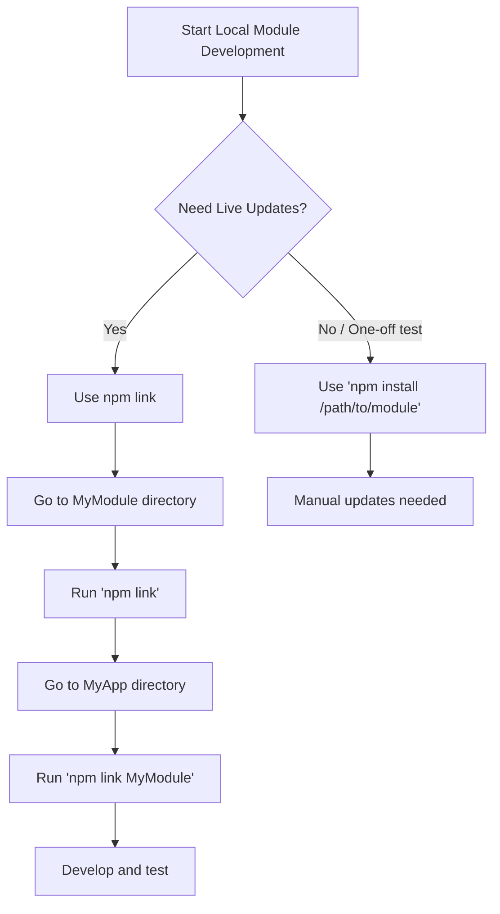

# How to Develop npm Modules Locally with `npm link`

When developing an application that relies on a custom npm module, a common challenge is setting up an efficient workflow for local development. Manually copying changes or repeatedly running `npm install /path/to/module` can be cumbersome and slow. This guide focuses on using `npm link` to create a seamless development experience, allowing you to make changes to your module and see them reflected instantly in your main application.

## Quick Answer

The most effective way to develop an npm module locally is by using `npm link`. This command creates symbolic links, allowing your main application to use a local version of your module as if it were installed from the npm registry.

1.  **In your module's directory (`MyModule`):**
    ```bash
    npm link
    ```
2.  **In your application's directory (`MyApp`):**
    ```bash
    npm link MyModule
    ```

This sets up a live link, so changes saved in `MyModule` are immediately available in `MyApp`.

## Choose Your Method

The `npm link` command is the primary and most recommended method for local npm module development. There are slight variations, but the core principle remains the same.




## Ready-to-Use Code

Here are the essential commands for setting up `npm link`:

### Step 1: Link Your Module Globally

Navigate to your module's root directory (e.g., `~/projects/MyModule`) and run:

```bash
cd ~/projects/MyModule
npm link
```

This command registers your `MyModule` with npm's global `node_modules` directory, creating a symbolic link from the global space to your local module's directory.

### Step 2: Link Your Application to the Global Module

Navigate to your application's root directory (e.g., `~/projects/MyApp`) and run:

```bash
cd ~/projects/MyApp
npm link MyModule
```

This command creates a symbolic link from your application's `node_modules` directory to the global link created in Step 1, which in turn points to your local `MyModule` directory.

### Alternative: Direct Relative Path Linking

For a slightly more direct approach, you can link using a relative path from your application's directory:

```bash
cd ~/projects/MyApp
npm link ../MyModule
```

This command directly links your application's `node_modules` to the local `MyModule` directory, bypassing the global link step. This can be simpler for closely located projects.

## Method 1: Using `npm link` (Recommended)

The `npm link` command is designed specifically for this use case. It creates a symlink (symbolic link) that allows your application to reference your local module directly.

### How it Works

1.  **Global Symlink Creation:** When you run `npm link` inside your module's directory, npm creates a global symlink. This symlink points from a location in npm's global package directory (e.g., `/usr/local/lib/node_modules/MyModule` on Unix-like systems) to your actual local module directory (e.g., `~/projects/MyModule`).
2.  **Local Symlink Creation:** When you run `npm link MyModule` inside your application's directory, npm creates another symlink. This one points from your application's `node_modules/MyModule` to the global symlink created in step 1.

The result is that any `require('MyModule')` or `import MyModule from 'MyModule'` statements in your application will resolve to your local `MyModule` directory. Any changes you save in `~/projects/MyModule` will be immediately available in `~/projects/MyApp` without needing to reinstall or copy files.

### Example Workflow

Let's assume your project structure is:

```
~/projects/
├── MyApp/
│   └── package.json
│   └── index.js
└── MyModule/
    └── package.json
    └── src/
        └── main.js
```

1.  **Prepare `MyModule`:**
    ```bash
    cd ~/projects/MyModule
    npm link
    ```
    You should see output similar to:
    ```
    /usr/local/lib/node_modules/mymodule -> /Users/youruser/projects/MyModule
    ```

2.  **Link `MyApp` to `MyModule`:**
    ```bash
    cd ~/projects/MyApp
    npm link MyModule
    ```
    This will create a `node_modules/MyModule` symlink in your `MyApp` directory.

Now, if `MyApp/index.js` contains `const myModule = require('MyModule');`, it will load `~/projects/MyModule/src/main.js` (or whatever your `main` entry point is in `MyModule/package.json`).

## Common Problems & Solutions

### 1. `npm link` not working or resolving correctly

*   **Problem:** After linking, changes aren't reflected, or the module isn't found.
*   **Solution:**
    *   Ensure you ran `npm link` in the module directory *first*, then `npm link <module-name>` in the app directory.
    *   Check the `node_modules` folder in your app. You should see `MyModule` as a symlink (often indicated by an arrow or different icon in file explorers).
    *   Sometimes, deleting `node_modules` and `package-lock.json` in `MyApp`, then running `npm install` followed by `npm link MyModule` again, can resolve issues.
    *   Verify the `name` field in `MyModule/package.json` matches the name you use in `npm link MyModule`.

### 2. Debugging linked modules

*   **Problem:** `console.log` is insufficient, and you want to use a debugger (e.g., VS Code).
*   **Solution:** Most modern debuggers (like VS Code's Node.js debugger) can follow symlinks.
    *   Set breakpoints directly in your `MyModule` source files.
    *   When running your `MyApp` with the debugger attached, the debugger should hit breakpoints in the linked `MyModule` code.
    *   Ensure your `MyApp`'s `launch.json` configuration is set up correctly for Node.js debugging.

### 3. Versioning conflicts with `npm link`

*   **Problem:** `npm link` bypasses version checks. If multiple applications need different versions of `MyModule`, `npm link` will always point to your single local development version.
*   **Solution:** `npm link` is primarily for *active development* of a single version. For testing different versions or in a microservice environment where strict versioning is critical, `npm link` is not suitable. In such cases, you might need to:
    *   Publish different versions to a private npm registry.
    *   Use tools like `yalc` (Yet Another Local Cache) which acts as a local npm registry, allowing you to "publish" local packages and "add" them to projects with versioning.
    *   Manually `npm install /path/to/module` for specific version testing, accepting the need to reinstall after changes.

### 4. Unlinking a module

*   **Problem:** You're done developing locally and want to revert to the published version.
*   **Solution:**
    1.  **In your application's directory (`MyApp`):**
        ```bash
        npm unlink MyModule
        ```
        This removes the symlink from `MyApp/node_modules`.
    2.  **In your module's directory (`MyModule`):**
        ```bash
        npm unlink
        ```
        This removes the global symlink.
    3.  After unlinking, you'll likely need to run `npm install` in `MyApp` to get the published version of `MyModule` back.

### 5. Checking linked dependencies

*   **Problem:** You want to see which modules are currently linked.
*   **Solution:**
    *   To see linked dependencies in your current project:
        ```bash
        npm ls --link
        ```
    *   To see all globally linked packages:
        ```bash
        npm ls --global --depth=0
        ```
        This will show you the global symlinks created by `npm link` in your module directories.

## Summary

`npm link` is an indispensable tool for local npm module development, providing a fast and efficient way to test changes without constant reinstallation. By understanding its two-step process and how to manage common issues, you can significantly streamline your development workflow. Remember to `npm unlink` when you're done with local development to revert to published versions.

---

## Image Generation Prompts

**PLACEHOLDER-1:** A clean, modern flowchart illustrating the `npm link` workflow. Start with "Start Local Module Development" (oval). Branch into "Need Live Updates?" (diamond). "Yes" path leads to "Use npm link" (rectangle), then "Go to MyModule directory" (rectangle), "Run 'npm link'" (rectangle), "Go to MyApp directory" (rectangle), "Run 'npm link MyModule'" (rectangle), and finally "Develop and test" (rectangle). The "No / One-off test" path from "Need Live Updates?" leads to "Use 'npm install /path/to/module'" (rectangle) and "Manual updates needed" (rectangle). Use a light color scheme with clear arrows and text.