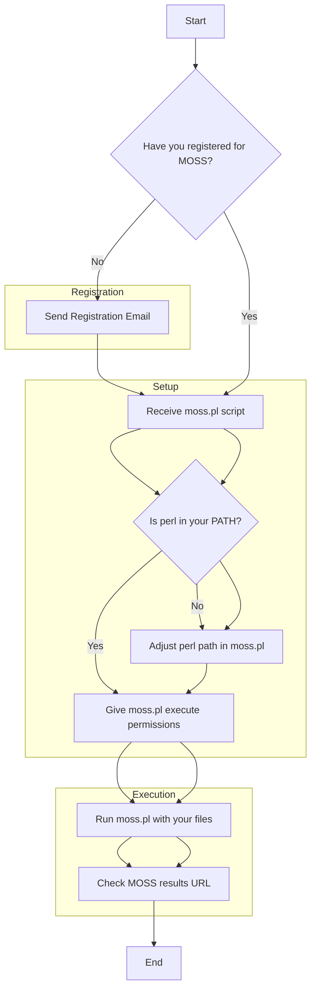

# How to Use the MOSS Plagiarism Detection Script on macOS

The MOSS (Measure Of Software Similarity) script is a powerful tool for detecting plagiarism in programming assignments. This guide will walk you through the steps to properly set up and use MOSS on your macOS system, addressing common issues like registration and script execution.

## Quick Answer

To use MOSS, you must first register by sending an email to `moss@moss.stanford.edu` with `registeruser` and your email in the body. Once registered, you'll receive a personalized `moss.pl` script. Ensure `perl` is in your system's PATH, give the script execute permissions (`chmod ug+x moss.pl`), and then run it with your files, e.g., `./moss.pl -l python file1.py file2.py`.

## Choose Your Method

Using the MOSS script primarily involves two stages: registration and execution. The main challenge often lies in ensuring the script is correctly set up and that you are a registered user.



## Ready-to-Use Code

Here are the essential commands you'll need for setting up and running MOSS.

### 1. Registering for MOSS

Send an email to `moss@moss.stanford.edu` with the following body:

```text
registeruser
mail "your_email@example.com"
```

Replace `"your_email@example.com"` with your actual email address. You will receive a `moss.pl` script in response.

### 2. Giving Execute Permissions

Once you have your `moss.pl` script, navigate to its directory in your terminal and run:

```bash
chmod ug+x moss.pl
```

### 3. Running the MOSS Script

To analyze Python files, for example:

```bash
./moss.pl -l python file_1.py file_2.py file_3.py
```

To analyze a directory (if your script supports it, check comments in `moss.pl`):

```bash
./moss.pl -l python -d assignment1/
```

## Method 1: Proper MOSS Registration and Script Acquisition

The most critical step often overlooked is proper registration. MOSS requires you to register your email address to receive a personalized script (`moss.pl`) that contains your unique user ID. Without this, the service will not process your submissions correctly.

1.  **Send Registration Email**: Compose an email to `moss@moss.stanford.edu`. The body of the email should contain:
    ```text
    registeruser
    mail "your_email@example.com"
    ```
    Replace `"your_email@example.com"` with the email address you wish to register.
    
2.  **Receive `moss.pl` Script**: After sending the registration email, you should receive a reply containing the `moss.pl` script. Save this file to a convenient location on your macOS system. This script will have your unique user ID embedded within it.

## Method 2: Script Setup and Permissions on macOS

Once you have the `moss.pl` script, you need to ensure it's executable and that your system can find the `perl` interpreter.

1.  **Verify Perl Path**: The `moss.pl` script is written in Perl. The very first line of the script typically specifies the path to the Perl interpreter (e.g., `#!/usr/bin/perl`). On macOS, `perl` is usually located at `/usr/bin/perl`. If your `perl` installation is in a different location, you might need to edit the first line of `moss.pl` to reflect the correct path.
    ```perl
    #!/usr/bin/perl
    # The rest of the MOSS script follows
    ```
    You can check your Perl path by typing `which perl` in your terminal.
2.  **Grant Execute Permissions**: Navigate to the directory where you saved `moss.pl` using your terminal. Then, grant execute permissions to the script:
    ```bash
    chmod ug+x moss.pl
    ```
    This command makes the script executable for the user and group, allowing you to run it directly.

## Method 3: Executing the MOSS Script and Interpreting Results

With the script registered and set up, you can now submit your files for plagiarism detection.

1.  **Submitting Files**:
    *   **Individual Files**: The most common way to submit files is by listing them directly after the language flag. For Python files:
        ```bash
        ./moss.pl -l python file_1.py file_2.py file_3.py file_4.py
        ```
    *   **Directories**: Some versions of the `moss.pl` script (or specific configurations) might support submitting an entire directory. Check the comments within your `moss.pl` script for usage instructions, especially regarding the `-d` flag. If supported, it might look like this:
        ```bash
        ./moss.pl -l python -d assignment1/
        ```
        The original question's attempt to use `-d` might have failed if the specific `moss.pl` version didn't support it or if the directory structure wasn't as expected by the script.
2.  **Understanding the Output**: When you run the script, you should see output similar to this:
    ```output
    Checking files . . .
    OK
    Uploading file_1.py ...done.
    Uploading file_2.py ...done.
    Query submitted.  Waiting for the server's response.
    http://moss.stanford.edu/results/123456789.
    ```
    The crucial part is the `http://moss.stanford.edu/results/` URL. This is where your plagiarism report will be available. If you only get "Checking files . . . OK" and no URL, it usually indicates a registration issue or an incorrect script.
    
3.  **Reviewing Results**: Open the provided URL in your web browser to view the detailed MOSS report, which highlights similarities between submitted files.

## Common Problems & Solutions

### Problem 1: "Checking files . . . OK" but no URL
*   **Cause**: This is the most common symptom of not being properly registered or using a generic script without your user ID. The MOSS server rejects submissions from unregistered users.
*   **Solution**: Ensure you have followed Method 1 precisely. You *must* receive the `moss.pl` script directly from Stanford after registration. The script you download from a public repository might not contain your user ID.

### Problem 2: Permission Denied when running `./moss.pl`
*   **Cause**: The script does not have execute permissions.
*   **Solution**: Run `chmod ug+x moss.pl` in your terminal from the directory where the script is located (as described in Method 2).

### Problem 3: `perl: command not found` or similar errors
*   **Cause**: The `perl` interpreter is not in your system's PATH, or the shebang line (`#!/usr/bin/perl`) in `moss.pl` points to an incorrect location.
*   **Solution**:
    1.  Check your Perl installation: `which perl`.
    2.  If `perl` is installed but in a different location (e.g., `/usr/local/bin/perl`), edit the first line of `moss.pl` to reflect the correct path.
    3.  If `perl` is not installed, you'll need to install it (though it's usually pre-installed on macOS).

### Problem 4: MOSS not detecting similarities even with identical files
*   **Cause**: This is almost always due to an issue with registration or the script not being correctly processed by the MOSS server. The "Checking files . . . OK" message can be misleading if no actual submission occurs.
*   **Solution**: Re-verify your registration and ensure you are using the `moss.pl` script provided by Stanford after your registration email. The problem description indicates this was the original issue, resolved by the user after receiving their official script.

## Summary

Successfully using the MOSS script on macOS involves a few critical steps:
1.  **Register** your email with Stanford to obtain your personalized `moss.pl` script.
2.  **Configure** the script by ensuring the correct Perl path and granting execute permissions.
3.  **Execute** the script with your target files, paying attention to the output for the results URL.

Always prioritize using the `moss.pl` script you receive directly from Stanford after registration, as it contains your unique identifier necessary for the service to function correctly.

---

## Image Generation Prompts

**PLACEHOLDER-1:** A screenshot of an email client (like Gmail or Outlook) showing a new email being composed. The recipient field should be `moss@moss.stanford.edu`. The subject line can be empty or "MOSS Registration". The email body should clearly display two lines of text: `registeruser` and `mail "your_email@example.com"` (with "your_email@example.com" highlighted or in a distinct color). The overall style should be clean and professional, resembling a modern email interface.

**PLACEHOLDER-2:** A terminal window on a macOS system. The window should show the output of a successful MOSS script execution. The output should include lines like:
`Checking files . . .`
`OK`
`Uploading file_1.py ...done.`
`Uploading file_2.py ...done.`
`Query submitted. Waiting for the server's response.`
`http://moss.stanford.edu/results/123456789.`
The URL should be clearly visible and highlighted. The terminal prompt should be visible before and after the command. The background of the terminal should be dark, with light text.