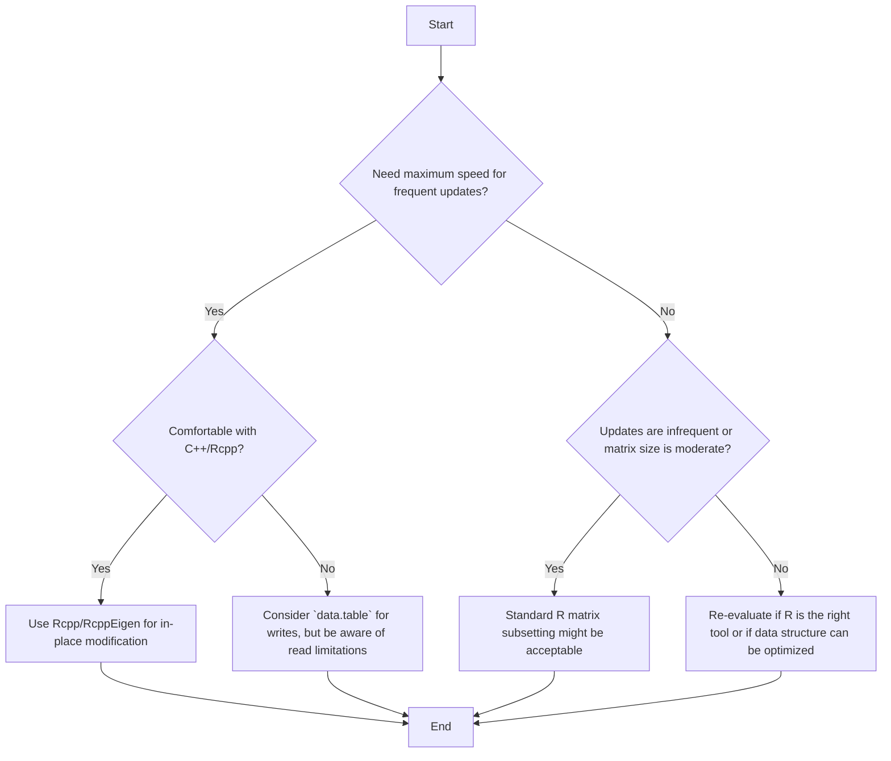

# Optimize R Matrix Subsetting: Fast Read/Write with Rcpp

## Quick Answer

For the fastest read and write operations to subsections of large R matrices, especially when frequent updates are needed, leverage `Rcpp` and C++ to perform in-place modifications. This bypasses R's copy-on-change semantics, offering substantial performance gains.

```r
# Example using RcppEigen (from Roland's solution)
library(RcppEigen)
library(inline)

# Define C++ code for in-place addition
incl <- '
using  Eigen::Map;
using  Eigen::MatrixXd;
using  Eigen::VectorXi;
typedef  Map<MatrixXd>  MapMatd;
typedef  Map<VectorXi>  MapVeci;
'
body <- '
MapMatd              A(as<MapMatd>(AA));
const MapMatd        B(as<MapMatd>(BB));
const MapVeci        ix(as<MapVeci>(ind));
const int            mB(B.cols());
for (int i = 0; i < mB; ++i)
{
A.col(ix.coeff(i)-1) += B.col(i);
}
'
funRcpp <- cxxfunction(signature(AA = "matrix", BB ="matrix", ind = "integer"),
                       body, "RcppEigen", incl)

# Example usage
K <- 100
V <- 100000
mat2 <- mat <- matrix(runif(K*V),nrow=K,ncol=V)
Vsub <- sample(1:V, 20)
toinsert <- matrix(runif(K*length(Vsub)), nrow=K, ncol=length(Vsub))

# Perform in-place addition using Rcpp function
invisible(funRcpp(mat2, toinsert, Vsub))

# Verify result (mat was modified by R's default, mat2 by Rcpp)
all.equal(mat, mat2) # Should be TRUE
```

## Problem Overview

When working with very large matrices in R (e.g., KxV where K is 5-1000 and V is 1000-1,000,000), frequent read and write operations to subsections can become a significant performance bottleneck. R's default behavior often involves "copy-on-change" semantics, meaning that when you modify a part of an object, R might create a full copy of the object before applying the change, which is expensive for large data structures.

The original question highlights this issue, particularly when updating sufficient statistics after processing each data point. While `data.table` offers fast write operations using `set()`, reading multiple columns efficiently for calculations before writing back is challenging.

## Choose Your Method

The best approach depends on your specific needs:



## Working Code Examples

The most effective solutions involve writing custom C++ functions that R can call, allowing for direct memory manipulation and avoiding R's overhead.

### Method 1: In-place Addition with RcppEigen

This method uses the `RcppEigen` package, which provides Rcpp bindings for the Eigen C++ template library for linear algebra. It allows for efficient matrix operations and in-place modification.

```r
library(RcppEigen)
library(inline) # For cxxfunction

# C++ header includes and type definitions
incl <- '
using  Eigen::Map;
using  Eigen::MatrixXd;
using  Eigen::VectorXi;
typedef  Map<MatrixXd>  MapMatd; // Map R matrix to Eigen MatrixXd
typedef  Map<VectorXi>  MapVeci; // Map R integer vector to Eigen VectorXi
'

# C++ function body
# AA: The matrix to be modified (passed by reference via Map)
# BB: The matrix to add (constant)
# ind: The column indices to modify (constant)
body <- '
MapMatd              A(as<MapMatd>(AA)); // Map AA to Eigen matrix A
const MapMatd        B(as<MapMatd>(BB)); // Map BB to Eigen matrix B
const MapVeci        ix(as<MapVeci>(ind)); // Map ind to Eigen vector ix
const int            mB(B.cols()); // Number of columns in B

// Loop through each column specified by 'ind'
for (int i = 0; i < mB; ++i)
{
    // Add column 'i' of B to the (ix[i]-1)-th column of A
    // ix.coeff(i)-1 is used because R indices are 1-based, C++ are 0-based
    A.col(ix.coeff(i)-1) += B.col(i);
}
'

# Compile the C++ function into an R function
funRcpp <- cxxfunction(signature(AA = "matrix", BB ="matrix", ind = "integer"),
                       body, "RcppEigen", incl)

# --- Example Usage ---
set.seed(94253)
K <- 100
V <- 100000
mat <- matrix(runif(K*V),nrow=K,ncol=V)
mat2 <- mat # Create a copy for Rcpp modification

Vsub <- sample(1:V, 20) # Subset of columns
toinsert <- matrix(runif(K*length(Vsub)), nrow=K, ncol=length(Vsub)) # Data to add

# R's default way (will likely involve copy-on-change)
mat_r_copy <- mat
mat_r_copy[,Vsub] <- mat_r_copy[,Vsub] + toinsert

# Rcpp in-place modification
invisible(funRcpp(mat2, toinsert, Vsub)) # 'invisible' prevents printing return value

# Verify that both methods yield the same result
all.equal(mat_r_copy, mat2)
```

### Method 2: In-place Assignment with C (memcpy)

This approach uses plain C and the `memcpy` function to directly copy memory blocks. It's more low-level than `RcppEigen` but offers fine-grained control and can be used for simple assignments. This function only performs assignment, not addition, so the addition must be done in R before calling the C function.

First, save the C code below into a file named `addCol.c`:

```c
#include <R.h>
#include <Rinternals.h>
#include <Rdefines.h>
#include <string.h> // For memcpy

SEXP addCol(SEXP mat, SEXP loc, SEXP matAdd)
{
  int i, nr = nrows(mat), nc = ncols(matAdd), ll = length(loc);

  // Input validation
  if(ll != nc)
    error("length(loc) must equal ncol(matAdd)");
  if(TYPEOF(mat) != TYPEOF(matAdd))
    error("mat and matAdd must be the same type");
  if(nr != nrows(matAdd))
    error("mat and matAdd must have the same number of rows");
  if(TYPEOF(loc) != INTSXP)
    error("loc must be integer");

  int *iloc = INTEGER(loc); // Get pointer to integer array for locations

  // Use a switch statement to handle different R data types (REALSXP for double, INTSXP for int)
  switch(TYPEOF(mat)) {
    case REALSXP: // For numeric (double) matrices
      for(i=0; i < ll; i++)
        // memcpy: destination, source, number of bytes
        // REAL(mat) gives pointer to the start of the matrix data
        // (iloc[i]-1)*nr calculates the offset for the start of the target column in 'mat'
        // i*nr calculates the offset for the start of the source column in 'matAdd'
        // nr*sizeof(double) is the size of one column in bytes
        memcpy(&(REAL(mat)[(iloc[i]-1)*nr]),
               &(REAL(matAdd)[i*nr]), nr*sizeof(double));
      break;
    case INTSXP: // For integer matrices
      for(i=0; i < ll; i++)
        memcpy(&(INTEGER(mat)[(iloc[i]-1)*nr]),
               &(INTEGER(matAdd)[i*nr]), nr*sizeof(int));
      break;
    default:
      error("unsupported type"); // Handle other types
  }
  return R_NilValue; // Return NULL from C to R
}
```

Then, compile and load this C code in R:

```r
# Compile the C code (run this in your R console or script)
# This creates a shared library (.so on Linux/macOS, .dll on Windows)
# You might need Rtools installed on Windows or developer tools on Linux/macOS
system("R CMD SHLIB addCol.c")

# Load the compiled function
addColC <- dyn.load("addCol.so")$addCol

# --- Example Usage ---
set.seed(94253)
K <- 100
V <- 100000
mat <- matrix(runif(K*V),nrow=K,ncol=V)
mat3 <- mat # Create a copy for C modification

Vsub <- sample(1:V, 20)
toinsert <- matrix(runif(K*length(Vsub)), nrow=K, ncol=length(Vsub))

# Calculate the values to assign in R first
values_to_assign <- mat3[,Vsub] + toinsert

# Call the C function for in-place assignment
.Call(addColC, mat3, Vsub, values_to_assign)

# Compare with R's default method (assuming mat_r_copy from previous example)
all.equal(mat_r_copy, mat3)
```

## Performance Comparison

The original question included `microbenchmark` results demonstrating the significant speedup achieved by C++ solutions compared to R's native matrix subsetting and `data.table` for multiple column operations.

| Expression                                     | Min (µs) | Median (µs) |
| :--------------------------------------------- | :------- | :---------- |
| `mat[, Vsub] <- mat[, Vsub] + toinsert` (R base) | 49.273   | 50.325      |
| `funRcpp(mat2, toinsert, Vsub)` (RcppEigen)    | 6.450    | 7.6605      |
| `data.table` (multiple columns)                | 4751.982 | 5087.376    |
| `data.table` (single column)                   | 6.737    | 9.304       |
| `Matrix Single Col` (R base)                   | 8.021    | 10.427      |

**Key Observations:**
*   **RcppEigen (`funRcpp`) is significantly faster** than R's base matrix operations for multiple column updates, often by an order of magnitude.
*   **`data.table`'s `set()` is very fast for single column updates**, comparable to Rcpp, but struggles with multiple columns when `with=FALSE` is used for reading.
*   The performance bottleneck is primarily the **assignment process**, which C/C++ can handle much more efficiently by modifying memory directly.


## Common Problems & Solutions

### 1. R's Copy-on-Change Semantics

*   **Problem**: R often creates a full copy of an object when a part of it is modified, especially if there are multiple references to the object. This is known as "copy-on-change" and can be very slow for large matrices.
*   **Solution**: Use `Rcpp` or C functions that directly manipulate memory. These functions can modify the R object "in-place," avoiding the expensive copying.
*   **Caveat**: As noted by Hadley Wickham, R *can* modify objects in place if there's only one reference to them. However, in interactive R sessions (like RStudio), RStudio itself might create additional references, forcing a copy. Within a function, if an object is passed and not referenced elsewhere, it might be modified in place. Using `pryr::address()` can help track memory addresses.

### 2. `data.table`'s `set()` Limitations for Reads

*   **Problem**: While `data.table::set()` is excellent for fast in-place writes, efficiently reading multiple columns for a calculation (e.g., `DT[,Vsub,with=FALSE]`) before writing back can be slow.
*   **Solution**: If your primary bottleneck is the read-modify-write cycle on multiple columns, `data.table` might not be the optimal choice compared to `Rcpp`. If you can structure your problem to update single columns, `data.table::set()` remains very fast.

### 3. Breaking R's Functional Paradigm

*   **Problem**: C/C++ functions that modify R objects in-place break R's typical functional programming paradigm where functions generally return new objects rather than modifying their inputs. This can lead to unexpected side effects if not handled carefully.
*   **Solution**: Be explicit in your documentation and code comments about which functions modify their arguments. Ensure that you understand the implications for your program's state. For example, the `invisible()` wrapper is often used when calling such functions to prevent R from printing the (usually NULL) return value.

## Real-World Use Cases

*   **Online Learning Algorithms**: Updating model parameters (e.g., sufficient statistics in Bayesian models, weights in neural networks) iteratively as new data points arrive.
*   **Simulation Studies**: Running large-scale simulations where matrix states need to be updated frequently and efficiently.
*   **High-Frequency Data Processing**: Financial or sensor data analysis where real-time updates to large data structures are critical.
*   **Image Processing**: Pixel-level manipulations on large image matrices.

## Related: Other R Optimization Techniques

*   **Vectorization**: Always prefer vectorized operations in R over explicit loops when possible.
*   **`data.table`**: For general data manipulation and aggregation on large datasets, `data.table` is often faster than base R data frames.
*   **`dplyr` / `tidyr`**: For readable and efficient data wrangling, though sometimes slower than `data.table` for extreme performance.
*   **Parallel Processing**: Use packages like `parallel` or `foreach` for computations that can be split across multiple cores.
*   **Memory Management**: Be mindful of object copies. Use `tracemem()` to track memory usage and identify where copies are being made.
*   **Profiling**: Use `Rprof()` or `profvis` to identify performance bottlenecks in your R code.

## Summary

Optimizing read and write operations to subsections of large matrices in R, especially for frequent updates, often requires moving beyond R's native capabilities. While `data.table` offers some performance gains, the most significant improvements come from integrating C++ code via `Rcpp` or direct C calls. These low-level solutions allow for in-place memory modification, bypassing R's copy-on-change semantics and dramatically reducing execution time. However, this comes with the responsibility of careful memory management and understanding the implications for R's functional paradigm.

---

## Image Generation Prompts

**PLACEHOLDER-1:** A bar chart comparing the performance (median time in microseconds) of different R matrix update methods. The bars should represent "R Base (Multiple Cols)", "RcppEigen (Multiple Cols)", "Data.table (Multiple Cols)", "Data.table (Single Col)", and "R Base (Single Col)". The RcppEigen bar should be significantly shorter than the others for multiple columns, and Data.table (Single Col) should be short as well. The Y-axis should be labeled "Median Time (microseconds)" and the X-axis "Method". Use a clean, modern design with distinct colors for each bar.