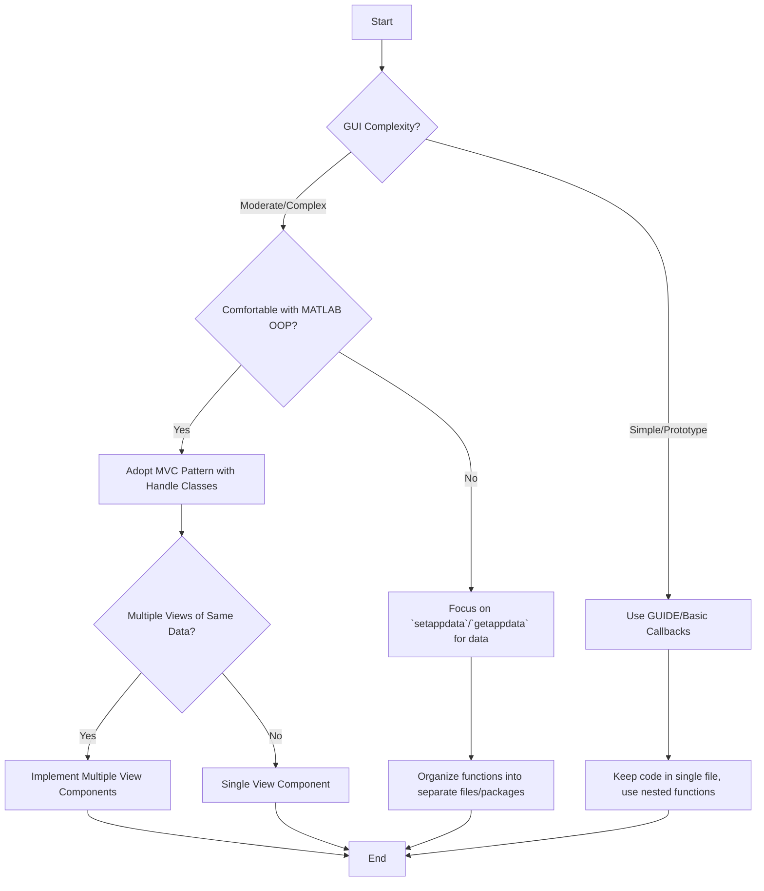

# Organizing MATLAB GUI Code with MVC and Best Practices

When developing sophisticated Graphical User Interfaces (GUIs) in MATLAB, organizing your code effectively is crucial for maintainability, scalability, and collaboration. While MATLAB's built-in GUI tools like GUIDE and `setappdata`/`guidata` offer quick solutions for simple interfaces, they can lead to "spaghetti code" in larger projects. This guide explores robust architectural patterns, data management strategies, and code organization techniques to build professional MATLAB GUIs.

## Quick Answer

The "right" way to organize complex MATLAB GUI code is to adopt an **Object-Oriented Programming (OOP)** approach, primarily using the **Model-View-Controller (MVC)** design pattern. This involves separating your application's data (Model), user interface (View), and logic (Controller) into distinct components, often implemented as MATLAB classes. For data storage, leverage `setappdata`/`getappdata` for efficiency, and consider using handle classes for large datasets to avoid unnecessary copying.

## Choose Your Method

Deciding on the best approach for your MATLAB GUI depends on its complexity, your comfort with OOP, and the desired level of maintainability.




## Model-View-Controller (MVC) Pattern

The MVC pattern is a widely recognized architectural pattern that separates an application into three main components:

*   **Model**: Manages the application's data, logic, and state. It is independent of the user interface.
*   **View**: Displays the model's data to the user and handles user input. It observes the model for changes.
*   **Controller**: Acts as an intermediary between the Model and View. It receives user input from the View, translates it into actions for the Model, and updates the View based on Model changes.

This separation makes the code more modular, testable, and easier to maintain.

### Implementing MVC in MATLAB

MATLAB's object-oriented features, especially handle classes and events, are well-suited for implementing MVC.

#### 1. The Model (Handle Class)

The Model should be a `handle` class to allow views and controllers to reference the same data without creating copies. It should expose observable properties for data that the GUI needs to display, allowing other components to listen for changes.

```matlab
classdef Model < handle
    %MODEL  Represents a signal composed of two components + white noise
    % with sampling frequency FS defined over t=[0,1] as:
    %   y(t) = a * sin(2pi * f*t) + sin(2pi * 2*f*t) + white_noise

    % Observable properties, listeners are notified on change
    properties (SetObservable = true)
        f       % frequency components in Hz
        a       % amplitude
    end

    % Read-only properties
    properties (SetAccess = private)
        fs      % sampling frequency (Hz)
        t       % time vector (seconds)
        noise   % noise component
    end

    % Computable dependent property
    properties (Dependent = true, SetAccess = private)
        data    % signal values
    end

    methods
        function obj = Model(fs, f, a)
            % Constructor
            if nargin < 3, a = 1.2; end
            if nargin < 2, f = 5; end
            if nargin < 1, fs = 100; end
            obj.fs = fs;
            obj.f = f;
            obj.a = a;

            % 1 time unit with 'fs' samples
            obj.t = 0 : 1/obj.fs : 1-(1/obj.fs);
            obj.noise = 0.2 * obj.a * rand(size(obj.t));
        end

        function y = get.data(obj)
            % Signal data
            y = obj.a * sin(2*pi * obj.f*obj.t) + ...
                sin(2*pi * 2*obj.f*obj.t) + obj.noise;
        end
    end

    % Business logic
    methods
        function [mx,freq] = computePowerSpectrum(obj)
            num = numel(obj.t);
            nfft = 2^(nextpow2(num));

            % Frequencies vector (symmetric one-sided)
            numUniquePts = ceil((nfft+1)/2);
            freq = (0:numUniquePts-1)*obj.fs/nfft;

            % Compute FFT
            fftx = fft(obj.data, nfft);

            % Calculate magnitude
            mx = abs(fftx(1:numUniquePts)).^2 / num;
            if rem(nfft, 2)
                mx(2:end) = mx(2:end)*2;
            else
                mx(2:end -1) = mx(2:end -1)*2;
            end
        end
    end
end
```

#### 2. The View (Function or Class)

The View is responsible for creating and displaying the GUI elements. It should listen for changes in the Model and update its display accordingly. It should *not* contain business logic. Views can be implemented as functions or classes.

```matlab
function handles = View_TimeDomain(m)
    %VIEW  a GUI representation of the signal model

    % Build the GUI
    handles = initGUI();
    onChangedF(handles, m);    % Populate with initial values

    % Observe on model changes and update view accordingly
    % (tie listener to model object lifecycle)
    addlistener(m, 'f', 'PostSet', ...
        @(o,e) onChangedF(handles,e.AffectedObject));
end

function handles = initGUI()
    % Initialize GUI controls
    hFig = figure('Menubar','none');
    hAx = axes('Parent',hFig, 'XLim',[0 1], 'YLim',[-2.5 2.5]);
    hSlid = uicontrol('Parent',hFig, 'Style','slider', ...
        'Min',1, 'Max',10, 'Value',5, 'Position',[20 20 200 20]);
    hLine = line('XData',NaN, 'YData',NaN, 'Parent',hAx, ...
        'Color','r', 'LineWidth',2);

    % Define a color property specific to the view
    hMenu = uicontextmenu;
    hMenuItem = zeros(3,1);
    hMenuItem(1) = uimenu(hMenu, 'Label','r', 'Checked','on');
    hMenuItem(2) = uimenu(hMenu, 'Label','g');
    hMenuItem(3) = uimenu(hMenu, 'Label','b');
    set(hLine, 'uicontextmenu',hMenu);

    % Customize
    xlabel(hAx, 'Time (sec)')
    ylabel(hAx, 'Amplitude')
    title(hAx, 'Signal in time-domain')

    % Return a structure of GUI handles
    handles = struct('fig',hFig, 'ax',hAx, 'line',hLine, ...
        'slider',hSlid, 'menu',hMenuItem);
end

function onChangedF(handles,model)
    % Respond to model changes by updating view
    if ~ishghandle(handles.fig), return, end
    set(handles.line, 'XData',model.t, 'YData',model.data)
    set(handles.slider, 'Value',model.f);
end
```

#### 3. The Controller (Function)

The Controller initializes the Model and View(s), and sets up callbacks to respond to user interactions in the View. These callbacks then update the Model, which in turn notifies the View(s).

```matlab
function [m,v1,v2] = Controller
    %CONTROLLER  main program

    % Controller knows about model and view
    m = Model(100);           % Model is independent
    v1 = View_TimeDomain(m);  % View has a reference of model

    % We can have multiple simultaneous views of the same data
    v2 = View_FrequencyDomain(m); % Assuming a similar View_FrequencyDomain exists

    % Hook up and respond to views events
    set(v1.slider, 'Callback',{@onSlide,m})
    set(v2.slider, 'Callback',{@onSlide,m})
    set(v1.menu, 'Callback',{@onChangeColor,v1})
    set(v2.menu, 'Callback',{@onChangeColor,v2})

    % Simulate some change
    pause(3)
    m.f = 10;
end

function onSlide(o,~,model)
    % Update model (which in turn triggers event that updates view)
    model.f = get(o,'Value');
end

function onChangeColor(o,~,handles)
    % Update view
    clr = get(o,'Label');
    set(handles.line, 'Color',clr)
    set(handles.menu, 'Checked','off')
    set(o, 'Checked','on')
end
```


## Data Management Strategies

Efficiently managing data is critical in MATLAB GUIs, especially when dealing with large datasets or multiple GUI components.

### `setappdata`/`getappdata` vs. `UserData` vs. `guidata`

*   **`UserData`**: A single property on any graphics object. It's limited to storing one variable, often a struct. Updating a single field requires retrieving, modifying, and re-setting the entire struct, which can be inefficient for large data.
*   **`setappdata`/`getappdata`**: These functions provide a more flexible and efficient way to store named properties on a figure or any graphics object. They are built-in functions, suggesting optimized access to the underlying `ApplicationData` property. They allow you to store multiple, heterogeneous properties without needing to manage a single large struct manually.
    *   **Performance**: MathWorks indicates that `setappdata`/`getappdata` are generally more efficient than `guidata` for large data because they can modify individual named properties without rewriting the entire data structure.
*   **`guidata`**: Primarily used with GUIDE-generated GUIs. It's a wrapper around `setappdata`/`getappdata` but stores all GUI handles and user data in a single struct under a special `ApplicationData` field (`'UsedByGUIData_m'`). This means any change to a single field requires rewriting the entire struct, leading to performance issues with large data.

**Recommendation**: Use `setappdata`/`getappdata` for storing application-specific data. For graphics handles, if not using an OOP approach, you can still use `guidata` or store them directly in a struct passed around. However, for complex GUIs, an OOP approach with class properties is superior.

### Handle Classes for Large Data

When your application deals with significant amounts of data, storing it directly in `guidata` or `setappdata` can lead to performance bottlenecks due to data copying. A better approach is to encapsulate large data within a `handle` class.

```matlab
% Example: A handle class for large data
classdef LargeDataStore < handle
    properties
        BigMatrix % A potentially large matrix
        Configuration % A struct of settings
    end

    methods
        function obj = LargeDataStore(initialMatrix)
            obj.BigMatrix = initialMatrix;
            obj.Configuration = struct('param1', 10, 'param2', 'value');
        end

        function updateMatrix(obj, newMatrix)
            obj.BigMatrix = newMatrix;
            % Perform some processing
        end
    end
end

% Usage:
% Create an instance of the handle class
myLargeData = LargeDataStore(rand(1000, 1000));

% Store the handle to this object in appdata
setappdata(hFig, 'LargeData', myLargeData);

% Later, retrieve the handle and modify the data directly
dataHandle = getappdata(hFig, 'LargeData');
dataHandle.updateMatrix(rand(1000, 1000)); % Modifies the original object
```
By storing only the *handle* to the `LargeDataStore` object in `appdata`, you avoid copying the entire `BigMatrix` every time you retrieve or update it.

## Code Organization and Directory Structure

For large MATLAB projects, a well-defined directory structure is essential.

*   **Package Folders (`+` prefix)**: Use package folders to group related functions and classes. This helps prevent name clashes and provides a clear namespace.
    ```
    +myApp
        +model
            Model.m
        +view
            View_TimeDomain.m
            View_FrequencyDomain.m
        +controller
            Controller.m
        +utils
            helperFunction1.m
            helperFunction2.m
        mainApp.m
    ```
*   **Class Folders (`@` prefix)**: If you have a class with many methods, you can put the class definition in a folder named `@ClassName` and each method in a separate `.m` file within that folder. This is less common with modern MATLAB OOP where all methods are typically defined within the `classdef` block.
*   **Separate Files for Callbacks**: While nested functions keep callbacks close to GUI creation, they limit reusability. For complex GUIs, define callbacks as separate functions (either private functions within a class or standalone functions in a `private` folder) and pass necessary data (like the Model handle) to them.

## Listeners vs. Callbacks

MATLAB's event system, using listeners, offers a powerful alternative to traditional callbacks, especially for decoupling components.

*   **Callbacks**: Directly linked to a GUI component's action (e.g., `ButtonPushedFcn`). They are good for immediate, component-specific actions.
*   **Listeners**: Allow objects to "listen" for events fired by other objects. This is particularly useful in an MVC pattern where the View listens for changes in the Model. When a Model property changes (e.g., `SetObservable = true` and `PostSet` event), the View's listener automatically triggers an update.

**Advantages of Listeners:**
*   **Decoupling**: The Model doesn't need to know which Views are observing it. Views simply register their interest.
*   **Modularity**: New Views can be added without modifying the Model or existing Views.
*   **Centralized Data Changes**: All data changes happen in the Model, and Views react to these changes.

```matlab
% In Model.m (as shown above)
properties (SetObservable = true)
    f       % frequency components in Hz
end

% In View_TimeDomain.m (as shown above)
addlistener(m, 'f', 'PostSet', ...
    @(o,e) onChangedF(handles,e.AffectedObject));
```
This `addlistener` line in the View ensures that whenever the `f` property of the Model `m` is set, the `onChangedF` function in the View is automatically called to update the display.

## GUI Layout Toolbox and App Designer

*   **GUI Layout Toolbox**: A highly recommended tool from MATLAB Central that simplifies creating flexible and resizable GUI layouts. It provides advanced containers and layout managers that are far superior to MATLAB's default layout capabilities.
*   **App Designer**: Introduced in MATLAB R2016a, App Designer is MathWorks' modern GUI development environment. It generates cleaner, object-oriented code compared to the older GUIDE. If starting a new GUI project, App Designer is often the preferred choice as it naturally encourages an object-oriented structure and simplifies event handling.

## Common Problems & Solutions

*   **Spaghetti Code**: Occurs when GUI logic, data management, and display updates are intertwined.
    *   **Solution**: Implement MVC. Separate concerns into distinct Model, View, and Controller components.
*   **Inefficient Data Passing**: Copying large data structures repeatedly between functions.
    *   **Solution**: Use `handle` classes for large data and pass handles. Leverage `setappdata`/`getappdata` for efficient storage of handles or smaller, independent data.
*   **Maintenance Nightmares**: Difficulty in tracking changes, debugging, and adding new features.
    *   **Solution**: Adopt OOP, use package folders for logical grouping, and employ listeners for decoupled updates.
*   **GUIDE-generated Code**: Often difficult to integrate into larger, well-structured applications.
    *   **Solution**: Use GUIDE only for visual layout (`.fig` file) and then load it programmatically (`hgload`) within your MVC View component, setting up callbacks and listeners manually. Or, preferably, use App Designer for new projects.

## Summary

Organizing complex MATLAB GUI code effectively requires moving beyond basic procedural approaches. By embracing Object-Oriented Programming, particularly the Model-View-Controller (MVC) pattern, developers can create modular, maintainable, and scalable applications. Key strategies include:

*   **Separating Concerns**: Distinguish between data (Model), presentation (View), and interaction logic (Controller).
*   **Efficient Data Management**: Utilize `setappdata`/`getappdata` for flexible data storage and `handle` classes for large datasets to avoid performance bottlenecks.
*   **Structured Codebase**: Employ package folders (`+`) to organize classes and functions, promoting reusability and preventing name conflicts.
*   **Event-Driven Communication**: Leverage MATLAB's event and listener system for decoupled communication between Model and View components.
*   **Modern Tools**: Consider App Designer for new projects and the GUI Layout Toolbox for advanced layout management.

Adopting these practices will transform your MATLAB GUI development from a potential "maintenance nightmare" into a robust and enjoyable process.

---

## Image Generation Prompts

**PLACEHOLDER-1:** A decision tree flowchart illustrating the process of choosing a MATLAB GUI organization method. Start with "GUI Complexity?" leading to "Simple/Prototype" (suggesting "GUIDE/Basic Callbacks") and "Moderate/Complex". "Moderate/Complex" then leads to "Comfortable with MATLAB OOP?". "No" leads to "Focus on `setappdata`/`getappdata` for data" and "Organize functions into separate files/packages". "Yes" leads to "Adopt MVC Pattern with Handle Classes". "Adopt MVC" then branches to "Multiple Views of Same Data?". "Yes" leads to "Implement Multiple View Components", and "No" leads to "Single View Component". All paths eventually lead to "End". Use clear, distinct boxes for decisions and actions, with arrows indicating flow.

**PLACEHEDER-2:** A clear, clean diagram illustrating the Model-View-Controller (MVC) architectural pattern specifically for MATLAB GUI. Show three distinct boxes labeled "Model", "View", and "Controller".
- **Model**: Contains "Data", "Business Logic", "Observable Properties".
- **View**: Contains "GUI Elements", "Displays Data", "Handles User Input", "Listens to Model Events".
- **Controller**: Contains "Initializes M & V", "Handles View Events", "Updates Model".
Draw arrows to show the flow:
- Controller initializes Model and View.
- View sends user input to Controller.
- Controller updates Model.
- Model notifies View of changes (via events/listeners).
- View updates its display based on Model changes.
Use MATLAB-specific icons or a subtle MATLAB theme if possible.