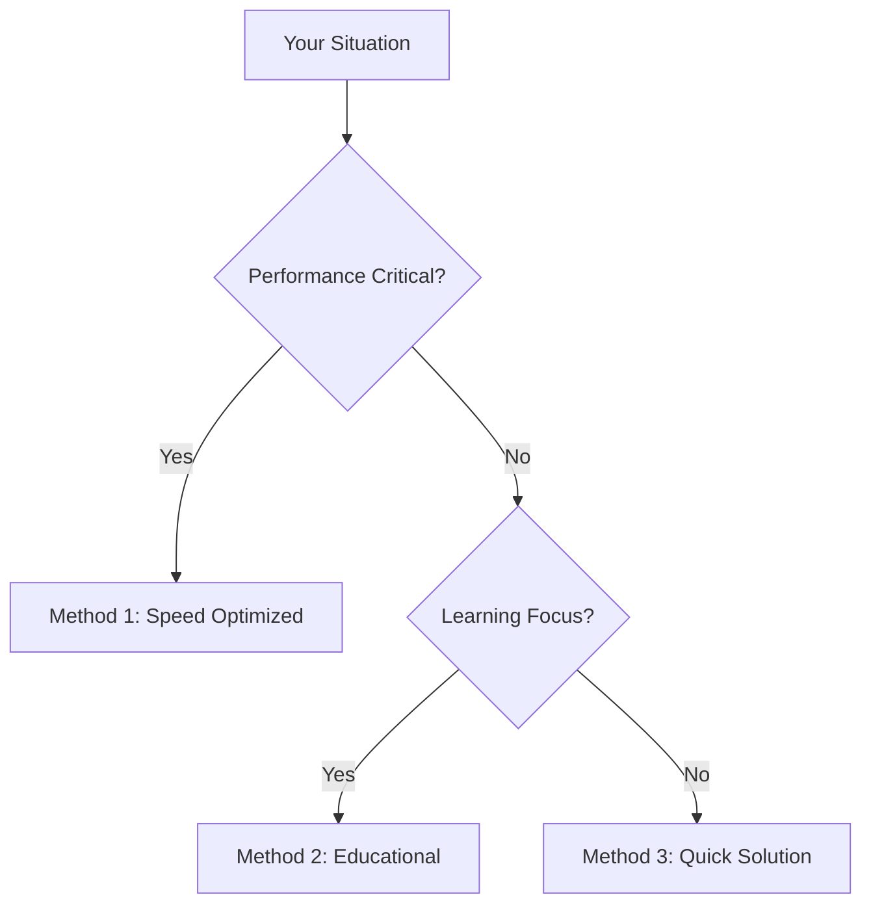

# Parse query string in JavaScript: Complete Guide with 6 Solutions

Query strings are a fundamental part of web development, allowing data to be passed between pages or to a server. Parsing these strings in JavaScript is a common task, whether you're building single-page applications, handling redirects, or integrating with third-party services. This comprehensive guide explores various methods for extracting information from query strings, catering to different needs and skill levels.

# # Quick Answer

For a fast, modern, and reliable way to parse query strings, especially when dealing with the current page's URL, the `URLSearchParams` API is the recommended approach. It's built-in, handles encoding/decoding automatically, and provides a clean interface.

```javascript
// Example 1: Get a single parameter from the current URL
// Assume current URL is: https://example.com/page?name=Alice&age=30
const urlParams = new URLSearchParams(window.location.search);
const name = urlParams.get('name');
console.log(`Name: ${name}`); // Output: Name: Alice

// Example 2: Get all parameters as an object
// Assume current URL is: https://example.com/page?product=laptop&color=silver&price=1200
const paramsObject = Object.fromEntries(urlParams.entries());
console.log('All parameters:', paramsObject);
// Output: All parameters: { product: 'laptop', color: 'silver', price: '1200' }

// Example 3: Iterate over parameters
// Assume current URL is: https://example.com/page?tag=js&tag=web&category=dev
for (const [key, value] of urlParams.entries()) {
    console.log(`${key}: ${value}`);
}
// Output:
// tag: js
// tag: web
// category: dev

// Example 4: Get all values for a specific parameter (e.g., multiple 'tag' parameters)
// Assume current URL is: https://example.com/page?tag=js&tag=web&category=dev
const tags = urlParams.getAll('tag');
console.log('Tags:', tags); // Output: Tags: ['js', 'web']

// Example 5: Parse a custom query string (not from current URL)
const customQueryString = '?city=London&country=UK&population=9000000';
const customParams = new URLSearchParams(customQueryString);
const city = customParams.get('city');
console.log(`City from custom string: ${city}`); // Output: City from custom string: London
```

# # Choose Your Method


# # Table of Contents
*   Ready-to-Use Code
*   Method 1: Using `URLSearchParams` (Modern & Robust) - *Speed Seeker, Problem Solver, Architecture Builder, Learning Explorer*
*   Method 2: Manual Parsing with String Methods (Educational & Legacy Compatible) - *Learning Explorer, Legacy Maintainer*
*   Method 3: Manual Parsing into an Object (Problem Solver & Architecture Builder) - *Problem Solver, Architecture Builder, Legacy Maintainer*
*   Method 4: Regular Expressions (Advanced & Concise) - *Speed Seeker, Architecture Builder*
*   Method 5: External Libraries (URI.js) (Architecture Builder & Output Focused) - *Architecture Builder, Output Focused*
*   Method 6: Simplified Regex for Single Parameter (Speed Seeker & Legacy Maintainer) - *Speed Seeker, Legacy Maintainer*
*   Performance Comparison
*   JavaScript Version Support
*   Common Problems & Solutions
*   Real-World Examples
*   Related JavaScript Functions
*   Summary
*   Frequently Asked Questions
*   Test Your Code

# # Ready-to-Use Code

Here's a collection of practical, copy-paste-ready code snippets covering the most common query string parsing scenarios.

```javascript
// Scenario 1: Get a specific parameter from the current URL using URLSearchParams
// URL: https://example.com/search?query=javascript+tutorial&page=2
const currentUrlParams = new URLSearchParams(window.location.search);
const searchQuery = currentUrlParams.get('query');
console.log(`Search Query: ${searchQuery}`); // Output: Search Query: javascript tutorial

// Scenario 2: Parse a custom query string into an object
// Query: ?user=John%20Doe&id=123&active=true
function parseCustomQueryString(queryString) {
    const params = new URLSearchParams(queryString);
    return Object.fromEntries(params.entries());
}
const customParamsObj = parseCustomQueryString('?user=John%20Doe&id=123&active=true');
console.log('Custom Params Object:', customParamsObj);
// Output: Custom Params Object: { user: 'John Doe', id: '123', active: 'true' }

// Scenario 3: Handle multiple parameters with the same name
// URL: https://example.com/products?category=electronics&category=books&sort=price
const multiValueParams = new URLSearchParams('?category=electronics&category=books&sort=price');
const categories = multiValueParams.getAll('category');
console.log('Categories:', categories); // Output: Categories: ['electronics', 'books']

// Scenario 4: Manual parsing for older browsers (ES5 compatible)
// Query: ?product=widget&color=blue
function getQueryVariableLegacy(variable) {
    const query = window.location.search.substring(1);
    const vars = query.split('&');
    for (let i = 0; i < vars.length; i++) {
        const pair = vars[i].split('=');
        if (decodeURIComponent(pair[0]) === variable) {
            return decodeURIComponent(pair[1] || '');
        }
    }
    return undefined; // Or null, or throw an error
}
// To test, imagine URL is: https://example.com/item?product=widget&color=blue
// console.log(`Legacy Product: ${getQueryVariableLegacy('product')}`); // Output: Legacy Product: widget

// Scenario 5: Check if a parameter exists
// URL: https://example.com/settings?darkMode=true
const settingsParams = new URLSearchParams('?darkMode=true&notifications');
const hasDarkMode = settingsParams.has('darkMode');
const hasNotifications = settingsParams.has('notifications');
console.log(`Has Dark Mode: ${hasDarkMode}`);     // Output: Has Dark Mode: true
console.log(`Has Notifications: ${hasNotifications}`); // Output: Has Notifications: true

// Scenario 6: Get a parameter that might not exist, with a default value
// URL: https://example.com/profile?id=user123
const profileParams = new URLSearchParams('?id=user123');
const userId = profileParams.get('id') || 'guest';
const theme = profileParams.get('theme') || 'light';
console.log(`User ID: ${userId}`);   // Output: User ID: user123
console.log(`Theme: ${theme}`);     // Output: Theme: light

// Scenario 7: Using a regular expression for a single known parameter
// Query: ?item=apple&quantity=5
function getSingleParamWithRegex(paramName, queryString) {
    const match = new RegExp(`[?&]${paramName}=([^&]*)`).exec(queryString);
    return match ? decodeURIComponent(match[1].replace(/\+/g, ' ')) : null;
}
const item = getSingleParamWithRegex('item', '?item=apple&quantity=5');
console.log(`Item (Regex): ${item}`); // Output: Item (Regex): apple

// Scenario 8: Building a query string from an object
const newParams = new URLSearchParams();
newParams.set('name', 'Jane Doe');
newParams.set('age', '28');
newParams.append('interests', 'coding');
newParams.append('interests', 'reading');
console.log(`New Query String: ${newParams.toString()}`);
// Output: New Query String: name=Jane+Doe&age=28&interests=coding&interests=reading
```

# # Method 1: Using `URLSearchParams` (Modern & Robust)

**User Personas:** *Speed Seeker, Problem Solver, Architecture Builder, Learning Explorer*

The `URLSearchParams` interface provides a powerful and standardized way to work with URL query strings. It's part of the Web APIs and is widely supported in modern browsers and Node.js environments. This is the **recommended approach** for most use cases due to its clarity, robustness, and automatic handling of URL encoding/decoding.

## # How it Works

You create an instance of `URLSearchParams` by passing it a query string (including or excluding the leading `?`). It then provides methods to `get()`, `getAll()`, `set()`, `append()`, `delete()`, `has()`, and iterate over parameters.

## # Advantages

*   **Standardized:** Part of the Web API, ensuring consistent behavior.
*   **Automatic Encoding/Decoding:** Handles `decodeURIComponent` and `encodeURIComponent` automatically.
*   **Handles Multiple Values:** `getAll()` easily retrieves all values for parameters with the same name (e.g., `?tag=js&tag=web`).
*   **Mutable:** You can modify the parameters and then convert them back to a string.
*   **Readability:** The API is intuitive and easy to understand.
*   **Performance:** Generally optimized for common use cases.

## # Disadvantages

*   **Browser Support:** While widely supported, it might require a polyfill for very old browsers (e.g., IE11).

## # Code Examples

```javascript
// Example 1.1: Get a single parameter from the current URL
// Assume current URL is: https://example.com/products?id=123&category=electronics
const currentParams = new URLSearchParams(window.location.search);
const productId = currentParams.get('id');
console.log(`Product ID: ${productId}`); // Output: Product ID: 123

// Example 1.2: Get a parameter from a custom query string
const customQuery = 'name=Alice%20Smith&age=30&city=New%20York';
const customSearchParams = new URLSearchParams(customQuery);
const userName = customSearchParams.get('name');
console.log(`User Name: ${userName}`); // Output: User Name: Alice Smith

// Example 1.3: Get all values for a repeated parameter
// Query: ?item=apple&color=red&item=banana&color=yellow
const repeatedParams = new URLSearchParams('item=apple&color=red&item=banana&color=yellow');
const items = repeatedParams.getAll('item');
const colors = repeatedParams.getAll('color');
console.log('Items:', items);   // Output: Items: ['apple', 'banana']
console.log('Colors:', colors); // Output: Colors: ['red', 'yellow']

// Example 1.4: Check if a parameter exists
const checkParams = new URLSearchParams('debug=true&mode=dev');
const hasDebug = checkParams.has('debug');
const hasEnv = checkParams.has('env');
console.log(`Has debug parameter: ${hasDebug}`); // Output: Has debug parameter: true
console.log(`Has env parameter: ${hasEnv}`);     // Output: Has env parameter: false

// Example 1.5: Iterate over all parameters
const iterateParams = new URLSearchParams('key1=value1&key2=value2&key3=value3');
console.log('Iterating over parameters:');
for (const [key, value] of iterateParams.entries()) {
    console.log(`  ${key}: ${value}`);
}
// Output:
//   key1: value1
//   key2: value2
//   key3: value3

// Example 1.6: Convert URLSearchParams to a plain JavaScript object
const objParams = new URLSearchParams('paramA=valA&paramB=valB&paramA=valC');
const paramsAsObject = Object.fromEntries(objParams.entries());
console.log('Parameters as Object:', paramsAsObject);
// Note: Object.fromEntries will only keep the last value for duplicate keys.
// Output: Parameters as Object: { paramA: 'valC', paramB: 'valB' }

// Example 1.7: Modify and then stringify URLSearchParams
const modifiableParams = new URLSearchParams('sort=asc&limit=10');
modifiableParams.set('sort', 'desc'); // Change existing
modifiableParams.append('filter', 'active'); // Add new
modifiableParams.delete('limit'); // Remove
console.log(`Modified Query String: ${modifiableParams.toString()}`);
// Output: Modified Query String: sort=desc&filter=active

// Example 1.8: Handling parameters without values (flags)
const flagParams = new URLSearchParams('verbose&debug=true&dryRun');
console.log(`Verbose: ${flagParams.get('verbose')}`); // Output: Verbose: '' (empty string)
console.log(`Dry Run: ${flagParams.get('dryRun')}`);   // Output: Dry Run: '' (empty string)
```

# # Method 2: Manual Parsing with String Methods (Educational & Legacy Compatible)

**User Personas:** *Learning Explorer, Legacy Maintainer*

This method involves using basic JavaScript string manipulation functions like `split()`, `substring()`, and `indexOf()` to manually parse the query string. It's a great way to understand the underlying mechanics of query string parsing and is compatible with very old JavaScript environments (ES5 and earlier).

## # How it Works

The core idea is to:
1.  Get the query string part of the URL (e.g., `window.location.search`).
2.  Remove the leading `?`.
3.  Split the string by `&` to get individual key-value pairs.
4.  For each pair, split by `=` to separate the key and value.
5.  Use `decodeURIComponent()` to handle URL-encoded characters.

## # Advantages

*   **High Compatibility:** Works in virtually any JavaScript environment, including very old browsers.
*   **Educational:** Helps in understanding string manipulation and URL structure.
*   **No Dependencies:** Pure vanilla JavaScript.

## # Disadvantages

*   **Verbosity:** Requires more lines of code compared to `URLSearchParams`.
*   **Error Prone:** Manual handling of edge cases (e.g., missing values, malformed pairs, duplicate keys) can be tricky.
*   **No Built-in Object Conversion:** You have to build the object yourself.
*   **Performance:** Can be less optimized than native APIs for complex strings.

## # Code Examples

```javascript
// Example 2.1: Basic function to get a single query variable
function getQueryVariable(variable) {
    const query = window.location.search.substring(1); // Remove '?'
    const vars = query.split('&');
    for (let i = 0; i < vars.length; i++) {
        const pair = vars[i].split('=');
        if (decodeURIComponent(pair[0]) === variable) {
            return decodeURIComponent(pair[1] || ''); // Handle cases like 'param=' or 'param'
        }
    }
    return undefined; // Return undefined if not found
}

// To test, imagine URL is: https://example.com/page?dest=aboutus.aspx&lang=en
// console.log(`Destination: ${getQueryVariable('dest')}`); // Output: Destination: aboutus.aspx
// console.log(`Language: ${getQueryVariable('lang')}`);   // Output: Language: en
// console.log(`Theme: ${getQueryVariable('theme')}`);     // Output: Theme: undefined

// Example 2.2: Getting a variable from a custom string
function getQueryVariableFromString(queryString, variable) {
    const query = queryString.startsWith('?') ? queryString.substring(1) : queryString;
    const vars = query.split('&');
    for (let i = 0; i < vars.length; i++) {
        const pair = vars[i].split('=');
        if (decodeURIComponent(pair[0]) === variable) {
            return decodeURIComponent(pair[1] || '');
        }
    }
    return undefined;
}
const customUrl = 'product=keyboard&price=75.99&currency=USD';
console.log(`Product: ${getQueryVariableFromString(customUrl, 'product')}`); // Output: Product: keyboard
console.log(`Price: ${getQueryVariableFromString(customUrl, 'price')}`);     // Output: Price: 75.99

// Example 2.3: Handling spaces encoded as '+' (common in older forms)
function getQueryVariableWithPlus(variable) {
    const query = window.location.search.substring(1);
    const vars = query.split('&');
    for (let i = 0; i < vars.length; i++) {
        const pair = vars[i].split('=');
        if (decodeURIComponent(pair[0]) === variable) {
            // Replace '+' with ' ' before decoding for values
            return decodeURIComponent(pair[1] ? pair[1].replace(/\+/g, ' ') : '');
        }
    }
    return undefined;
}
// To test, imagine URL is: https://example.com/search?q=hello+world&source=web
// console.log(`Search Query (with plus): ${getQueryVariableWithPlus('q')}`); // Output: Search Query (with plus): hello world

// Example 2.4: A more robust manual parser that returns an object (similar to Method 3)
function parseQueryStringToObjectManual(queryString) {
    const query = queryString.startsWith('?') ? queryString.substring(1) : queryString;
    const params = {};
    if (!query) return params;

    query.split('&').forEach(pair => {
        let [key, value] = pair.split('=').map(decodeURIComponent);
        key = key.replace(/\+/g, ' '); // Handle '+' for spaces in keys too, if needed
        value = value ? value.replace(/\+/g, ' ') : ''; // Handle '+' for spaces in values

        if (params.hasOwnProperty(key)) {
            if (Array.isArray(params[key])) {
                params[key].push(value);
            } else {
                params[key] = [params[key], value];
            }
        } else {
            params[key] = value;
        }
    });
    return params;
}
const manualParsed = parseQueryStringToObjectManual('?name=John%20Doe&age=30&tag=js&tag=web&city=New+York');
console.log('Manual Parsed Object:', manualParsed);
// Output: Manual Parsed Object: { name: 'John Doe', age: '30', tag: ['js', 'web'], city: 'New York' }

// Example 2.5: Getting a boolean flag (parameter without value)
function getBooleanFlag(flagName) {
    const query = window.location.search.substring(1);
    const vars = query.split('&');
    for (let i = 0; i < vars.length; i++) {
        const pair = vars[i].split('=');
        const key = decodeURIComponent(pair[0]);
        if (key === flagName) {
            // If there's no '=', it's a flag. If there is, check its value.
            return pair.length === 1 || decodeURIComponent(pair[1]).toLowerCase() === 'true';
        }
    }
    return false;
}
// To test, imagine URL is: https://example.com/settings?darkMode&notifications=false
// console.log(`Dark Mode Enabled: ${getBooleanFlag('darkMode')}`);       // Output: Dark Mode Enabled: true
// console.log(`Notifications Enabled: ${getBooleanFlag('notifications')}`); // Output: Notifications Enabled: false

// Example 2.6: Using reduce for a more functional approach (still manual)
function parseQueryReduce(queryString) {
    const query = queryString.startsWith('?') ? queryString.substring(1) : queryString;
    if (!query) return {};

    return query.split('&').reduce((acc, part) => {
        let [key, value] = part.split('=').map(decodeURIComponent);
        key = key.replace(/\+/g, ' ');
        value = value ? value.replace(/\+/g, ' ') : '';

        if (acc.hasOwnProperty(key)) {
            if (Array.isArray(acc[key])) {
                acc[key].push(value);
            } else {
                acc[key] = [acc[key], value];
            }
        } else {
            acc[key] = value;
        }
        return acc;
    }, {});
}
const reducedParsed = parseQueryReduce('?color=red&size=M&color=blue&material=cotton');
console.log('Reduced Parsed Object:', reducedParsed);
// Output: Reduced Parsed Object: { color: ['red', 'blue'], size: 'M', material: 'cotton' }
```

# # Method 3: Manual Parsing into an Object (Problem Solver & Architecture Builder)

**User Personas:** *Problem Solver, Architecture Builder, Legacy Maintainer*

This method builds upon the manual string manipulation by creating a function that returns a complete object containing all query parameters. This is often more convenient than repeatedly calling a function for each parameter, especially when you need to access multiple values. It also handles duplicate keys by storing them as arrays.

## # How it Works

Similar to Method 2, but instead of returning a single value, it iterates through all key-value pairs and populates a JavaScript object. It includes logic to handle:
*   URL decoding.
*   Parameters without values (flags).
*   Multiple parameters with the same name (e.g., `tag=js&tag=web`) by converting the value to an array.

## # Advantages

*   **Convenient:** Returns all parameters in a single, easy-to-access object.
*   **Handles Duplicates:** Can store multiple values for the same key as an array.
*   **Good for Legacy:** Works in older environments if `Object.fromEntries` or `URLSearchParams` are not available.
*   **Customizable:** You have full control over how parameters are processed.

## # Disadvantages

*   **More Code:** Requires more boilerplate than `URLSearchParams`.
*   **Manual Decoding:** Requires explicit `decodeURIComponent`.
*   **Potential for Bugs:** More complex logic means more potential for errors if not carefully implemented.

## # Code Examples

```javascript
// Example 3.1: Basic function to parse query string into an object
function parseQueryStringAsObject(queryString) {
    const query = queryString.startsWith('?') ? queryString.substring(1) : queryString;
    const params = {};
    if (!query) return params;

    query.split('&').forEach(part => {
        const [keyEncoded, valueEncoded] = part.split('=');
        const key = decodeURIComponent(keyEncoded.replace(/\+/g, ' ')); // Handle '+' for spaces
        const value = valueEncoded ? decodeURIComponent(valueEncoded.replace(/\+/g, ' ')) : ''; // Handle '+' and empty values

        if (params.hasOwnProperty(key)) {
            if (Array.isArray(params[key])) {
                params[key].push(value);
            } else {
                params[key] = [params[key], value];
            }
        } else {
            params[key] = value;
        }
    });
    return params;
}

// To test, imagine URL is: https://example.com/search?q=javascript+tutorial&page=2&tag=web&tag=programming
const currentUrlObject = parseQueryStringAsObject(window.location.search);
// console.log('Current URL Parameters:', currentUrlObject);
// Example output if URL was: ?q=javascript+tutorial&page=2&tag=web&tag=programming
// { q: 'javascript tutorial', page: '2', tag: ['web', 'programming'] }

// Example 3.2: Parsing a specific query string
const specificQuery = 'user=Jane%20Doe&id=456&status=active&roles=admin&roles=editor';
const parsedSpecific = parseQueryStringAsObject(specificQuery);
console.log('Specific Query Parameters:', parsedSpecific);
// Output: Specific Query Parameters: { user: 'Jane Doe', id: '456', status: 'active', roles: ['admin', 'editor'] }

// Example 3.3: Handling parameters without values (flags)
const flagQuery = '?debug&verbose=true&dryRun';
const parsedFlags = parseQueryStringAsObject(flagQuery);
console.log('Flag Parameters:', parsedFlags);
// Output: Flag Parameters: { debug: '', verbose: 'true', dryRun: '' }

// Example 3.4: Using the function with a full URL string
function parseFullUrlQuery(url) {
    const queryStringIndex = url.indexOf('?');
    if (queryStringIndex === -1) return {};
    const queryString = url.substring(queryStringIndex + 1);
    return parseQueryStringAsObject(queryString);
}
const fullUrl = 'https://api.example.com/data?format=json&version=2.0&auth_token=abc-123';
const parsedFullUrl = parseFullUrlQuery(fullUrl);
console.log('Full URL Query:', parsedFullUrl);
// Output: Full URL Query: { format: 'json', version: '2.0', auth_token: 'abc-123' }

// Example 3.5: A slightly more concise version using Array.prototype.reduce
const parseQueryReduce = (queryString) => {
    const query = queryString.startsWith('?') ? queryString.substring(1) : queryString;
    if (!query) return {};

    return query.split('&').reduce((acc, part) => {
        let [key, value] = part.split('=').map(s => decodeURIComponent(s.replace(/\+/g, ' ')));
        value = value === undefined ? '' : value; // Ensure value is always a string

        if (acc.hasOwnProperty(key)) {
            if (Array.isArray(acc[key])) {
                acc[key].push(value);
            } else {
                acc[key] = [acc[key], value];
            }
        } else {
            acc[key] = value;
        }
        return acc;
    }, {});
};
const reducedResult = parseQueryReduce('?param1=value1&param2=value2&param1=value3');
console.log('Reduced Result:', reducedResult);
// Output: Reduced Result: { param1: ['value1', 'value3'], param2: 'value2' }

// Example 3.6: Handling empty query strings
const emptyQuery = parseQueryStringAsObject('');
console.log('Empty Query Result:', emptyQuery); // Output: Empty Query Result: {}
const questionMarkOnly = parseQueryStringAsObject('?');
console.log('Question Mark Only Result:', questionMarkOnly); // Output: Question Mark Only Result: {}
```

# # Method 4: Regular Expressions (Advanced & Concise)

**User Personas:** *Speed Seeker, Architecture Builder*

Regular expressions offer a powerful and often concise way to extract patterns from strings. While `URLSearchParams` is generally preferred for robustness, a well-crafted regex can be extremely fast for specific parsing tasks, especially when you need to extract all parameters into an object.

## # How it Works

A regular expression is used to match key-value pairs within the query string. The `exec()` method of a regex can be called repeatedly to find all matches.

## # Advantages

*   **Concise:** Can be very compact for certain patterns.
*   **Potentially Fast:** For simple, well-defined patterns, regex can be very efficient.
*   **Flexible:** Can be tailored to very specific parsing requirements.

## # Disadvantages

*   **Complexity:** Regular expressions can be difficult to read, write, and debug, especially for complex patterns.
*   **Edge Cases:** Handling all possible query string edge cases (encoding, multiple values, flags, malformed strings) with a single regex can be extremely challenging and error-prone.
*   **Performance:** A poorly written or overly complex regex can be slower than string manipulation or native APIs.
*   **No Built-in Decoding:** Requires manual `decodeURIComponent`.

## # Code Examples

```javascript
// Example 4.1: Function to parse query string into an object using regex
function parseQueryStringWithRegex(queryString) {
    const params = {};
    // Regex to match key=value pairs, handling optional '?' at the start
    // and '+' for spaces, and allowing for keys/values without '='
    const regex = /[?&]([^=&]+)(?:=([^&]*))?/g;
    let match;

    // Ensure we're working with the actual query part
    const query = queryString.startsWith('?') ? queryString : `?${queryString}`;

    while ((match = regex.exec(query)) !== null) {
        const key = decodeURIComponent(match[1].replace(/\+/g, ' '));
        const value = match[2] ? decodeURIComponent(match[2].replace(/\+/g, ' ')) : ''; // Handle cases like 'param=' or 'param'

        if (params.hasOwnProperty(key)) {
            if (Array.isArray(params[key])) {
                params[key].push(value);
            } else {
                params[key] = [params[key], value];
            }
        } else {
            params[key] = value;
        }
    }
    return params;
}

// To test, imagine URL is: https://example.com/report?type=summary&date=2024-01-01&filter=active&filter=new
const regexParsedCurrent = parseQueryStringWithRegex(window.location.search);
// console.log('Regex Parsed Current URL:', regexParsedCurrent);
// Example output if URL was: ?type=summary&date=2024-01-01&filter=active&filter=new
// { type: 'summary', date: '2024-01-01', filter: ['active', 'new'] }

// Example 4.2: Parsing a custom query string with regex
const customRegexQuery = 'search=javascript+regex&page=1&sort=date&debug';
const parsedCustomRegex = parseQueryStringWithRegex(customRegexQuery);
console.log('Custom Regex Parsed:', parsedCustomRegex);
// Output: Custom Regex Parsed: { search: 'javascript regex', page: '1', sort: 'date', debug: '' }

// Example 4.3: Getting a single variable using a simpler regex (less robust for general parsing)
function getQueryVariableRegexSingle(variable, queryString) {
    // Escaping variable name for regex safety
    const escapedVariable = variable.replace(/[.*+?^${}()|[\]\\]/g, '\\$&');
    const regex = new RegExp(`(?:[?&]|&amp;)${escapedVariable}=([^&]*)`, 'i');
    const match = regex.exec(queryString);
    return match ? decodeURIComponent(match[1].replace(/\+/g, ' ')) : undefined;
}
const singleVarQuery = '?product=laptop&color=silver&size=15inch';
console.log(`Product (Single Regex): ${getQueryVariableRegexSingle('product', singleVarQuery)}`); // Output: Product (Single Regex): laptop
console.log(`Size (Single Regex): ${getQueryVariableRegexSingle('size', singleVarQuery)}`);       // Output: Size (Single Regex): 15inch

// Example 4.4: Regex for a full URL, extracting query string first
function parseFullUrlWithRegex(url) {
    const queryPartMatch = url.match(/\?([^#]*)/); // Get everything after '?' and before '#'
    if (!queryPartMatch) return {};
    return parseQueryStringWithRegex(queryPartMatch[1]);
}
const fullUrlRegex = 'https://example.com/path/to/resource?param1=value1&param2=value2#section';
const parsedFullUrlRegex = parseFullUrlWithRegex(fullUrlRegex);
console.log('Full URL Regex Parsed:', parsedFullUrlRegex);
// Output: Full URL Regex Parsed: { param1: 'value1', param2: 'value2' }

// Example 4.5: Handling empty query strings with regex
const emptyRegexResult = parseQueryStringWithRegex('');
console.log('Empty Regex Result:', emptyRegexResult); // Output: Empty Regex Result: {}
const questionMarkRegexResult = parseQueryStringWithRegex('?');
console.log('Question Mark Regex Result:', questionMarkRegexResult); // Output: Question Mark Regex Result: {}

// Example 4.6: Regex for specific parameter with potential multiple values (more complex)
function getQueryVariableRegexAll(variable, queryString) {
    const escapedVariable = variable.replace(/[.*+?^${}()|[\]\\]/g, '\\$&');
    const regex = new RegExp(`(?:[?&]|&amp;)${escapedVariable}=([^&]*)`, 'gi'); // 'g' for all matches
    const values = [];
    let match;
    while ((match = regex.exec(queryString)) !== null) {
        values.push(decodeURIComponent(match[1].replace(/\+/g, ' ')));
    }
    return values.length > 0 ? values : undefined;
}
const multiValueRegexQuery = '?tag=js&tag=web&category=dev';
console.log(`Tags (Regex All): ${getQueryVariableRegexAll('tag', multiValueRegexQuery)}`); // Output: Tags (Regex All): js,web
console.log(`Category (Regex All): ${getQueryVariableRegexAll('category', multiValueRegexQuery)}`); // Output: Category (Regex All): dev
```

# # Method 5: External Libraries (URI.js) (Architecture Builder & Output Focused)

**User Personas:** *Architecture Builder, Output Focused*

For complex URL manipulation, including parsing query strings, managing paths, and handling fragments, external libraries can provide a more comprehensive and robust solution. `URI.js` is a popular choice that offers a fluent API for all aspects of URL handling.

## # How it Works

You instantiate a `URI` object with a URL string. The library then provides methods like `query()` to access and manipulate the query string, often returning it as a JavaScript object.

## # Advantages

*   **Comprehensive:** Handles all aspects of URL parsing and building.
*   **Robust:** Thoroughly tested for edge cases and compliance with RFCs.
*   **Fluent API:** Chaining methods makes code readable and concise for complex operations.
*   **Cross-Browser:** Abstract away browser inconsistencies.
*   **Additional Features:** Includes normalization, relative path resolution, and more.

## # Disadvantages

*   **Dependency:** Adds an external library to your project, increasing bundle size.
*   **Overkill for Simple Tasks:** For just getting one parameter, it's more than what's needed.
*   **Learning Curve:** Requires learning the library's API.

## # Code Examples

First, you would need to include the URI.js library in your project. For example, via CDN or npm:
```html
<!-- Via CDN -->
<script src="https://cdnjs.cloudflare.com/ajax/libs/URI.js/1.19.11/URI.min.js"></script>
```
Or if using a module bundler:
```javascript
// npm install uri.js
import URI from 'urijs';
```

```javascript
// Example 5.1: Parse current page's query string into an object
// Assume current URL is: https://example.com/dashboard?user=admin&theme=dark
// var $_GET = URI(document.URL).query(true); // Original example from source
// console.log(`User from URI.js: ${$_GET['user']}`); // Output: User from URI.js: admin

// Since we can't directly use document.URL in a generic code block,
// we'll simulate it with a string.
const currentUrlSimulated = 'https://example.com/dashboard?user=admin&theme=dark&feature=beta';
const currentQs = URI(currentUrlSimulated).query(true);
console.log('URI.js Current Query:', currentQs);
console.log(`User: ${currentQs.user}`);     // Output: User: admin
console.log(`Theme: ${currentQs.theme}`);   // Output: Theme: dark

// Example 5.2: Parse a specific query string
const specificUriQuery = 'product=widget&color=blue&size=M';
const qsObject = URI('?' + specificUriQuery).query(true); // URI.js expects a full URL or a query string starting with '?'
console.log('URI.js Specific Query:', qsObject);
console.log(`Product: ${qsObject.product}`); // Output: Product: widget

// Example 5.3: Handling multiple values for the same parameter
const multiValueUri = 'https://example.com/items?tag=electronics&tag=sale&sort=price';
const multiQs = URI(multiValueUri).query(true);
console.log('URI.js Multi-Value Query:', multiQs);
// URI.js by default returns the last value for duplicate keys in query(true)
// To get all, you might need to iterate or use specific methods if available.
// For simple query(true), it behaves like Object.fromEntries.
// Output: URI.js Multi-Value Query: { tag: 'sale', sort: 'price' }

// Example 5.4: Building a query string
const newUri = URI('https://example.com/search');
newUri.addQuery('q', 'javascript');
newUri.addQuery('page', 3);
newUri.addQuery('sort', 'relevance');
console.log(`URI.js Built Query: ${newUri.toString()}`);
// Output: URI.js Built Query: https://example.com/search?q=javascript&page=3&sort=relevance

// Example 5.5: Modifying an existing query string
const modifyUri = URI('https://example.com/settings?theme=light&notifications=true');
modifyUri.setQuery('theme', 'dark'); // Change existing
modifyUri.removeQuery('notifications'); // Remove
modifyUri.addQuery('lang', 'es'); // Add new
console.log(`URI.js Modified Query: ${modifyUri.toString()}`);
// Output: URI.js Modified Query: https://example.com/settings?theme=dark&lang=es

// Example 5.6: Getting a specific parameter directly
const directParamUri = URI('https://example.com/profile?id=user123&view=compact');
const userId = directParamUri.query(true).id;
console.log(`Direct User ID: ${userId}`); // Output: Direct User ID: user123

// Example 5.7: Handling parameters without values (flags)
const flagUri = URI('https://example.com/debug?verbose&log=true');
const flagQs = flagUri.query(true);
console.log('URI.js Flag Query:', flagQs);
// Output: URI.js Flag Query: { verbose: '', log: 'true' }

// Example 5.8: Parsing a query string from a full URL and then accessing a specific parameter
const fullUrlWithQuery = 'https://www.mysite.com/default.aspx?dest=aboutus.aspx&param2=value2';
const qs = URI(fullUrlWithQuery).query(true);
console.log(`Destination from full URL: ${qs.dest}`); // Output: Destination from full URL: aboutus.aspx
```

# # Method 6: Simplified Regex for Single Parameter (Speed Seeker & Legacy Maintainer)

**User Personas:** *Speed Seeker, Legacy Maintainer*

For scenarios where you only need to extract a single, known query parameter and want the absolute minimum code, a very simple regular expression can be used. This method is less robust for general parsing but extremely efficient for its specific purpose.

## # How it Works

A regex is constructed to specifically look for `variableName=value` within the query string. It then captures the `value` part.

## # Advantages

*   **Extremely Concise:** Often a single line of code.
*   **Fast:** For its specific use case, it can be very quick as it doesn't need to parse the entire string.
*   **Legacy Compatible:** Works in older JavaScript environments.

## # Disadvantages

*   **Limited Scope:** Only suitable for extracting a single parameter.
*   **No Object Output:** Doesn't provide a structured object of all parameters.
*   **Manual Decoding:** Requires `decodeURIComponent`.
*   **Fragile:** Can be brittle if the query string format deviates even slightly (e.g., `&amp;` instead of `&`).
*   **Doesn't Handle Duplicates:** Will typically only return the first or last match depending on the regex.

## # Code Examples

```javascript
// Example 6.1: Get a single parameter using a simple regex
function getSingleQueryParam(paramName) {
    // Escaping paramName to prevent regex injection issues
    const escapedParamName = paramName.replace(/[.*+?^${}()|[\]\\]/g, '\\$&');
    const regex = new RegExp(`(?:[?&]|&amp;)${escapedParamName}=([^&]*)`, 'i');
    const match = regex.exec(window.location.search);
    return match ? decodeURIComponent(match[1].replace(/\+/g, ' ')) : null;
}

// To test, imagine URL is: https://example.com/item?id=product123&ref=homepage
// console.log(`Item ID: ${getSingleQueryParam('id')}`); // Output: Item ID: product123
// console.log(`Referrer: ${getSingleQueryParam('ref')}`); // Output: Referrer: homepage
// console.log(`Category: ${getSingleQueryParam('category')}`); // Output: Category: null

// Example 6.2: Simplified regex for a single parameter (from source)
// This version assumes the parameter is the ONLY one or the FIRST one,
// and doesn't handle multiple parameters well.
// var dest = location.search.replace(/^.*?\=/, ''); // Original source example
// This regex is very specific and might not work for all cases.
// It replaces everything up to the first '=' with an empty string.
// If the URL is `?dest=aboutus.aspx&param=value`, it would return `aboutus.aspx&param=value`.
// If the URL is `?param=value&dest=aboutus.aspx`, it would return `value&dest=aboutus.aspx`.
// It's generally not recommended for robust parsing.

// A more robust single-parameter regex:
function getSingleParamRobust(paramName, queryString) {
    const escapedParamName = paramName.replace(/[.*+?^${}()|[\]\\]/g, '\\$&');
    const regex = new RegExp(`(?:[?&])${escapedParamName}=([^&]*)`);
    const match = regex.exec(queryString);
    return match ? decodeURIComponent(match[1].replace(/\+/g, ' ')) : null;
}
const urlForSingleParam = '?dest=aboutus.aspx&lang=en&user=guest';
console.log(`Destination (Robust Single): ${getSingleParamRobust('dest', urlForSingleParam)}`); // Output: Destination (Robust Single): aboutus.aspx
console.log(`Language (Robust Single): ${getSingleParamRobust('lang', urlForSingleParam)}`);   // Output: Language (Robust Single): en
console.log(`Non-existent (Robust Single): ${getSingleParamRobust('theme', urlForSingleParam)}`); // Output: Non-existent (Robust Single): null

// Example 6.3: Handling parameters with no value (flags)
function getSingleFlagParam(flagName, queryString) {
    const escapedFlagName = flagName.replace(/[.*+?^${}()|[\]\\]/g, '\\$&');
    const regex = new RegExp(`(?:[?&])${escapedFlagName}(?=[&]|$)`); // Matches flag followed by & or end of string
    return regex.test(queryString);
}
const flagQueryString = '?debug&mode=test&verbose';
console.log(`Is debug flag present: ${getSingleFlagParam('debug', flagQueryString)}`);   // Output: Is debug flag present: true
console.log(`Is verbose flag present: ${getSingleFlagParam('verbose', flagQueryString)}`); // Output: Is verbose flag present: true
console.log(`Is prod flag present: ${getSingleFlagParam('prod', flagQueryString)}`);     // Output: Is prod flag present: false

// Example 6.4: Getting a parameter from a full URL string
function getSingleParamFromFullUrl(paramName, fullUrl) {
    const queryStringIndex = fullUrl.indexOf('?');
    if (queryStringIndex === -1) return null;
    const queryString = fullUrl.substring(queryStringIndex); // Keep '?' for regex
    return getSingleParamRobust(paramName, queryString);
}
const fullUrlExample = 'https://app.example.com/settings?user=admin&token=xyz123&env=prod';
console.log(`Token from full URL: ${getSingleParamFromFullUrl('token', fullUrlExample)}`); // Output: Token from full URL: xyz123

// Example 6.5: Handling encoded characters in the value
const encodedUrl = '?data=hello%20world%21&id=1';
console.log(`Decoded data: ${getSingleParamRobust('data', encodedUrl)}`); // Output: Decoded data: hello world!

// Example 6.6: Handling '+' for spaces in the value
const plusEncodedUrl = '?query=search+term+with+spaces&page=1';
console.log(`Decoded query: ${getSingleParamRobust('query', plusEncodedUrl)}`); // Output: Decoded query: search term with spaces
```

# # Performance Comparison

| Method                                      | Speed (Relative) | Compatibility (Oldest JS) | Complexity (Dev) | Robustness (Edge Cases) | Bundle Size |
| :------------------------------------------ | :--------------- | :------------------------ | :--------------- | :---------------------- | :---------- |
| **`URLSearchParams`**                       | Fast             | ES6 (Polyfill for IE11)   | Low              | High                    | Native      |
| **Manual Parsing (String Methods)**         | Medium           | ES5                       | Medium           | Medium                  | Zero        |
| **Manual Parsing (into Object)**            | Medium           | ES5                       | Medium-High      | Medium-High             | Zero        |
| **Regular Expressions (General)**           | Medium-Fast      | ES5                       | High             | Medium                  | Zero        |
| **External Libraries (e.g., URI.js)**       | Medium           | ES5 (Library dependent)   | Low (API usage)  | Very High               | Small       |
| **Simplified Regex (Single Parameter)**     | Very Fast        | ES5                       | Low              | Low                     | Zero        |

**Notes on Performance:**

*   **`URLSearchParams`** is generally the best balance of speed, robustness, and ease of use for modern applications. Native implementations are highly optimized.
*   **Manual Parsing** methods can be surprisingly fast for simple query strings, but their performance degrades with very long or complex strings due to repeated string operations and loop iterations.
*   **Regular Expressions** can be very fast for simple, targeted extractions. However, complex regex patterns can lead to "catastrophic backtracking" and become very slow. For general-purpose parsing, they are often less efficient and harder to maintain than `URLSearchParams`.
*   **External Libraries** introduce overhead due to their size and abstraction layers, but their internal parsing logic is usually well-optimized. The "cost" is typically in initial load time, not runtime performance for parsing.
*   **Simplified Regex** for a single parameter is often the fastest if you truly only need one specific value, as it avoids iterating through all parameters.

For most web applications, the performance difference between these methods will be negligible unless you are parsing extremely long query strings thousands of times per second. **Readability, maintainability, and correctness (handling edge cases) should often take precedence over micro-optimizations.**

# # JavaScript Version Support

| Feature / Method          | ES5 (IE9-11) | ES6+ (Modern Browsers) | Node.js (v6+) |
| :------------------------ | :----------- | :--------------------- | :------------ |
| `URLSearchParams`         | No (Polyfill) | Yes                    | Yes           |
| `String.prototype.split`  | Yes          | Yes                    | Yes           |
| `String.prototype.indexOf`| Yes          | Yes                    | Yes           |
| `String.prototype.substring`| Yes          | Yes                    | Yes           |
| `decodeURIComponent`      | Yes          | Yes                    | Yes           |
| `Array.prototype.forEach` | Yes          | Yes                    | Yes           |
| `Array.prototype.reduce`  | Yes          | Yes                    | Yes           |
| `Object.fromEntries`      | No           | Yes                    | Yes (v12+)    |
| `const`/`let`             | No           | Yes                    | Yes           |
| Arrow Functions (`=>`)    | No           | Yes                    | Yes           |
| `URI.js` (Library)        | Yes (via script tag) | Yes                    | Yes           |

**Key Takeaways:**

*   For maximum compatibility with older browsers (like IE11), stick to ES5 features. This means using `var` instead of `const`/`let`, traditional `function` declarations, and avoiding `URLSearchParams` or `Object.fromEntries` unless you include polyfills.
*   Modern JavaScript (ES6+) and Node.js environments fully support `URLSearchParams` and other convenient features, making it the preferred choice.
*   If you must support IE11 and don't want to use polyfills, the "Manual Parsing with String Methods" or "Manual Parsing into an Object" (carefully written with ES5 syntax) are your best bets.

# # Common Problems & Solutions

## # 1. URL Encoding/Decoding Issues

**Problem:** Query string values often contain special characters (spaces, `&`, `=`, `/`, etc.) that are URL-encoded (e.g., ` ` becomes `%20` or `+`). Failing to decode them results in incorrect values.

**Solution:** Always use `decodeURIComponent()` for values retrieved from the query string. Be mindful of `+` characters, which are sometimes used to represent spaces (though `%20` is standard).

```javascript
// Problematic:
const encodedValue = 'hello%20world%21';
console.log(encodedValue); // Output: hello%20world! (not decoded)

// Solution:
const decodedValue = decodeURIComponent(encodedValue);
console.log(decodedValue); // Output: hello world!

// Handling '+' for spaces (URLSearchParams does this automatically)
const plusEncoded = 'search+term';
const decodedPlus = decodeURIComponent(plusEncoded.replace(/\+/g, ' '));
console.log(decodedPlus); // Output: search term
```

## # 2. Parameters with No Values (Flags)

**Problem:** A query string might contain parameters without an `=` sign, acting as boolean flags (e.g., `?debug&verbose`).

**Solution:**
*   **`URLSearchParams`:** `get('debug')` will return an empty string `''` if the parameter exists without a value. `has('debug')` will return `true`.
*   **Manual Parsing:** Check if `pair.length === 1` after splitting by `=`.

```javascript
// Using URLSearchParams
const params = new URLSearchParams('?debug&mode=test');
console.log(`Debug value: '${params.get('debug')}'`); // Output: Debug value: ''
console.log(`Has debug: ${params.has('debug')}`);     // Output: Has debug: true

// Manual Parsing (from Method 3)
function parseQueryStringAsObject(queryString) {
    const query = queryString.startsWith('?') ? queryString.substring(1) : queryString;
    const params = {};
    if (!query) return params;
    query.split('&').forEach(part => {
        const [keyEncoded, valueEncoded] = part.split('=');
        const key = decodeURIComponent(keyEncoded.replace(/\+/g, ' '));
        // If valueEncoded is undefined, it's a flag, assign empty string
        const value = valueEncoded ? decodeURIComponent(valueEncoded.replace(/\+/g, ' ')) : '';
        params[key] = value;
    });
    return params;
}
const manualFlags = parseQueryStringAsObject('?debug&verbose=true');
console.log('Manual Flags:', manualFlags); // Output: Manual Flags: { debug: '', verbose: 'true' }
```

## # 3. Multiple Parameters with the Same Name

**Problem:** A query string can have multiple instances of the same parameter (e.g., `?tag=js&tag=web`). Standard object assignment would overwrite previous values.

**Solution:**
*   **`URLSearchParams`:** Use `getAll('tag')` to retrieve an array of all values.
*   **Manual Parsing:** When building the object, check if the key already exists. If it does, convert the existing value to an array and push the new value.

```javascript
// Using URLSearchParams
const params = new URLSearchParams('?tag=js&tag=web&category=dev');
const tags = params.getAll('tag');
console.log('Tags:', tags); // Output: Tags: ['js', 'web']

// Manual Parsing (from Method 3)
function parseQueryStringAsObjectWithArrays(queryString) {
    const query = queryString.startsWith('?') ? queryString.substring(1) : queryString;
    const params = {};
    if (!query) return params;
    query.split('&').forEach(part => {
        const [keyEncoded, valueEncoded] = part.split('=');
        const key = decodeURIComponent(keyEncoded.replace(/\+/g, ' '));
        const value = valueEncoded ? decodeURIComponent(valueEncoded.replace(/\+/g, ' ')) : '';

        if (params.hasOwnProperty(key)) {
            if (Array.isArray(params[key])) {
                params[key].push(value);
            } else {
                params[key] = [params[key], value];
            }
        } else {
            params[key] = value;
        }
    });
    return params;
}
const manualMulti = parseQueryStringAsObjectWithArrays('?item=apple&color=red&item=banana');
console.log('Manual Multi-value:', manualMulti); // Output: Manual Multi-value: { item: ['apple', 'banana'], color: 'red' }
```

## # 4. Malformed Query Strings

**Problem:** Query strings can be malformed (e.g., `key==value`, `key=`, `&key=value`, `key`).

**Solution:** Robust parsing functions (like `URLSearchParams` or well-tested libraries) handle these gracefully. Manual parsers need careful error checking and default assignments.

```javascript
// URLSearchParams is robust:
const malformedParams = new URLSearchParams('?a=1&&b=2&c=&d');
console.log(malformedParams.get('a')); // Output: 1
console.log(malformedParams.get('b')); // Output: 2
console.log(malformedParams.get('c')); // Output: ''
console.log(malformedParams.get('d')); // Output: ''
console.log(malformedParams.has('e')); // Output: false

// Manual parsing needs to be careful with `split('=')` results
// (already handled in Method 3 examples with `valueEncoded ? ... : ''`)
```

## # 5. Accessing Query String from Full URL

**Problem:** You have a full URL string, not just `window.location.search`, and need to extract the query part.

**Solution:** Use `String.prototype.indexOf('?')` and `String.prototype.substring()` to isolate the query string before parsing.

```javascript
function getQueryStringFromUrl(fullUrl) {
    const questionMarkIndex = fullUrl.indexOf('?');
    if (questionMarkIndex === -1) {
        return ''; // No query string
    }
    const hashIndex = fullUrl.indexOf('#', questionMarkIndex);
    if (hashIndex === -1) {
        return fullUrl.substring(questionMarkIndex);
    }
    return fullUrl.substring(questionMarkIndex, hashIndex);
}

const fullUrl = 'https://example.com/path/page?param1=value1&param2=value2#section';
const queryString = getQueryStringFromUrl(fullUrl);
console.log(`Extracted Query String: ${queryString}`); // Output: Extracted Query String: ?param1=value1&param2=value2

const params = new URLSearchParams(queryString);
console.log(`Param1: ${params.get('param1')}`); // Output: Param1: value1
```

# # Real-World Examples

## # 1. Dynamic Content Loading Based on URL

```javascript
// Scenario: A product page loads product details based on an 'id' parameter.
// URL: https://mystore.com/product.html?id=PROD123&category=electronics

function loadProductDetails() {
    const urlParams = new URLSearchParams(window.location.search);
    const productId = urlParams.get('id');
    const category = urlParams.get('category');

    if (productId) {
        console.log(`Loading details for Product ID: ${productId} in category: ${category}`);
        // Simulate fetching data
        fetch(`/api/products/${productId}`)
            .then(response => response.json())
            .then(data => {
                document.getElementById('product-title').textContent = data.name || `Product ${productId}`;
                document.getElementById('product-description').textContent = data.description || 'No description available.';
                document.getElementById('product-price').textContent = `$${data.price || 'N/A'}`;
                console.log('Product data loaded:', data);
            })
            .catch(error => console.error('Error loading product:', error));
    } else {
        console.log('No product ID found in URL. Displaying default content.');
        document.getElementById('product-title').textContent = 'Product Not Found';
        document.getElementById('product-description').textContent = 'Please provide a valid product ID.';
    }
}

// Assume HTML elements exist: <h1 id="product-title"></h1>, <p id="product-description"></p>, <span id="product-price"></span>
// Call this function on page load
// document.addEventListener('DOMContentLoaded', loadProductDetails);
// For demonstration:
const mockLocationSearch = '?id=PROD123&category=electronics';
const mockWindow = { location: { search: mockLocationSearch } };
const urlParams = new URLSearchParams(mockWindow.location.search);
const productId = urlParams.get('id');
const category = urlParams.get('category');
console.log(`[Mock] Loading details for Product ID: ${productId} in category: ${category}`);
```

## # 2. Filtering and Sorting Data in a Table

```javascript
// Scenario: A data table allows filtering by 'status' and sorting by 'column'.
// URL: https://myapp.com/data.html?status=active&sort=name&order=asc

function applyTableFiltersAndSort() {
    const urlParams = new URLSearchParams(window.location.search);
    const statusFilter = urlParams.get('status') || 'all';
    const sortBy = urlParams.get('sort') || 'id';
    const sortOrder = urlParams.get('order') || 'asc';

    console.log(`Applying filters: Status=${statusFilter}, SortBy=${sortBy}, Order=${sortOrder}`);

    // Simulate updating UI or fetching data
    // document.getElementById('status-dropdown').value = statusFilter;
    // document.getElementById('sort-column').value = sortBy;
    // document.getElementById('sort-order').value = sortOrder;
    // fetchData({ status: statusFilter, sortBy: sortBy, sortOrder: sortOrder });
}

// document.addEventListener('DOMContentLoaded', applyTableFiltersAndSort);
// For demonstration:
const mockLocationSearch2 = '?status=pending&sort=date&order=desc';
const mockWindow2 = { location: { search: mockLocationSearch2 } };
const urlParams2 = new URLSearchParams(mockWindow2.location.search);
const statusFilter2 = urlParams2.get('status') || 'all';
const sortBy2 = urlParams2.get('sort') || 'id';
const sortOrder2 = urlParams2.get('order') || 'asc';
console.log(`[Mock] Applying filters: Status=${statusFilter2}, SortBy=${sortBy2}, Order=${sortOrder2}`);
```

## # 3. A/B Testing or Feature Flags

```javascript
// Scenario: Enable a new UI feature based on a 'feature' flag in the URL.
// URL: https://myapp.com/home?feature=new-dashboard&variant=A

function initializeFeatures() {
    const urlParams = new URLSearchParams(window.location.search);
    const featureFlag = urlParams.get('feature');
    const variant = urlParams.get('variant');

    if (featureFlag === 'new-dashboard') {
        console.log(`Enabling new dashboard feature. Variant: ${variant || 'default'}`);
        // document.getElementById('old-dashboard').style.display = 'none';
        // document.getElementById('new-dashboard').style.display = 'block';
    } else {
        console.log('Using old dashboard.');
        // document.getElementById('old-dashboard').style.display = 'block';
        // document.getElementById('new-dashboard').style.display = 'none';
    }
}

// document.addEventListener('DOMContentLoaded', initializeFeatures);
// For demonstration:
const mockLocationSearch3 = '?feature=new-dashboard&variant=B';
const mockWindow3 = { location: { search: mockLocationSearch3 } };
const urlParams3 = new URLSearchParams(mockWindow3.location.search);
const featureFlag3 = urlParams3.get('feature');
const variant3 = urlParams3.get('variant');
console.log(`[Mock] Initializing features: Feature=${featureFlag3}, Variant=${variant3}`);
```

## # 4. Pre-filling Form Fields

```javascript
// Scenario: A registration form can be pre-filled from URL parameters.
// URL: https://myapp.com/register?email=test@example.com&name=John%20Doe

function prefillForm() {
    const urlParams = new URLSearchParams(window.location.search);
    const email = urlParams.get('email');
    const name = urlParams.get('name');

    if (email) {
        console.log(`Prefilling email: ${email}`);
        // document.getElementById('email-input').value = email;
    }
    if (name) {
        console.log(`Prefilling name: ${name}`);
        // document.getElementById('name-input').value = name;
    }
}

// document.addEventListener('DOMContentLoaded', prefillForm);
// For demonstration:
const mockLocationSearch4 = '?email=user@domain.com&name=Alice%20Wonderland';
const mockWindow4 = { location: { search: mockLocationSearch4 } };
const urlParams4 = new URLSearchParams(mockWindow4.location.search);
const email4 = urlParams4.get('email');
const name4 = urlParams4.get('name');
console.log(`[Mock] Prefilling form: Email=${email4}, Name=${name4}`);
```

## # 5. Tracking and Analytics

```javascript
// Scenario: Capture UTM parameters for analytics.
// URL: https://myapp.com/landing?utm_source=google&utm_medium=cpc&utm_campaign=summer_sale

function trackUtmParameters() {
    const urlParams = new URLSearchParams(window.location.search);
    const utmSource = urlParams.get('utm_source');
    const utmMedium = urlParams.get('utm_medium');
    const utmCampaign = urlParams.get('utm_campaign');

    if (utmSource || utmMedium || utmCampaign) {
        const trackingData = {
            source: utmSource,
            medium: utmMedium,
            campaign: utmCampaign
        };
        console.log('Tracking UTM data:', trackingData);
        // Send to analytics platform (e.g., Google Analytics, custom backend)
        // analytics.trackEvent('page_view', trackingData);
    } else {
        console.log('No UTM parameters found.');
    }
}

// document.addEventListener('DOMContentLoaded', trackUtmParameters);
// For demonstration:
const mockLocationSearch5 = '?utm_source=facebook&utm_medium=social&utm_campaign=spring_promo';
const mockWindow5 = { location: { search: mockLocationSearch5 } };
const urlParams5 = new URLSearchParams(mockWindow5.location.search);
const utmSource5 = urlParams5.get('utm_source');
const utmMedium5 = urlParams5.get('utm_medium');
const utmCampaign5 = urlParams5.get('utm_campaign');
console.log(`[Mock] Tracking UTM data: Source=${utmSource5}, Medium=${utmMedium5}, Campaign=${utmCampaign5}`);
```

# # Related JavaScript Functions

When working with query strings, several other JavaScript functions and APIs are often used in conjunction:

*   **`window.location.search`**: The primary source for the current page's query string. Returns the query string including the leading `?`.
    ```javascript
    console.log(window.location.search); // e.g., "?param1=value1&param2=value2"
    ```
*   **`window.location.href`**: The entire URL of the current page. Useful if you need to parse a full URL string.
    ```javascript
    console.log(window.location.href); // e.g., "https://example.com/page?param1=value1"
    ```
*   **`window.location.origin`**: Returns the protocol, hostname and port number of the URL.
    ```javascript
    console.log(window.location.origin); // e.g., "https://example.com"
    ```
*   **`encodeURIComponent()`**: Encodes a URI component. Use this when *creating* query string values to ensure special characters are handled correctly.
    ```javascript
    const rawValue = "my value with spaces & symbols!";
    const encodedValue = encodeURIComponent(rawValue);
    console.log(encodedValue); // Output: "my%20value%20with%20spaces%20%26%20symbols%21"
    ```
*   **`decodeURIComponent()`**: Decodes a URI component. Essential for retrieving correct values from a parsed query string.
    ```javascript
    const encoded = "my%20value%20with%20spaces%20%26%20symbols%21";
    const decoded = decodeURIComponent(encoded);
    console.log(decoded); // Output: "my value with spaces & symbols!"
    ```
*   **`URL` API**: The `URL` constructor can parse an entire URL string and provides properties like `search`, `pathname`, `hostname`, etc. `URLSearchParams` is often used in conjunction with `new URL()`.
    ```javascript
    const url = new URL('https://example.com/path?name=Alice&age=30#section');
    console.log(url.search);    // Output: "?name=Alice&age=30"
    console.log(url.pathname);  // Output: "/path"
    console.log(url.hash);      // Output: "#section"
    const params = new URLSearchParams(url.search);
    console.log(params.get('name')); // Output: "Alice"
    ```
*   **`history.pushState()` / `history.replaceState()`**: Used to modify the URL in the browser's address bar without causing a full page reload. This is crucial for single-page applications that update query parameters dynamically.
    ```javascript
    // Example: Add a 'page' parameter to the URL
    const currentParams = new URLSearchParams(window.location.search);
    currentParams.set('page', '2');
    const newUrl = `${window.location.pathname}?${currentParams.toString()}${window.location.hash}`;
    history.pushState({ path: newUrl }, '', newUrl);
    console.log('URL updated to:', newUrl);
    ```

# # Summary

Choosing the right method for parsing query strings in JavaScript depends heavily on your project's specific requirements, target browser compatibility, and personal preference for code style.

*   **Speed Seeker:** For modern environments, `URLSearchParams` is fast and efficient. For single, known parameters in legacy contexts, a simplified regex can be the quickest.
*   **Learning Explorer:** Manual parsing with `split()` and `substring()` is excellent for understanding the fundamentals. `URLSearchParams` offers a clear, high-level API to learn modern practices.
*   **Problem Solver:** `URLSearchParams` provides a robust, copy-paste solution that handles most common scenarios without fuss.
*   **Architecture Builder:** `URLSearchParams` is the go-to for maintainable, scalable code in modern applications. For highly complex URL management, an external library like URI.js might be considered.
*   **Output Focused:** `URLSearchParams` offers clean methods for both parsing and building query strings, making it easy to control the output format. External libraries also excel here.
*   **Legacy Maintainer:** Manual parsing with string methods (carefully written in ES5) is the safest bet for maximum compatibility without polyfills.

In 2025, for most new projects targeting modern browsers and Node.js, **`URLSearchParams` is the unequivocally recommended method**. It offers the best balance of features, performance, and ease of use, abstracting away the complexities of URL encoding and edge cases. Only resort to manual parsing or external libraries if you have very specific, compelling reasons (e.g., extreme legacy support without polyfills, or highly specialized URL manipulation