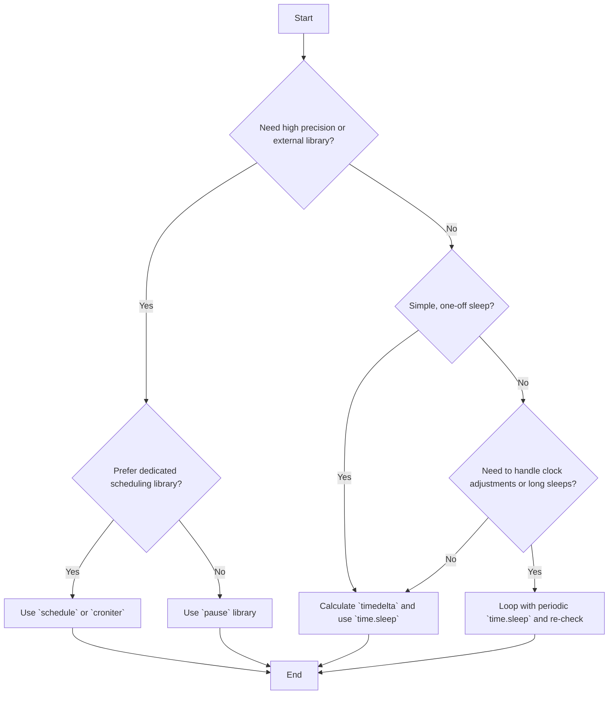

# Python Thread Sleep Until Specific Time

When developing Python applications, you often encounter scenarios where a thread needs to pause execution until a precise future moment, rather than for a fixed duration. This is common for scheduled tasks, background processes, or synchronization. While `time.sleep(NUM)` pauses for `NUM` seconds, sleeping until a specific clock time (e.g., 2 AM) requires calculating the time difference.

This guide explores various Pythonic ways to achieve this, from manual calculations using `datetime` to leveraging specialized libraries, addressing common pitfalls and providing practical examples.

## Quick Answer

To make a Python thread sleep until a specific time, calculate the difference between the target time and the current time, then use `time.sleep()` with that duration.

```python
import time
import datetime

def sleep_until_specific_time(target_hour, target_minute):
    now = datetime.datetime.now()
    target_time = datetime.datetime(now.year, now.month, now.day, target_hour, target_minute, 0)

    if now > target_time:
        # If target time has already passed today, set it for tomorrow
        target_time += datetime.timedelta(days=1)

    time_to_sleep = (target_time - now).total_seconds()
    print(f"Sleeping for {time_to_sleep:.2f} seconds until {target_time}...")
    time.sleep(time_to_sleep)
    print("Woke up!")

# Example: Sleep until 2 AM
# sleep_until_specific_time(2, 0)
```

## Choose Your Method

The best approach depends on your specific needs regarding precision, external dependencies, and complexity.



## Ready-to-Use Code

Here are some of the most effective and commonly used solutions for sleeping until a specific time.

### 1. Using `datetime` and `time.sleep` (Manual Calculation)

This is the most fundamental approach, using Python's built-in `datetime` module to calculate the exact duration to sleep.

```python
import time
import datetime

def sleep_until(hour, minute):
    """
    Sleeps the current thread until a specified hour and minute.
    If the target time has already passed today, it sleeps until the next day.
    """
    now = datetime.datetime.now()
    target_time = datetime.datetime(now.year, now.month, now.day, hour, minute, 0)

    # If the target time has already passed today, set it for tomorrow
    if now > target_time:
        target_time += datetime.timedelta(days=1)

    time_to_sleep = (target_time - now).total_seconds()
    print(f"Current time: {now}")
    print(f"Target time: {target_time}")
    print(f"Sleeping for {time_to_sleep:.2f} seconds...")
    time.sleep(time_to_sleep)
    print(f"Woke up at: {datetime.datetime.now()}")

# Example: Sleep until 2 AM
# sleep_until(2, 0)

# Example: Sleep until 10:30 PM
# sleep_until(22, 30)
```

### 2. Using the `pause` library

The `pause` library simplifies sleeping until a specific `datetime` object. It handles the calculation internally and can offer more robust behavior for clock adjustments (though this is not explicitly stated in its documentation, it's a common feature of such libraries).

First, install the library:
```bash
pip install pause
```

Then, use it in your code:
```python
import pause
from datetime import datetime, timedelta

def sleep_with_pause_library(target_hour, target_minute):
    """
    Sleeps the current thread until a specified hour and minute using the pause library.
    If the target time has already passed today, it sleeps until the next day.
    """
    now = datetime.now()
    target_datetime = datetime(now.year, now.month, now.day, target_hour, target_minute, 0)

    if now > target_datetime:
        target_datetime += timedelta(days=1)

    print(f"Current time: {now}")
    print(f"Target time: {target_datetime}")
    print(f"Sleeping until {target_datetime} using pause library...")
    pause.until(target_datetime)
    print(f"Woke up at: {datetime.now()}")

# Example: Sleep until 2 AM
# sleep_with_pause_library(2, 0)
```

### 3. Logarithmically Decreasing Sleep (for precision and responsiveness)

For scenarios where you need to wake up very close to the target time and potentially react to clock changes, a loop with decreasing sleep intervals can be effective. This avoids sleeping for a very long, fixed duration which might miss the exact wake-up time if the system clock changes or if the process is delayed.

```python
import time
from datetime import datetime, timedelta

def wait_until_logarithmic(end_datetime):
    """
    Waits until the specified end_datetime, using logarithmically decreasing sleep intervals.
    This provides better responsiveness near the target time.
    """
    print(f"Current time: {datetime.now()}")
    print(f"Target time: {end_datetime}")
    while True:
        diff = (end_datetime - datetime.now()).total_seconds()
        if diff <= 0:
            print(f"Woke up at: {datetime.now()}")
            return # Target time reached or passed

        # Sleep for a fraction of the remaining time, but not too long
        # This makes the sleep intervals shorter as we get closer to the target
        sleep_duration = diff / 2
        if sleep_duration > 60: # Cap max sleep to avoid very long initial sleeps
            sleep_duration = 60
        elif sleep_duration < 0.01: # Ensure a minimum sleep to avoid busy-waiting
            sleep_duration = 0.01

        print(f"Sleeping for {sleep_duration:.3f} seconds (remaining: {diff:.3f})...")
        time.sleep(sleep_duration)

# Example: Sleep until 2 AM tomorrow
# now = datetime.now()
# target_tomorrow_2am = datetime(now.year, now.month, now.day, 2, 0)
# if now > target_tomorrow_2am:
#     target_tomorrow_2am += timedelta(days=1)
# wait_until_logarithmic(target_tomorrow_2am)
```

## Method 1: Calculating Sleep Duration with `datetime`

This is the most common and recommended approach for its simplicity and reliance on standard library modules.

### How it Works

1.  **Get Current Time:** Use `datetime.datetime.now()` to get the current date and time.
2.  **Define Target Time:** Create a `datetime` object for your desired wake-up time, using the current date and the specified hour/minute.
3.  **Handle Past Times:** Check if the target time has already passed today. If so, add one day to the target `datetime` object using `datetime.timedelta(days=1)` to schedule it for tomorrow.
4.  **Calculate Difference:** Subtract the current `datetime` from the target `datetime` to get a `datetime.timedelta` object.
5.  **Extract Seconds:** Use the `total_seconds()` method of the `timedelta` object to get the duration in seconds.
6.  **Sleep:** Pass this duration to `time.sleep()`.

### Example Implementation

```python
import time
import datetime

def sleep_until_next_occurrence(hour, minute, second=0):
    """
    Calculates the time difference and sleeps until the next occurrence
    of the specified hour, minute, and second.
    """
    now = datetime.datetime.now()
    target_time = datetime.datetime(now.year, now.month, now.day, hour, minute, second)

    # If the target time has already passed today, schedule for tomorrow
    if now >= target_time:
        target_time += datetime.timedelta(days=1)

    time_to_sleep = (target_time - now).total_seconds()
    print(f"Current time: {now}")
    print(f"Scheduled wake-up: {target_time}")
    print(f"Sleeping for {time_to_sleep:.2f} seconds...")
    time.sleep(time_to_sleep)
    print(f"Woke up at: {datetime.datetime.now()}")

# Example usage:
# sleep_until_next_occurrence(2, 0) # Sleep until 2:00:00 AM
# sleep_until_next_occurrence(14, 30, 15) # Sleep until 2:30:15 PM
```

### Considerations

*   **Clock Jitter/Adjustments:** This method assumes the system clock remains constant. If the clock is adjusted (e.g., for daylight saving or manual changes), the sleep duration might become inaccurate.
*   **Precision:** `time.sleep()` is not guaranteed to be perfectly precise. The actual wake-up time might be slightly after the requested duration, especially on busy systems.
*   **Long Sleeps:** For very long sleep durations (e.g., days), the script will be blocked for that entire period.

## Method 2: Using the `pause` Library

The `pause` library provides a more direct way to sleep until a `datetime` object, abstracting away the manual `timedelta` calculation.

### How it Works

The `pause.until()` function takes a `datetime` object and blocks execution until that time is reached. It's designed to be a convenient wrapper around the `time.sleep` mechanism.

### Example Implementation

```python
import pause
from datetime import datetime, timedelta

def sleep_with_pause(target_hour, target_minute, target_second=0):
    """
    Sleeps the current thread until a specified time using the 'pause' library.
    Handles scheduling for the next day if the time has passed.
    """
    now = datetime.now()
    target_datetime = datetime(now.year, now.month, now.day, target_hour, target_minute, target_second)

    if now >= target_datetime:
        target_datetime += timedelta(days=1)

    print(f"Current time: {now}")
    print(f"Scheduled wake-up: {target_datetime}")
    print(f"Sleeping until {target_datetime} using 'pause' library...")
    pause.until(target_datetime)
    print(f"Woke up at: {datetime.now()}")

# Example usage:
# sleep_with_pause(2, 0) # Sleep until 2:00:00 AM
```

### Considerations

*   **External Dependency:** Requires `pip install pause`.
*   **Simplicity:** Offers a cleaner API than manual `timedelta` calculation.
*   **Underlying Mechanism:** It still relies on `time.sleep` internally, so precision and clock adjustment issues are similar to Method 1.

## Method 3: Iterative Sleep with Decreasing Intervals

For applications requiring more responsiveness near the target time or robustness against clock changes, an iterative approach can be beneficial.

### How it Works

Instead of one long `time.sleep()`, this method repeatedly calculates the remaining time and sleeps for a fraction of it. As the target time approaches, the sleep intervals become shorter, allowing the thread to wake up more frequently and check the time.

```python
import time
from datetime import datetime, timedelta

def iterative_sleep_until(target_datetime, max_sleep_duration=60, min_sleep_duration=0.01):
    """
    Sleeps until the target_datetime using an iterative approach with decreasing sleep intervals.
    This is more robust to clock changes and offers better precision near the target.
    """
    print(f"Current time: {datetime.now()}")
    print(f"Target time: {target_datetime}")
    while True:
        remaining_seconds = (target_datetime - datetime.now()).total_seconds()

        if remaining_seconds <= 0:
            print(f"Woke up at: {datetime.now()}")
            return # Target time reached or passed

        # Calculate sleep duration: half of remaining time, capped by max/min
        sleep_duration = remaining_seconds / 2
        if sleep_duration > max_sleep_duration:
            sleep_duration = max_sleep_duration
        elif sleep_duration < min_sleep_duration:
            sleep_duration = min_sleep_duration

        print(f"Sleeping for {sleep_duration:.3f} seconds (remaining: {remaining_seconds:.3f})...")
        time.sleep(sleep_duration)

# Example: Sleep until 2 AM tomorrow
# now = datetime.now()
# target_tomorrow_2am = datetime(now.year, now.month, now.day, 2, 0)
# if now > target_tomorrow_2am:
#     target_tomorrow_2am += timedelta(days=1)
# iterative_sleep_until(target_tomorrow_2am)
```

### Considerations

*   **CPU Usage:** This method uses slightly more CPU than a single long `time.sleep()` because it wakes up more often. However, for typical `max_sleep_duration` values (e.g., 60 seconds), this overhead is usually negligible.
*   **Robustness:** More resilient to system clock changes and can wake up closer to the exact target time.
*   **Complexity:** Slightly more complex to implement than a single `time.sleep()`.

## Method 4: Using `schedule` Library for Recurring Tasks

If your goal is not just a one-off sleep but a recurring task at a specific time (e.g., "every day at 2 AM"), the `schedule` library is an excellent choice.

### How it Works

The `schedule` library allows you to define jobs that run at specific intervals or times. It manages the sleeping and execution logic for you.

First, install the library:
```bash
pip install schedule
```

Then, define your job and schedule it:
```python
import schedule
import time
import datetime

def my_scheduled_task():
    """A task that runs at the scheduled time."""
    print(f"Task executed at: {datetime.datetime.now()}")
    # Add your actual task logic here

def run_scheduler_until_stop():
    """
    Sets up a recurring task and runs the scheduler.
    This example runs a task every day at 02:00.
    """
    print("Scheduler started. Waiting for 02:00 AM...")
    schedule.every().day.at("02:00").do(my_scheduled_task)

    # To keep the script running and checking for scheduled jobs
    while True:
        schedule.run_pending()
        time.sleep(1) # Check every second

# Example usage:
# run_scheduler_until_stop()
```

### Considerations

*   **Recurring Tasks:** Ideal for jobs that need to run repeatedly at specific times.
*   **Abstraction:** Hides the complexities of time calculation and sleep management.
*   **External Dependency:** Requires `pip install schedule`.
*   **Continuous Loop:** The `while True` loop keeps the main thread busy checking for pending jobs. For long-running applications, consider running the scheduler in a separate thread.

## Common Problems & Solutions

### 1. Target Time Already Passed Today

**Problem:** If you calculate the target time for `2 AM` and the current time is `3 AM`, `time_to_sleep` will be negative, causing an error or unexpected behavior with `time.sleep()`.

**Solution:** Always check if the `target_datetime` is in the past. If it is, add one day to it to schedule the sleep for the next day.

```python
import datetime
import time

now = datetime.datetime.now()
target_time = datetime.datetime(now.year, now.month, now.day, 2, 0, 0) # 2 AM today

if now >= target_time: # Check if target time has passed or is current
    target_time += datetime.timedelta(days=1) # Schedule for tomorrow

sleep_duration = (target_time - now).total_seconds()
# time.sleep(sleep_duration)
```

### 2. Clock Adjustments (Daylight Saving, Manual Changes)

**Problem:** A long `time.sleep()` might become inaccurate if the system clock is adjusted during the sleep period.

**Solution:**
*   **Iterative Sleep (Method 3):** This is the most robust solution as it re-evaluates the remaining time frequently.
*   **External Libraries:** Libraries like `pause` or `schedule` might have internal mechanisms to handle clock changes more gracefully, but it's good to verify their behavior.
*   **Operating System Schedulers:** For mission-critical tasks, consider using OS-level schedulers like `cron` (Linux) or Task Scheduler (Windows), which are designed to be robust against system changes.

### 3. Precision of `time.sleep()`

**Problem:** `time.sleep()` is not guaranteed to sleep for *exactly* the specified duration. It's a request to the operating system, and the actual wake-up time can be slightly delayed, especially on busy systems.

**Solution:**
*   For sub-second precision, Python's `time.sleep()` is generally not suitable.
*   If you need to perform an action *as close as possible* to a specific time, the iterative sleep method (Method 3) can help by reducing the final sleep interval.
*   For extremely high precision, you might need to look into real-time operating systems or specialized hardware, which is beyond the scope of standard Python.

### 4. Timezones

**Problem:** `datetime.datetime.now()` returns a naive `datetime` object (without timezone information). If your application needs to operate across different timezones or respect local time with daylight saving, this can lead to errors.

**Solution:** Use timezone-aware `datetime` objects with the `pytz` library.

```python
import datetime
import time
import pytz

def sleep_until_timezone_aware(hour, minute, timezone_str="America/New_York"):
    tz = pytz.timezone(timezone_str)
    now_tz = datetime.datetime.now(tz)
    
    # Create target datetime in the specified timezone
    target_tz = tz.localize(datetime.datetime(now_tz.year, now_tz.month, now_tz.day, hour, minute, 0))

    if now_tz >= target_tz:
        target_tz += datetime.timedelta(days=1)

    time_to_sleep = (target_tz - now_tz).total_seconds()
    print(f"Current time ({timezone_str}): {now_tz}")
    print(f"Scheduled wake-up ({timezone_str}): {target_tz}")
    print(f"Sleeping for {time_to_sleep:.2f} seconds...")
    time.sleep(time_to_sleep)
    print(f"Woke up at: {datetime.datetime.now(tz)}")

# Example: Sleep until 2 AM in New York timezone
# sleep_until_timezone_aware(2, 0, "America/New_York")
```


## Summary

Sleeping a Python thread until a specific time is a common requirement for scheduling tasks. While `time.sleep()` only accepts a duration, combining it with Python's `datetime` module allows you to calculate the necessary sleep time.

*   **Direct Calculation (`datetime` + `time.sleep`):** The most straightforward and built-in method. Ideal for simple, one-off sleeps where high precision isn't critical. Remember to handle cases where the target time has already passed.
*   **`pause` Library:** Offers a slightly cleaner API for sleeping until a `datetime` object, abstracting the calculation.
*   **Iterative Sleep:** Provides more robustness against clock changes and better precision near the target time by breaking down long sleeps into smaller, re-evaluated intervals.
*   **`schedule` Library:** Best suited for defining and managing recurring tasks that need to run at specific times or intervals.

Choose the method that best fits your application's requirements for precision, robustness, and external dependencies.

---

## Image Generation Prompts

**PLACEHOLDER-1:** A diagram illustrating the flow of a timezone-aware sleep function. It should show:
1.  A "Start" node.
2.  "Get current time (timezone-aware)" node.
3.  "Define target time (timezone-aware)" node.
4.  A decision node: "Is current time >= target time?".
5.  If "Yes", an arrow to "Add 1 day to target time".
6.  If "No" or after "Add 1 day", an arrow to "Calculate `timedelta` in seconds".
7.  "Call `time.sleep()`" node.
8.  "Wake up and execute task" node.
9.  "End" node.
Use a clean, modern flowchart style with clear labels.