# Retrieve data from stored procedure which has multiple result sets: Complete Guide with 6 Solutions

When working with SQL Server stored procedures, it's common to encounter scenarios where a single procedure returns multiple result sets. While client-side applications (like .NET with `SqlDataReader`) are well-equipped to handle this, retrieving and processing these distinct result sets directly within T-SQL can be a significant challenge. This comprehensive guide explores various strategies, from best practices to clever workarounds, to help you effectively manage multiple result sets from stored procedures in SQL Server.

# # Quick Answer

For immediate T-SQL consumption of multiple result sets, the most direct and recommended approach is to refactor the stored procedure into smaller, single-purpose procedures. If refactoring isn't an option, or if you need to selectively retrieve specific result sets, consider modifying the stored procedure to accept a parameter that dictates which result set(s) to return.

**Example of Refactoring:**

```sql
-- Original Stored Procedure (returns two result sets)
CREATE PROCEDURE dbo.GetSomething
AS
BEGIN
    SELECT PersonID, FirstName, LastName FROM dbo.Person;
    SELECT CarID, Make, Model FROM dbo.Car;
END;
GO

-- Refactored Stored Procedures (single result set each)
CREATE PROCEDURE dbo.GetPeople
AS
BEGIN
    SELECT PersonID, FirstName, LastName FROM dbo.Person;
END;
GO

CREATE PROCEDURE dbo.GetCars
AS
BEGIN
    SELECT CarID, Make, Model FROM dbo.Car;
END;
GO

-- How to use the refactored procedures to get both results in T-SQL:
-- Method 1: Insert into separate temp tables
CREATE TABLE #PeopleTemp (PersonID INT, FirstName NVARCHAR(50), LastName NVARCHAR(50));
INSERT INTO #PeopleTemp EXEC dbo.GetPeople;

CREATE TABLE #CarsTemp (CarID INT, Make NVARCHAR(50), Model NVARCHAR(50));
INSERT INTO #CarsTemp EXEC dbo.GetCars;

SELECT * FROM #PeopleTemp;
SELECT * FROM #CarsTemp;

DROP TABLE #PeopleTemp;
DROP TABLE #CarsTemp;
GO
```

# # Choose Your Method

Deciding the best approach depends on your specific needs, environment, and constraints. Use the following decision tree to navigate to the most suitable solution.

```mermaid
graph TD
    A[Start: Need to retrieve multiple result sets from a SP?] --> B{Can you modify the Stored Procedure?};

    B -- Yes --> C{Do you need all result sets or specific ones?};
    B -- No --> D{Are you consuming from a .NET application?};

    C -- All Result Sets --> E[Method 1: Refactor into single-purpose SPs];
    C -- Specific Result Sets --> F[Method 2: Parameterized SP for selective retrieval];

    D -- Yes --> G[Method 3: Use SqlDataReader.NextResult() in .NET];
    D -- No --> H{Is CLR integration an option?};

    H -- Yes --> I[Method 4: CLR Stored Procedure with SqlDataReader.NextResult()];
    H -- No --> J{Can you tolerate a "hacky" T-SQL approach?};

    J -- Yes --> K[Method 5: Dynamic SQL with temporary tables (Advanced)];
    J -- No --> L[Method 6: XML Output (Consider performance)];

    E --> M[End: Best Practice for T-SQL consumption];
    F --> M;
    G --> M[End: Standard .NET approach];
    I --> M[End: Advanced T-SQL with .NET capabilities];
    K --> M[End: T-SQL workaround];
    L --> M[End: Alternative for complex data structures];

    style A fill:#f9f,stroke:#333,stroke-width:2px;
    style M fill:#bbf,stroke:#333,stroke-width:2px;
    style E fill:#ccf,stroke:#333,stroke-width:2px;
    style F fill:#ccf,stroke:#333,stroke-width:2px;
    style G fill:#ccf,stroke:#333,stroke-width:2px;
    style I fill:#ccf,stroke:#333,stroke-width:2px;
    style K fill:#ccf,stroke:#333,stroke-width:2px;
    style L fill:#ccf,stroke:#333,stroke-width:2px;
```

# # Table of Contents
- Quick Answer
- Choose Your Method
- Ready-to-Use Code
- Method 1: Refactor into Single-Purpose Stored Procedures
- Method 2: Parameterized Stored Procedure for Selective Retrieval
- Method 3: Using SqlDataReader.NextResult() in .NET
- Method 4: CLR Stored Procedure with SqlDataReader.NextResult()
- Method 5: Dynamic SQL with Temporary Tables (Advanced T-SQL Workaround)
- Method 6: XML Output for Multiple Result Sets
- Performance Comparison
- SQL Server Version Support
- Common Problems & Solutions
- Real-World Use Cases
- Related: Other SQL Server Operations
- Summary
- Frequently Asked Questions
- Tools & Resources

# # Ready-to-Use Code

Here are the top 3 ready-to-use solutions for common scenarios.

## # 1. Refactoring for T-SQL Consumption (Recommended for 🏗️ Architecture Builder, 📚 Learning Explorer)

```sql
-- Step 1: Define your base tables
CREATE TABLE dbo.Person (
    PersonID INT PRIMARY KEY IDENTITY(1,1),
    FirstName NVARCHAR(50) NOT NULL,
    LastName NVARCHAR(50) NOT NULL,
    Email NVARCHAR(100) UNIQUE
);

CREATE TABLE dbo.Car (
    CarID INT PRIMARY KEY IDENTITY(1,1),
    Make NVARCHAR(50) NOT NULL,
    Model NVARCHAR(50) NOT NULL,
    Year INT,
    PersonID INT FOREIGN KEY REFERENCES dbo.Person(PersonID)
);

-- Insert sample data
INSERT INTO dbo.Person (FirstName, LastName, Email) VALUES
('Alice', 'Smith', 'alice.s@example.com'),
('Bob', 'Johnson', 'bob.j@example.com');

INSERT INTO dbo.Car (Make, Model, Year, PersonID) VALUES
('Toyota', 'Camry', 2020, 1),
('Honda', 'Civic', 2022, 1),
('Ford', 'F-150', 2023, 2);
GO

-- Step 2: Create refactored stored procedures
CREATE PROCEDURE dbo.GetPeople
AS
BEGIN
    SELECT PersonID, FirstName, LastName, Email FROM dbo.Person;
END;
GO

CREATE PROCEDURE dbo.GetCars
AS
BEGIN
    SELECT CarID, Make, Model, Year, PersonID FROM dbo.Car;
END;
GO

-- Step 3: Consume in T-SQL using temporary tables
CREATE TABLE #PeopleResults (
    PersonID INT,
    FirstName NVARCHAR(50),
    LastName NVARCHAR(50),
    Email NVARCHAR(100)
);

CREATE TABLE #CarResults (
    CarID INT,
    Make NVARCHAR(50),
    Model NVARCHAR(50),
    Year INT,
    PersonID INT
);

INSERT INTO #PeopleResults EXEC dbo.GetPeople;
INSERT INTO #CarResults EXEC dbo.GetCars;

SELECT 'People Data' AS ResultSetName, * FROM #PeopleResults;
SELECT 'Car Data' AS ResultSetName, * FROM #CarResults;

DROP TABLE #PeopleResults;
DROP TABLE #CarResults;
GO
```

## # 2. Parameterized Stored Procedure for Selective Retrieval (Recommended for 🔧 Problem Solver, 🚀 Speed Seeker)

```sql
-- Step 1: Create a stored procedure with a result set indicator parameter
CREATE PROCEDURE dbo.GetSomethingSelective
    @ResultSetIndicator INT = 0 -- 0 for all, 1 for People, 2 for Cars
AS
BEGIN
    SET NOCOUNT ON;

    IF @ResultSetIndicator = 0 OR @ResultSetIndicator = 1
    BEGIN
        SELECT PersonID, FirstName, LastName, Email FROM dbo.Person;
    END;

    IF @ResultSetIndicator = 0 OR @ResultSetIndicator = 2
    BEGIN
        SELECT CarID, Make, Model, Year, PersonID FROM dbo.Car;
    END;
END;
GO

-- Step 2: Consume specific result sets in T-SQL
-- Get only People data
CREATE TABLE #PeopleOnly (
    PersonID INT,
    FirstName NVARCHAR(50),
    LastName NVARCHAR(50),
    Email NVARCHAR(100)
);
INSERT INTO #PeopleOnly EXEC dbo.GetSomethingSelective @ResultSetIndicator = 1;
SELECT 'People Only' AS ResultSetName, * FROM #PeopleOnly;
DROP TABLE #PeopleOnly;
GO

-- Get only Car data
CREATE TABLE #CarsOnly (
    CarID INT,
    Make NVARCHAR(50),
    Model NVARCHAR(50),
    Year INT,
    PersonID INT
);
INSERT INTO #CarsOnly EXEC dbo.GetSomethingSelective @ResultSetIndicator = 2;
SELECT 'Cars Only' AS ResultSetName, * FROM #CarsOnly;
DROP TABLE #CarsOnly;
GO

-- Get all data (behaves like original multi-result SP)
EXEC dbo.GetSomethingSelective @ResultSetIndicator = 0;
GO
```

## # 3. .NET `SqlDataReader.NextResult()` (Recommended for 🎨 Output Focused, ⚡ Legacy Maintainer)

```csharp
using System;
using System.Data;
using System.Data.SqlClient;
using System.Collections.Generic;

public class MultiResultSetReader
{
    public static void ReadMultipleResultSets(string connectionString, string storedProcedureName)
    {
        using (SqlConnection connection = new SqlConnection(connectionString))
        {
            SqlCommand command = new SqlCommand(storedProcedureName, connection);
            command.CommandType = CommandType.StoredProcedure;

            try
            {
                connection.Open();
                SqlDataReader reader = command.ExecuteReader();

                // Process the first result set (e.g., People)
                Console.WriteLine("--- First Result Set (People) ---");
                if (reader.HasRows)
                {
                    while (reader.Read())
                    {
                        Console.WriteLine($"PersonID: {reader["PersonID"]}, Name: {reader["FirstName"]} {reader["LastName"]}, Email: {reader["Email"]}");
                    }
                }
                else
                {
                    Console.WriteLine("No rows found in the first result set.");
                }

                // Move to the next result set (e.g., Cars)
                if (reader.NextResult())
                {
                    Console.WriteLine("\n--- Second Result Set (Cars) ---");
                    if (reader.HasRows)
                    {
                        while (reader.Read())
                        {
                            Console.WriteLine($"CarID: {reader["CarID"]}, Make: {reader["Make"]}, Model: {reader["Model"]}, Year: {reader["Year"]}, PersonID: {reader["PersonID"]}");
                        }
                    }
                    else
                    {
                        Console.WriteLine("No rows found in the second result set.");
                    }
                }
                else
                {
                    Console.WriteLine("\nNo more result sets.");
                }

                reader.Close();
            }
            catch (Exception ex)
            {
                Console.WriteLine($"An error occurred: {ex.Message}");
            }
        }
    }

    public static void Main(string[] args)
    {
        // Replace with your actual connection string
        string connectionString = "Data Source=.;Initial Catalog=YourDatabaseName;Integrated Security=True";
        string storedProcedureName = "dbo.GetSomething"; // Assuming dbo.GetSomething from Quick Answer

        // Ensure dbo.Person, dbo.Car, and dbo.GetSomething are created and populated
        // You can run the setup script from the "Ready-to-Use Code" section first.

        ReadMultipleResultSets(connectionString, storedProcedureName);
    }
}
```

# # Method 1: Refactor into Single-Purpose Stored Procedures

**Persona Focus:** 🏗️ Architecture Builder, 📚 Learning Explorer, 🚀 Speed Seeker

This method is often considered the cleanest and most maintainable approach, especially when consuming results directly within T-SQL. Instead of having one stored procedure return multiple, unrelated result sets, you break it down into several smaller, focused procedures, each returning a single result set.

## # Why Refactor?

*   **Clarity and Maintainability:** Each procedure has a single responsibility, making it easier to understand, test, and maintain.
*   **Performance:** You only execute the specific query needed, avoiding unnecessary data retrieval.
*   **T-SQL Compatibility:** T-SQL's `INSERT...EXEC` statement works seamlessly with single-result-set procedures, allowing you to capture results into temporary tables or table variables.
*   **Reusability:** Individual procedures can be reused independently in different contexts.

## # Implementation Steps

1.  **Identify Result Sets:** Determine the distinct `SELECT` statements within your original multi-result stored procedure.
2.  **Create New Procedures:** For each distinct `SELECT` statement, create a new stored procedure that encapsulates only that `SELECT` query.
3.  **Update Calling Code:** Modify any T-SQL code that previously called the multi-result procedure to call the new, single-purpose procedures and capture their output.

## # Code Examples

Let's assume we have the initial `dbo.GetSomething` procedure:

```sql
-- Original multi-result stored procedure
CREATE PROCEDURE dbo.GetSomething
AS
BEGIN
    -- Result Set 1: People
    SELECT PersonID, FirstName, LastName, Email
    FROM dbo.Person;

    -- Result Set 2: Cars
    SELECT CarID, Make, Model, Year, PersonID
    FROM dbo.Car;
END;
GO
```

### # Example 1.1: Refactored Procedures

```sql
-- Refactored procedure for People data
CREATE PROCEDURE dbo.GetPeopleData
AS
BEGIN
    SET NOCOUNT ON;
    SELECT PersonID, FirstName, LastName, Email
    FROM dbo.Person;
END;
GO

-- Refactored procedure for Car data
CREATE PROCEDURE dbo.GetCarData
AS
BEGIN
    SET NOCOUNT ON;
    SELECT CarID, Make, Model, Year, PersonID
    FROM dbo.Car;
END;
GO
```

### # Example 1.2: Consuming Refactored Procedures in T-SQL

```sql
-- Declare temporary tables to hold the results
CREATE TABLE #PeopleTemp (
    PersonID INT,
    FirstName NVARCHAR(50),
    LastName NVARCHAR(50),
    Email NVARCHAR(100)
);

CREATE TABLE #CarsTemp (
    CarID INT,
    Make NVARCHAR(50),
    Model NVARCHAR(50),
    Year INT,
    PersonID INT
);

-- Execute and insert results from the first procedure
INSERT INTO #PeopleTemp (PersonID, FirstName, LastName, Email)
EXEC dbo.GetPeopleData;

-- Execute and insert results from the second procedure
INSERT INTO #CarsTemp (CarID, Make, Model, Year, PersonID)
EXEC dbo.GetCarData;

-- Now you can work with the data in your temporary tables
SELECT 'People Data' AS Source, * FROM #PeopleTemp;
SELECT 'Car Data' AS Source, * FROM #CarsTemp;

-- Clean up temporary tables
DROP TABLE #PeopleTemp;
DROP TABLE #CarsTemp;
GO
```

### # Example 1.3: Recreating the Original Multi-Result Behavior (Optional)

If you still need a single entry point that returns both result sets for client applications, you can create a wrapper procedure:

```sql
-- Wrapper procedure to mimic the original multi-result behavior
CREATE PROCEDURE dbo.GetSomethingCombined
AS
BEGIN
    SET NOCOUNT ON;
    EXEC dbo.GetPeopleData;
    EXEC dbo.GetCarData;
END;
GO

-- How a client application would call this (e.g., .NET SqlDataReader)
-- This would return two result sets, just like the original dbo.GetSomething
-- EXEC dbo.GetSomethingCombined;
```

## # Considerations

*   **Schema Changes:** If the schema of the underlying tables changes, you'll need to update the corresponding refactored procedures and any `INSERT...EXEC` statements that rely on their output schema.
*   **Transaction Management:** If the original procedure performed multiple DML operations across result sets within a single transaction, ensure your refactored approach maintains transactional integrity if needed.
*   **Overhead:** Calling multiple procedures incurs a slight overhead compared to a single call, but for most applications, the benefits of modularity outweigh this.

# # Method 2: Parameterized Stored Procedure for Selective Retrieval

**Persona Focus:** 🔧 Problem Solver, 🚀 Speed Seeker, ⚡ Legacy Maintainer

This method is a good compromise when you cannot fully refactor the stored procedure into separate entities, but you need the flexibility to retrieve specific result sets or all of them. It involves adding a parameter to the existing stored procedure that acts as a "result set indicator."

## # How it Works

The stored procedure accepts an integer or string parameter. Based on the value of this parameter, `IF` or `CASE` statements control which `SELECT` statements are executed and thus which result sets are returned.

## # Implementation Steps

1.  **Add Parameter:** Introduce a new input parameter (e.g., `@ResultSetIndicator INT`) to your existing multi-result stored procedure.
2.  **Conditional Logic:** Wrap each `SELECT` statement with `IF` conditions that check the value of `@ResultSetIndicator`.
3.  **Update Calling Code:** When calling the procedure, pass the appropriate value for `@ResultSetIndicator` to get the desired result set(s).

## # Code Examples

Let's use our `dbo.GetSomething` procedure again:

```sql
-- Original multi-result stored procedure
-- (Assume dbo.Person and dbo.Car tables exist and are populated)
CREATE PROCEDURE dbo.GetSomething
AS
BEGIN
    SELECT PersonID, FirstName, LastName, Email FROM dbo.Person;
    SELECT CarID, Make, Model, Year, PersonID FROM dbo.Car;
END;
GO
```

### # Example 2.1: Modifying the Stored Procedure with a Parameter

```sql
-- Drop the old procedure if it exists
IF OBJECT_ID('dbo.GetSomethingSelective') IS NOT NULL
    DROP PROCEDURE dbo.GetSomethingSelective;
GO

-- Create the new parameterized procedure
CREATE PROCEDURE dbo.GetSomethingSelective
    @ResultSetIndicator INT = 0 -- 0: All, 1: People, 2: Cars
AS
BEGIN
    SET NOCOUNT ON;

    -- Result Set 1: People
    IF @ResultSetIndicator = 0 OR @ResultSetIndicator = 1
    BEGIN
        SELECT PersonID, FirstName, LastName, Email
        FROM dbo.Person;
    END;

    -- Result Set 2: Cars
    IF @ResultSetIndicator = 0 OR @ResultSetIndicator = 2
    BEGIN
        SELECT CarID, Make, Model, Year, PersonID
        FROM dbo.Car;
    END;
END;
GO
```

### # Example 2.2: Consuming Specific Result Sets in T-SQL

```sql
-- Get only People data
CREATE TABLE #PeopleOnly (
    PersonID INT,
    FirstName NVARCHAR(50),
    LastName NVARCHAR(50),
    Email NVARCHAR(100)
);
INSERT INTO #PeopleOnly (PersonID, FirstName, LastName, Email)
EXEC dbo.GetSomethingSelective @ResultSetIndicator = 1;
SELECT 'People Only' AS Source, * FROM #PeopleOnly;
DROP TABLE #PeopleOnly;
GO

-- Get only Car data
CREATE TABLE #CarsOnly (
    CarID INT,
    Make NVARCHAR(50),
    Model NVARCHAR(50),
    Year INT,
    PersonID INT
);
INSERT INTO #CarsOnly (CarID, Make, Model, Year, PersonID)
EXEC dbo.GetSomethingSelective @ResultSetIndicator = 2;
SELECT 'Cars Only' AS Source, * FROM #CarsOnly;
DROP TABLE #CarsOnly;
GO
```

### # Example 2.3: Consuming All Result Sets (Default Behavior)

```sql
-- Execute with default parameter (0) to get all result sets
-- This will return two result sets, similar to the original procedure
EXEC dbo.GetSomethingSelective @ResultSetIndicator = 0;
GO

-- Or simply:
EXEC dbo.GetSomethingSelective;
GO
```

## # Considerations

*   **Parameter Management:** You need to consistently manage the `@ResultSetIndicator` parameter in all calling code.
*   **Procedure Complexity:** The procedure can become more complex with many `SELECT` statements and conditional logic.
*   **Performance:** While you avoid executing unnecessary `SELECT` statements, the procedure still contains all the logic, which might be slightly less efficient than completely separate procedures if the conditional logic itself is complex.
*   **Schema Mismatch:** If you try to `INSERT...EXEC` a call that returns multiple result sets (e.g., `EXEC dbo.GetSomethingSelective @ResultSetIndicator = 0`), it will still fail because `INSERT...EXEC` expects a single, schema-matching result set. This method is primarily for *selectively* retrieving one result set at a time into a temporary table, or for client applications that can handle multiple result sets but want to control which ones are returned.

# # Method 3: Using SqlDataReader.NextResult() in .NET

**Persona Focus:** 🎨 Output Focused, ⚡ Legacy Maintainer, 📚 Learning Explorer

This is the standard and most efficient way to handle multiple result sets from a stored procedure when consuming them from a .NET application. The `SqlDataReader` object provides the `NextResult()` method specifically for this purpose.

## # How it Works

After executing a command that returns multiple result sets, the `SqlDataReader` initially points to the first result set. Calling `reader.NextResult()` advances the reader to the next available result set. You can call it repeatedly until it returns `false`, indicating no more result sets are available.

## # Implementation Steps

1.  **Establish Connection:** Create a `SqlConnection` object.
2.  **Create Command:** Create a `SqlCommand` object, setting its `CommandType` to `StoredProcedure` and `CommandText` to your stored procedure name.
3.  **Execute Reader:** Call `command.ExecuteReader()` to get a `SqlDataReader`.
4.  **Iterate Result Sets:** Use a `do...while(reader.NextResult())` loop to process each result set. Inside the loop, use `reader.Read()` to iterate through the rows of the current result set.

## # Code Examples

Let's use our original `dbo.GetSomething` procedure that returns two result sets:

```sql
-- Original multi-result stored procedure
-- (Assume dbo.Person and dbo.Car tables exist and are populated)
CREATE PROCEDURE dbo.GetSomething
AS
BEGIN
    SET NOCOUNT ON;
    SELECT PersonID, FirstName, LastName, Email FROM dbo.Person;
    SELECT CarID, Make, Model, Year, PersonID FROM dbo.Car;
END;
GO
```

### # Example 3.1: Basic .NET Consumption with `SqlDataReader.NextResult()`

```csharp
using System;
using System.Data;
using System.Data.SqlClient;
using System.Collections.Generic;

public class DataReaderExample
{
    public static void ProcessMultipleResultSets(string connectionString, string storedProcedureName)
    {
        using (SqlConnection connection = new SqlConnection(connectionString))
        {
            SqlCommand command = new SqlCommand(storedProcedureName, connection);
            command.CommandType = CommandType.StoredProcedure;

            try
            {
                connection.Open();
                SqlDataReader reader = command.ExecuteReader();

                int resultSetIndex = 0;
                do
                {
                    resultSetIndex++;
                    Console.WriteLine($"\n--- Processing Result Set {resultSetIndex} ---");

                    if (reader.HasRows)
                    {
                        // Get column names for the current result set
                        List<string> columnNames = new List<string>();
                        for (int i = 0; i < reader.FieldCount; i++)
                        {
                            columnNames.Add(reader.GetName(i));
                        }
                        Console.WriteLine($"Columns: {string.Join(", ", columnNames)}");

                        // Read rows from the current result set
                        while (reader.Read())
                        {
                            // Access data by column name or index
                            // Example: Dynamically print all column values
                            for (int i = 0; i < reader.FieldCount; i++)
                            {
                                Console.Write($"{reader.GetName(i)}: {reader.GetValue(i)} \t");
                            }
                            Console.WriteLine();
                        }
                    }
                    else
                    {
                        Console.WriteLine("No rows found in this result set.");
                    }

                } while (reader.NextResult()); // Move to the next result set

                reader.Close();
            }
            catch (SqlException ex)
            {
                Console.WriteLine($"SQL Error: {ex.Message}");
            }
            catch (Exception ex)
            {
                Console.WriteLine($"General Error: {ex.Message}");
            }
        }
    }

    public static void Main(string[] args)
    {
        string connectionString = "Data Source=.;Initial Catalog=YourDatabaseName;Integrated Security=True";
        string storedProcedureName = "dbo.GetSomething"; // Our example SP

        // Ensure dbo.Person, dbo.Car, and dbo.GetSomething are created and populated
        // You can run the setup script from the "Ready-to-Use Code" section first.

        ProcessMultipleResultSets(connectionString, storedProcedureName);
    }
}
```

### # Example 3.2: Mapping to Specific Objects

```csharp
using System;
using System.Data;
using System.Data.SqlClient;
using System.Collections.Generic;

// Define simple POCOs for mapping
public class Person
{
    public int PersonID { get; set; }
    public string FirstName { get; set; }
    public string LastName { get; set; }
    public string Email { get; set; }
}

public class Car
{
    public int CarID { get; set; }
    public string Make { get; set; }
    public string Model { get; set; }
    public int Year { get; set; }
    public int PersonID { get; set; }
}

public class DataReaderMapperExample
{
    public static (List<Person> people, List<Car> cars) GetPeopleAndCars(string connectionString, string storedProcedureName)
    {
        List<Person> people = new List<Person>();
        List<Car> cars = new List<Car>();

        using (SqlConnection connection = new SqlConnection(connectionString))
        {
            SqlCommand command = new SqlCommand(storedProcedureName, connection);
            command.CommandType = CommandType.StoredProcedure;

            connection.Open();
            using (SqlDataReader reader = command.ExecuteReader())
            {
                // First result set: People
                while (reader.Read())
                {
                    people.Add(new Person
                    {
                        PersonID = reader.GetInt32(reader.GetOrdinal("PersonID")),
                        FirstName = reader.GetString(reader.GetOrdinal("FirstName")),
                        LastName = reader.GetString(reader.GetOrdinal("LastName")),
                        Email = reader.GetString(reader.GetOrdinal("Email"))
                    });
                }

                // Move to the second result set: Cars
                if (reader.NextResult())
                {
                    while (reader.Read())
                    {
                        cars.Add(new Car
                        {
                            CarID = reader.GetInt32(reader.GetOrdinal("CarID")),
                            Make = reader.GetString(reader.GetOrdinal("Make")),
                            Model = reader.GetString(reader.GetOrdinal("Model")),
                            Year = reader.GetInt32(reader.GetOrdinal("Year")),
                            PersonID = reader.GetInt32(reader.GetOrdinal("PersonID"))
                        });
                    }
                }
            }
        }
        return (people, cars);
    }

    public static void Main(string[] args)
    {
        string connectionString = "Data Source=.;Initial Catalog=YourDatabaseName;Integrated Security=True";
        string storedProcedureName = "dbo.GetSomething";

        var (peopleList, carsList) = GetPeopleAndCars(connectionString, storedProcedureName);

        Console.WriteLine("--- People List ---");
        foreach (var p in peopleList)
        {
            Console.WriteLine($"ID: {p.PersonID}, Name: {p.FirstName} {p.LastName}, Email: {p.Email}");
        }

        Console.WriteLine("\n--- Car List ---");
        foreach (var c in carsList)
        {
            Console.WriteLine($"ID: {c.CarID}, Make: {c.Make}, Model: {c.Model}, Year: {c.Year}, PersonID: {c.PersonID}");
        }
    }
}
```

## # Considerations

*   **Client-Side Only:** This method is exclusively for client applications (like .NET, Java, Python with appropriate database drivers) and does not help with consuming multiple result sets directly within T-SQL.
*   **Order Dependency:** The client code must know the expected order and schema of the result sets to correctly process them.
*   **Resource Management:** Always ensure `SqlDataReader` and `SqlConnection` objects are properly disposed of (e.g., using `using` statements) to prevent resource leaks.

# # Method 4: CLR Stored Procedure with SqlDataReader.NextResult()

**Persona Focus:** 🏗️ Architecture Builder, 🔧 Problem Solver (for complex scenarios)

When you need the power of `SqlDataReader.NextResult()` but must operate within the SQL Server environment (e.g., to process multiple result sets and then insert them into other tables or perform further T-SQL logic), a Common Language Runtime (CLR) stored procedure can bridge the gap. This approach allows you to write C# (or other .NET languages) code that executes within SQL Server.

## # How it Works

A CLR stored procedure can connect back to the same SQL Server instance (or another) using a `SqlConnection` and `SqlCommand`. Inside the CLR procedure, you can execute the target multi-result stored procedure, use `SqlDataReader.NextResult()` to iterate through its result sets, and then process each result set as needed (e.g., insert into temporary tables, perform aggregations, etc.). Finally, the CLR procedure can return its own result set(s) or output parameters.

## # Implementation Steps (High-Level)

1.  **Enable CLR:** Ensure CLR integration is enabled on your SQL Server instance.
2.  **Create .NET Project:** Develop a C# class library project in Visual Studio.
3.  **Write CLR Code:**
    *   Create a `SqlProcedure` method.
    *   Inside this method, establish a `SqlConnection` (using `context connection=true` for in-process connections).
    *   Execute the target multi-result stored procedure using `SqlCommand.ExecuteReader()`.
    *   Use `SqlDataReader.NextResult()` to iterate through result sets.
    *   Process each result set (e.g., read data, build `DataTable`s, or use `SqlPipe.Send()` to return results directly to the caller).
4.  **Deploy Assembly:** Compile the project and deploy the resulting assembly to SQL Server.
5.  **Create CLR Stored Procedure:** Create a T-SQL stored procedure that points to your CLR method.

## # Cloud Architecture Diagram: CLR Stored Procedure Flow

```mermaid
graph TD
    subgraph SQL Server Instance
        A[T-SQL Caller] --> B(CLR Stored Procedure)
        B -- Executes --> C(Internal SqlConnection)
        C -- Calls Multi-Result SP --> D(Target Multi-Result Stored Procedure)
        D -- Returns Result Sets --> E(SqlDataReader in CLR SP)
        E -- NextResult() --> F(Process Result Set 1)
        E -- NextResult() --> G(Process Result Set 2)
        F -- e.g., Insert into #TempTable --> H(SQL Server TempDB)
        G -- e.g., Insert into #TempTable --> H
        B -- Returns Final Result/Output --> A
    end

    style A fill:#bbf,stroke:#333,stroke-width:2px;
    style B fill:#f9f,stroke:#333,stroke-width:2px;
    style C fill:#ccf,stroke:#333,stroke-width:2px;
    style D fill:#ccf,stroke:#333,stroke-width:2px;
    style E fill:#ccf,stroke:#333,stroke-width:2px;
    style F fill:#ccf,stroke:#333,stroke-width:2px;
    style G fill:#ccf,stroke:#333,stroke-width:2px;
    style H fill:#ccf,stroke:#333,stroke-width:2px;
```



## # Code Examples

### # Example 4.1: C# CLR Code (Visual Studio Project)

Create a new C# Class Library project (e.g., `SqlClrMultiResultReader`).

```csharp
using System;
using System.Data;
using System.Data.SqlClient;
using System.Data.SqlTypes;
using Microsoft.SqlServer.Server;
using System.Collections.Generic;

public class MultiResultSetProcessor
{
    [SqlProcedure]
    public static void ProcessAndReturnMultiResultSets(SqlString spName)
    {
        // Use the context connection for an in-process connection to the same SQL Server instance
        using (SqlConnection connection = new SqlConnection("context connection=true"))
        {
            SqlCommand command = new SqlCommand(spName.ToString(), connection);
            command.CommandType = CommandType.StoredProcedure;

            connection.Open();

            using (SqlDataReader reader = command.ExecuteReader())
            {
                int resultSetIndex = 0;
                do
                {
                    resultSetIndex++;
                    SqlContext.Pipe.Send($"--- Processing Result Set {resultSetIndex} from '{spName}' ---");

                    if (reader.HasRows)
                    {
                        // Send the current result set directly to the caller
                        // This is useful if you want the CLR SP to just pass through the results
                        SqlContext.Pipe.Send(reader);
                    }
                    else
                    {
                        SqlContext.Pipe.Send("No rows found in this result set.");
                    }

                } while (reader.NextResult());
            }
        }
    }

    // Example of processing and inserting into a temporary table (more complex)
    [SqlProcedure]
    public static void ProcessAndInsertMultiResultSets(SqlString spName)
    {
        using (SqlConnection connection = new SqlConnection("context connection=true"))
        {
            connection.Open();

            // Create temporary tables for demonstration (must match schema of target SP)
            // In a real scenario, you'd likely create these outside or dynamically.
            SqlCommand createTempTablesCmd = new SqlCommand(@"
                IF OBJECT_ID('tempdb..#ClrPeople') IS NOT NULL DROP TABLE #ClrPeople;
                CREATE TABLE #ClrPeople (PersonID INT, FirstName NVARCHAR(50), LastName NVARCHAR(50), Email NVARCHAR(100));

                IF OBJECT_ID('tempdb..#ClrCars') IS NOT NULL DROP TABLE #ClrCars;
                CREATE TABLE #ClrCars (CarID INT, Make NVARCHAR(50), Model NVARCHAR(50), Year INT, PersonID INT);
            ", connection);
            createTempTablesCmd.ExecuteNonQuery();

            SqlCommand command = new SqlCommand(spName.ToString(), connection);
            command.CommandType = CommandType.StoredProcedure;

            using (SqlDataReader reader = command.ExecuteReader())
            {
                // First result set: People
                if (reader.HasRows)
                {
                    using (SqlBulkCopy bulkCopy = new SqlBulkCopy(connection))
                    {
                        bulkCopy.DestinationTableName = "#ClrPeople";
                        bulkCopy.WriteToServer(reader);
                    }
                }

                // Second result set: Cars
                if (reader.NextResult() && reader.HasRows)
                {
                    using (SqlBulkCopy bulkCopy = new SqlBulkCopy(connection))
                    {
                        bulkCopy.DestinationTableName = "#ClrCars";
                        bulkCopy.WriteToServer(reader);
                    }
                }
            }

            // Now the data is in temp tables, can be queried by the caller T-SQL
            SqlContext.Pipe.Send("Data from multi-result SP inserted into #ClrPeople and #ClrCars.");
        }
    }
}
```

### # Example 4.2: T-SQL Deployment and Usage

```sql
-- Step 1: Enable CLR (if not already enabled)
EXEC sp_configure 'clr enabled', 1;
RECONFIGURE;
GO

-- Step 2: Create a database master key if you plan to sign your assembly
-- (Recommended for production, but optional for simple testing)
-- CREATE MASTER KEY ENCRYPTION BY PASSWORD = 'YourStrongPassword!';
-- GO

-- Step 3: Create an ASYMMETRIC KEY from the assembly (if signing)
-- This allows you to grant UNSAFE ASSEMBLY permission without TRUSTWORTHY ON
-- CREATE ASYMMETRIC KEY SqlClrMultiResultReaderKey FROM EXECUTABLE FILE = 'C:\Path\To\SqlClrMultiResultReader.dll';
-- CREATE LOGIN SqlClrMultiResultReaderLogin FROM ASYMMETRIC KEY SqlClrMultiResultReaderKey;
-- GRANT UNSAFE ASSEMBLY TO SqlClrMultiResultReaderLogin;
-- GO

-- Step 4: Deploy the assembly (replace path with your actual DLL path)
-- For simplicity, we'll use PERMISSION_SET = UNSAFE, which requires TRUSTWORTHY ON or ASYMMETRIC KEY
ALTER DATABASE YourDatabaseName SET TRUSTWORTHY ON; -- Use with caution in production!
GO

CREATE ASSEMBLY SqlClrMultiResultReader
FROM 'C:\Path\To\SqlClrMultiResultReader.dll' -- Update this path!
WITH PERMISSION_SET = UNSAFE;
GO

-- Step 5: Create the CLR Stored Procedures
CREATE PROCEDURE dbo.ClrGetMultiResultSets
    @spName NVARCHAR(256)
AS EXTERNAL NAME SqlClrMultiResultReader.[MultiResultSetProcessor].ProcessAndReturnMultiResultSets;
GO

CREATE PROCEDURE dbo.ClrInsertMultiResultSetsIntoTempTables
    @spName NVARCHAR(256)
AS EXTERNAL NAME SqlClrMultiResultReader.[MultiResultSetProcessor].ProcessAndInsertMultiResultSets;
GO

-- Step 6: Test the CLR Stored Procedures
-- Ensure dbo.GetSomething exists and returns multiple result sets (from previous examples)
EXEC dbo.ClrGetMultiResultSets 'dbo.GetSomething';
GO

-- Test the insertion into temp tables
EXEC dbo.ClrInsertMultiResultSetsIntoTempTables 'dbo.GetSomething';
-- Now query the temp tables created by the CLR SP
SELECT 'CLR People Temp' AS Source, * FROM #ClrPeople;
SELECT 'CLR Cars Temp' AS Source, * FROM #ClrCars;
GO

-- Clean up temp tables (if not dropped by CLR SP)
DROP TABLE IF EXISTS #ClrPeople;
DROP TABLE IF EXISTS #ClrCars;
GO

-- Step 7: Clean up (optional)
-- DROP PROCEDURE dbo.ClrGetMultiResultSets;
-- DROP PROCEDURE dbo.ClrInsertMultiResultSetsIntoTempTables;
-- DROP ASSEMBLY SqlClrMultiResultReader;
-- ALTER DATABASE YourDatabaseName SET TRUSTWORTHY OFF;
-- DROP LOGIN SqlClrMultiResultReaderLogin;
-- DROP ASYMMETRIC KEY SqlClrMultiResultReaderKey;
-- EXEC sp_configure 'clr enabled', 0; RECONFIGURE;
```

## # Considerations

*   **Complexity:** CLR integration adds a layer of complexity to development, deployment, and debugging.
*   **Security:** `UNSAFE` permission set (often required for `SqlBulkCopy` or `context connection=true`) can pose security risks if not managed carefully. `TRUSTWORTHY ON` should be avoided in production if possible, favoring signed assemblies.
*   **Performance:** While powerful, CLR procedures have startup overhead. For simple tasks, native T-SQL is usually faster. For complex data manipulation or external integration, CLR can be highly performant.
*   **Maintenance:** Requires .NET development skills in addition to T-SQL.
*   **Limited Use:** This is a niche solution for specific problems where T-SQL alone is insufficient and client-side processing is not an option.

# # Method 5: Dynamic SQL with Temporary Tables (Advanced T-SQL Workaround)

**Persona Focus:** 🔧 Problem Solver, ⚡ Legacy Maintainer (when refactoring is impossible)

This method is a T-SQL workaround for situations where you cannot modify the original stored procedure, and you need to capture its multiple result sets into separate temporary tables within a T-SQL context. It's considered "hacky" because it relies on dynamic SQL and careful schema management.

**Warning:** This method is generally discouraged due to its complexity, potential for SQL injection (if not handled carefully), and maintenance challenges. Only use if other, cleaner methods are not feasible.

## # How it Works

The core idea is to execute the multi-result stored procedure within a dynamic SQL string. The challenge is that `INSERT...EXEC` only captures the *first* result set. To get subsequent result sets, you would theoretically need to "skip" the earlier ones, which T-SQL doesn't natively support.

The "hacky" solution often involves:
1.  **Creating a wrapper SP:** A new SP that calls the original multi-result SP.
2.  **Using `OPENROWSET` or `OPENQUERY` with `EXEC`:** This is typically used for linked servers, but can sometimes be coerced to work with local `EXEC` calls, though it's highly problematic for multiple result sets.
3.  **The most common (still hacky) approach:** Modify the original SP (if possible) to return only one result set at a time based on a parameter (Method 2), or use a CLR SP (Method 4). If the original SP *cannot* be modified, and you *must* stay in T-SQL, you are in a very difficult spot.

Let's re-evaluate the original problem statement and common "hacks" that are often proposed but don't quite work for *multiple* result sets in T-SQL without modifying the source SP.

**The `INSERT...EXEC` limitation:**
`INSERT INTO #TempTable EXEC MyMultiResultSetSP;` will *always* fail if `MyMultiResultSetSP` returns more than one result set, or if the first result set's schema doesn't match `#TempTable`. It will *never* capture subsequent result sets.

**The "trick" mentioned in one of the answers (Answer 6) about `SELECT ... INTO temp1 FROM table1` inside a procedure:**
This creates *permanent* tables (`temp1`, `temp2`) in the database, not temporary tables. This is highly problematic for concurrency and cleanup.

```sql
-- Example of the problematic "trick" (DO NOT USE IN PRODUCTION)
CREATE PROC dbo.test_something_bad
AS
BEGIN
    -- This creates a permanent table named temp1
    SELECT a, b INTO temp1 FROM table1;
    -- This creates a permanent table named temp2
    SELECT b, c INTO temp2 FROM table2;
END;
GO

-- If two users run this concurrently, they will conflict on table creation.
-- Also, these tables are never dropped automatically.
```

**The only viable T-SQL workaround without modifying the source SP is extremely complex and often involves parsing the output as XML or JSON (Method 6), or using CLR (Method 4).**

However, if you *can* modify the stored procedure, even slightly, the parameterized approach (Method 2) is the closest T-SQL solution to selectively retrieving results.

**Let's assume a scenario where you *can* create a wrapper, but the original SP is fixed.**
This is still very difficult. The only way to "skip" result sets in T-SQL is if the original SP is designed to conditionally return them.

**If the original SP is truly fixed and returns multiple result sets, and you *must* consume them in T-SQL without CLR, the only way is to capture the *entire output* as a single string (e.g., XML/JSON) and then parse it.** This leads us to Method 6.

**Therefore, Method 5, as a pure T-SQL way to capture *separate* result sets from an *unmodified* multi-result SP, is largely impractical or relies on highly problematic techniques.** The closest "workaround" is to use the parameterized approach (Method 2) if modification is possible, or CLR (Method 4) if not.

**Let's illustrate a common *misconception* or a technique that *doesn't work* for multiple result sets, to highlight why this is hard.**

### # Example 5.1: Attempting to use `OPENROWSET` (Fails for multiple result sets)

```sql
-- This will only capture the FIRST result set, and will fail if the SP returns more.
-- It also requires Ad Hoc Distributed Queries to be enabled, which is a security risk.
EXEC sp_configure 'show advanced options', 1;
RECONFIGURE;
EXEC sp_configure 'Ad Hoc Distributed Queries', 1;
RECONFIGURE;
GO

-- Create a dummy multi-result SP for demonstration
IF OBJECT_ID('dbo.MyMultiResultSP') IS NOT NULL DROP PROCEDURE dbo.MyMultiResultSP;
GO
CREATE PROCEDURE dbo.MyMultiResultSP
AS
BEGIN
    SELECT 1 AS ID, 'First' AS Name;
    SELECT 2 AS ID, 'Second' AS Name, GETDATE() AS CurrentDate;
END;
GO

-- Attempt to capture the first result set
CREATE TABLE #Result1 (ID INT, Name NVARCHAR(50));
INSERT INTO #Result1
SELECT ID, Name
FROM OPENROWSET('SQLNCLI11', 'Server=(local);Trusted_Connection=yes;',
                'EXEC YourDatabaseName.dbo.MyMultiResultSP;');
-- This will fail with "The OLE DB provider "SQLNCLI11" for linked server "(null)"
-- returned a rowset that was not expected." because the SP returns multiple result sets.
-- Even if it didn't, it would only ever get the first.

SELECT * FROM #Result1;
DROP TABLE #Result1;
GO

-- Clean up
EXEC sp_configure 'Ad Hoc Distributed Queries', 0;
RECONFIGURE;
EXEC sp_configure 'show advanced options', 0;
RECONFIGURE;
DROP PROCEDURE dbo.MyMultiResultSP;
GO
```

**Conclusion for Method 5:** For truly *unmodified* multi-result stored procedures, capturing *multiple distinct* result sets into separate T-SQL temporary tables is not directly supported by `INSERT...EXEC` or `OPENROWSET`. The most practical T-SQL solutions involve either modifying the source SP (Method 1 or 2) or using CLR (Method 4) or XML/JSON output (Method 6).

# # Method 6: XML Output for Multiple Result Sets

**Persona Focus:** 🎨 Output Focused, ⚡ Legacy Maintainer (for complex, hierarchical data)

When you need to retrieve multiple result sets from a stored procedure in a single, structured output that can be parsed within T-SQL or by a client, converting the results to XML (or JSON) is a viable, albeit often performance-intensive, option. This method consolidates all data into a single string, which can then be processed.

## # How it Works

You modify the stored procedure to combine all its `SELECT` statements into a single XML document. This typically involves using `FOR XML PATH` or `FOR XML AUTO` with `ROOT` and `TYPE` directives to create a well-formed XML structure. The client or calling T-SQL then receives this single XML string and parses it to extract the individual data sets.

## # Implementation Steps

1.  **Modify SP:** Change the `SELECT` statements in your stored procedure to use `FOR XML PATH`, `FOR XML AUTO`, or `FOR XML RAW` clauses.
2.  **Combine XML:** If multiple logical result sets are needed, you might combine them into a single root XML element.
3.  **Return XML:** The stored procedure returns this single XML string.
4.  **Parse XML:** The calling T-SQL or client application parses the XML string to extract the desired data.

## # Code Examples

Let's use our `dbo.Person` and `dbo.Car` tables.

### # Example 6.1: Stored Procedure Returning XML

```sql
-- Drop existing SP if it exists
IF OBJECT_ID('dbo.GetSomethingAsXml') IS NOT NULL
    DROP PROCEDURE dbo.GetSomethingAsXml;
GO

CREATE PROCEDURE dbo.GetSomethingAsXml
AS
BEGIN
    SET NOCOUNT ON;

    SELECT
        (SELECT PersonID, FirstName, LastName, Email
         FROM dbo.Person
         FOR XML PATH('Person'), TYPE) AS People,
        (SELECT CarID, Make, Model, Year, PersonID
         FROM dbo.Car
         FOR XML PATH('Car'), TYPE) AS Cars
    FOR XML PATH('Data'), ROOT('Root'), TYPE;
END;
GO
```

### # Example 6.2: Consuming XML in T-SQL

```sql
-- Declare a variable to hold the XML output
DECLARE @xmlData XML;

-- Execute the stored procedure and capture the XML output
INSERT INTO @xmlData
EXEC dbo.GetSomethingAsXml;

-- Now parse the XML to extract data into temporary tables or table variables

-- Extract People data
SELECT
    T.C.value('PersonID[1]', 'INT') AS PersonID,
    T.C.value('FirstName[1]', 'NVARCHAR(50)') AS FirstName,
    T.C.value('LastName[1]', 'NVARCHAR(50)') AS LastName,
    T.C.value('Email[1]', 'NVARCHAR(100)') AS Email
FROM @xmlData.nodes('/Root/Data/People/Person') AS T(C);

-- Extract Car data
SELECT
    T.C.value('CarID[1]', 'INT') AS CarID,
    T.C.value('Make[1]', 'NVARCHAR(50)') AS Make,
    T.C.value('Model[1]', 'NVARCHAR(50)') AS Model,
    T.C.value('Year[1]', 'INT') AS Year,
    T.C.value('PersonID[1]', 'INT') AS PersonID
FROM @xmlData.nodes('/Root/Data/Cars/Car') AS T(C);
GO
```

### # Example 6.3: Stored Procedure Returning JSON (SQL Server 2016+)

```sql
-- Drop existing SP if it exists
IF OBJECT_ID('dbo.GetSomethingAsJson') IS NOT NULL
    DROP PROCEDURE dbo.GetSomethingAsJson;
GO

CREATE PROCEDURE dbo.GetSomethingAsJson
AS
BEGIN
    SET NOCOUNT ON;

    SELECT
        (SELECT PersonID, FirstName, LastName, Email
         FROM dbo.Person
         FOR JSON PATH) AS People,
        (SELECT CarID, Make, Model, Year, PersonID
         FROM dbo.Car
         FOR JSON PATH) AS Cars
    FOR JSON PATH, ROOT('Root');
END;
GO
```

### # Example 6.4: Consuming JSON in T-SQL (SQL Server 2016+)

```sql
-- Declare a variable to hold the JSON output
DECLARE @jsonData NVARCHAR(MAX);

-- Execute the stored procedure and capture the JSON output
INSERT INTO @jsonData
EXEC dbo.GetSomethingAsJson;

-- Now parse the JSON to extract data into temporary tables or table variables

-- Extract People data
SELECT
    JSON_VALUE(value, '$.PersonID') AS PersonID,
    JSON_VALUE(value, '$.FirstName') AS FirstName,
    JSON_VALUE(value, '$.LastName') AS LastName,
    JSON_VALUE(value, '$.Email') AS Email
FROM OPENJSON(@jsonData, '$.Root.People') AS PeopleArray;

-- Extract Car data
SELECT
    JSON_VALUE(value, '$.CarID') AS CarID,
    JSON_VALUE(value, '$.Make') AS Make,
    JSON_VALUE(value, '$.Model') AS Model,
    JSON_VALUE(value, '$.Year') AS Year,
    JSON_VALUE(value, '$.PersonID') AS PersonID
FROM OPENJSON(@jsonData, '$.Root.Cars') AS CarsArray;
GO
```

## # Considerations

*   **Performance Overhead:** Converting relational data to XML/JSON and then parsing it back is computationally expensive, especially for large datasets. This can significantly impact performance.
*   **Data Types:** XML/JSON parsing can sometimes be tricky with specific data types (e.g., `XML` data type itself, spatial data).
*   **Complexity:** The `FOR XML` and `FOR JSON` syntax can be complex to write and debug, especially for nested structures.
*   **Schema Flexibility:** XML/JSON provides schema flexibility, which can be an advantage for highly variable result sets, but also means you lose the strong typing of relational tables until parsed.
*   **SQL Server Version:** `FOR JSON` and `OPENJSON` are available from SQL Server