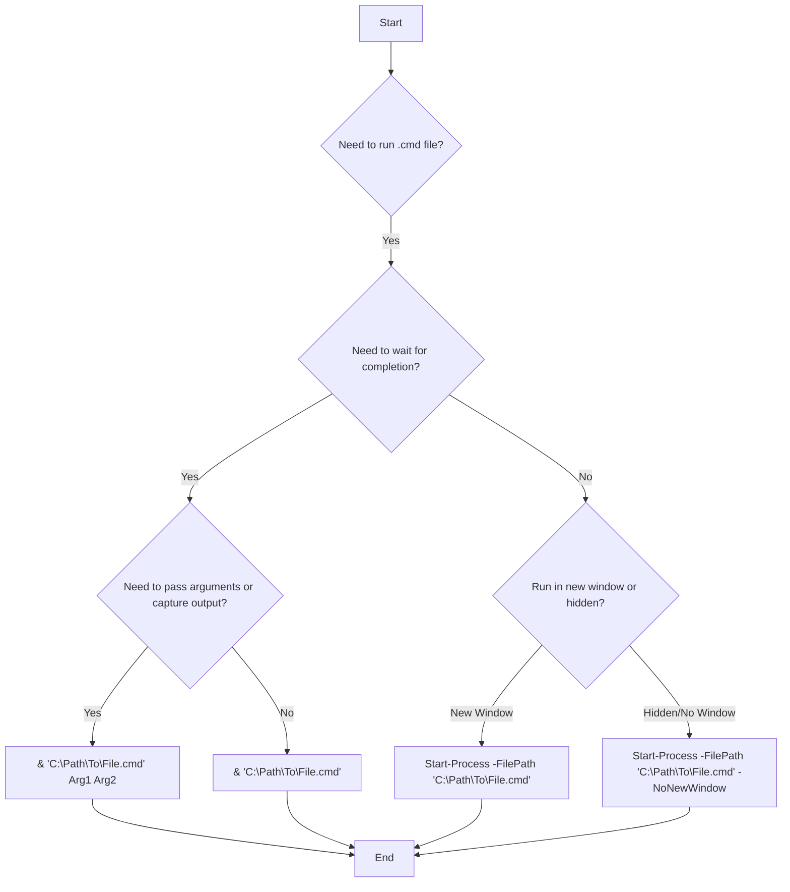

# How to Run a .cmd File Through PowerShell

When working with Windows systems, you often encounter situations where you need to execute traditional `.cmd` or `.bat` batch files from within a PowerShell script. While PowerShell is a powerful scripting language, directly calling a `.cmd` file can sometimes lead to errors like "not recognized as the name of a cmdlet" if the syntax isn't quite right. This guide will show you several robust methods to run `.cmd` files from PowerShell, including handling paths with spaces and passing arguments.

## Quick Answer

The most straightforward way to run a `.cmd` file from PowerShell is to use the call operator (`&`) or `Start-Process` for background execution.

```powershell
# Using the call operator for direct execution
& "C:\MyDirectory\MyCommand.cmd"

# Using Start-Process for background execution or with specific options
Start-Process -FilePath "C:\MyDirectory\MyCommand.cmd" -Wait -NoNewWindow
```

## Choose Your Method

The best method for running a `.cmd` file depends on your specific needs, such as whether you need to wait for it to finish, run it in the background, or pass arguments.



## Table of Contents
1. Quick Answer
2. Choose Your Method
3. Using the Call Operator (`&`)
4. Using `Start-Process`
5. Using `cmd.exe /c`
6. Changing Directory First
7. Common Problems and Solutions
8. Real-World Use Cases
9. Summary

## Using the Call Operator (`&`)

The call operator (`&`), also known as the invocation operator, is PowerShell's way of executing commands, scripts, or executables that are not native PowerShell cmdlets. This is often the most direct and preferred method for running `.cmd` files.

### Basic Execution

To run a `.cmd` file, simply prepend its full path with `&`. If the path contains spaces, enclose the entire path in double quotes.

```powershell
# Example 1: Simple path
& C:\MyDirectory\MyCommand.cmd

# Example 2: Path with spaces
& "C:\Program Files\My App\RunMe.cmd"
```

### Passing Arguments

You can pass arguments to the `.cmd` file by listing them after the file path.

```powershell
# MyCommand.cmd expects two arguments
# Example: MyCommand.cmd arg1 arg2
& "C:\MyDirectory\MyCommand.cmd" "argument 1" "argument 2"
```

### Capturing Output

The output of the `.cmd` file will be directed to the PowerShell console by default. You can capture it into a variable:

```powershell
$cmdOutput = & "C:\MyDirectory\MyCommand.cmd"
Write-Host "CMD Output: $cmdOutput"
```

## Using `Start-Process`

The `Start-Process` cmdlet is more powerful for launching external applications, including `.cmd` files. It offers options for controlling the process window, waiting for completion, and running as a different user.

### Basic Execution

```powershell
# Runs the .cmd file in a new window and waits for it to complete
Start-Process -FilePath "C:\MyDirectory\MyCommand.cmd" -Wait

# Runs the .cmd file without opening a new window (hidden) and waits
Start-Process -FilePath "C:\MyDirectory\MyCommand.cmd" -NoNewWindow -Wait
```

### Passing Arguments

Use the `-ArgumentList` parameter to pass arguments. Each argument should be a separate string in an array.

```powershell
# MyCommand.cmd expects two arguments
# Example: MyCommand.cmd arg1 arg2
Start-Process -FilePath "C:\MyDirectory\MyCommand.cmd" -ArgumentList "argument 1", "argument 2" -Wait -NoNewWindow
```

### Running as Administrator

`Start-Process` allows you to run the `.cmd` file with elevated privileges using the `-Verb RunAs`. This will prompt the user for administrator credentials if not already running as admin.

```powershell
Start-Process -FilePath "C:\MyDirectory\MyCommand.cmd" -Verb RunAs -Wait
```


### Running on a Remote Server

When running on a remote server, you'd typically use `Invoke-Command` to execute the `Start-Process` command on the remote machine.

```powershell
Invoke-Command -ComputerName "RemoteServer" -ScriptBlock {
    Start-Process -FilePath "C:\MyDirectory\MyCommand.cmd" -Wait -NoNewWindow
}
```

## Using `cmd.exe /c`

This method explicitly invokes the `cmd.exe` interpreter to run your batch file. This can be useful if you encounter unexpected behavior with other methods, or if you need to ensure the command is processed exactly as `cmd.exe` would.

The `/c` switch tells `cmd.exe` to execute the following command and then terminate.

```powershell
# Basic execution
cmd /c "C:\MyDirectory\MyCommand.cmd"

# With arguments
cmd /c "C:\MyDirectory\MyCommand.cmd" "argument 1" "argument 2"
```

### Handling Variables

If your `.cmd` file path or arguments are stored in PowerShell variables, you can construct the command string.

```powershell
$cmdPath = "C:\MyDirectory\MyCommand.cmd"
$arg1 = "value1"
$arg2 = "value2"

cmd /c "$cmdPath $arg1 $arg2"
```

## Changing Directory First

Sometimes, a `.cmd` file might rely on its current working directory to find other files or scripts. In such cases, it's best to change the PowerShell current directory to the `.cmd` file's location before executing it.

```powershell
# Get the directory of the .cmd file
$cmdFile = "C:\MyDirectory\MyCommand.cmd"
$cmdDir = Split-Path -Path $cmdFile -Parent

# Change current directory
Set-Location -Path $cmdDir

# Execute the .cmd file using relative path
.\MyCommand.cmd

# Optionally, change back to the original directory
# Set-Location -Path $PSScriptRoot # Or whatever your original path was
```

Alternatively, you can use `Start-Process` with the `-WorkingDirectory` parameter:

```powershell
Start-Process -FilePath "C:\MyDirectory\MyCommand.cmd" -WorkingDirectory "C:\MyDirectory" -Wait -NoNewWindow
```

## Common Problems and Solutions

### "not recognized as the name of a cmdlet" Error

This error occurs when PowerShell tries to interpret the `.cmd` file path as a PowerShell command or cmdlet.

**Problematic Code:**
```powershell
C:\MyDirectory\MyCommand.cmd
```

**Solution:**
Use the call operator (`&`) or `Start-Process`.

```powershell
& C:\MyDirectory\MyCommand.cmd
# OR
Start-Process -FilePath "C:\MyDirectory\MyCommand.cmd" -Wait
```

### `Invoke-Command` Parameter Set Error

The `Invoke-Command` cmdlet is used to run script blocks on local or remote computers, not directly to execute external files like `.cmd` files.

**Problematic Code:**
```powershell
Invoke-Command C:\MyDirectory\MyCommand.cmd
```

**Solution:**
Wrap the execution of the `.cmd` file within a script block that `Invoke-Command` can execute.

```powershell
Invoke-Command -ComputerName "RemoteServer" -ScriptBlock {
    & "C:\MyDirectory\MyCommand.cmd"
}
```

### Paths with Spaces

If your `.cmd` file path contains spaces and you don't quote it correctly, PowerShell might misinterpret the path.

**Problematic Code:**
```powershell
& C:\Program Files\My App\RunMe.cmd
```

**Solution:**
Always enclose paths with spaces in double quotes when using the call operator or `cmd /c`.

```powershell
& "C:\Program Files\My App\RunMe.cmd"
# OR
cmd /c "`"C:\Program Files\My App\RunMe.cmd`"" # Note the escaped quotes for cmd /c
```

### Variable Expansion in `cmd /c`

When using `cmd /c` with PowerShell variables, ensure proper quoting and variable expansion.

```powershell
$appName = "Abc"
# Incorrect: cmd /c ".\$appName.Web.deploy /y"
# Correct:
cmd /c ".\$($appName).Web.deploy /y"
# Or, better for clarity and robustness:
$command = ".\$appName.Web.deploy /y"
cmd /c $command
```

## Real-World Use Cases

*   **Automating Legacy Tasks:** Running older batch scripts that perform specific system maintenance, data processing, or application deployments.
*   **Integrating with Third-Party Tools:** Many older or specialized tools provide `.cmd` interfaces for their operations. PowerShell can orchestrate these.
*   **Scheduled Tasks:** Creating PowerShell scripts that execute `.cmd` files as part of a larger automated workflow managed by Windows Task Scheduler.
*   **Deployment Pipelines:** In CI/CD pipelines, PowerShell scripts might be used to call `.cmd` files that handle specific build or deployment steps.

## Summary

Running `.cmd` files from PowerShell is a common requirement in Windows environments. The most reliable methods involve using the call operator (`&`) for direct execution or `Start-Process` for more control over the process. For scenarios requiring explicit `cmd.exe` invocation or specific working directories, `cmd /c` and `Set-Location` or `Start-Process -WorkingDirectory` provide robust alternatives. Always remember to properly quote paths, especially those containing spaces, to avoid common errors.

---

## Image Generation Prompts

**PLACEHOLDER-1:** A screenshot of a Windows User Account Control (UAC) prompt asking for administrator permission. The prompt should clearly show a program name like "MyCommand.cmd" attempting to make changes to the system, with "Yes" and "No" buttons. The overall style should be clean and modern Windows UI.