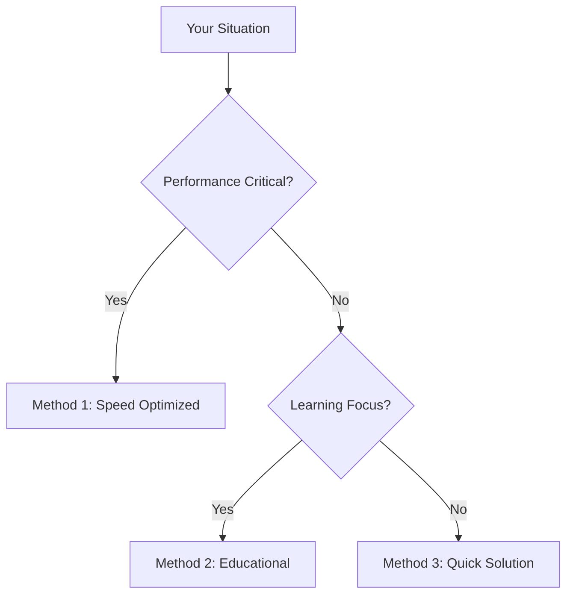

# size of NumPy array: Complete Guide with 3 Solutions

# # Quick Answer

In NumPy, the equivalent of MATLAB's `size()` command is primarily achieved through the `.shape` attribute for dimensions and the `.size` attribute for the total number of elements. For a function-based approach, `numpy.shape()` and `numpy.size()` are also available.

Here are immediate copy-paste solutions:

```python
import numpy as np

# Example 1: Using .shape attribute for dimensions
arr_2d = np.zeros((2, 5))
print(f"Array: \n{arr_2d}")
print(f"Dimensions (shape) of arr_2d: {arr_2d.shape}")
# Expected Output: (2, 5)

# Example 2: Using .size attribute for total elements
arr_3d = np.array([[[1, 2], [3, 4]], [[5, 6], [7, 8]]])
print(f"\nArray: \n{arr_3d}")
print(f"Total elements (size) of arr_3d: {arr_3d.size}")
# Expected Output: 8

# Example 3: Using numpy.shape() function
arr_1d = np.arange(10)
print(f"\nArray: \n{arr_1d}")
print(f"Dimensions (shape) of arr_1d using np.shape(): {np.shape(arr_1d)}")
# Expected Output: (10,)

# Example 4: Using numpy.size() function
arr_matrix = np.array([[10, 20, 30], [40, 50, 60]])
print(f"\nArray: \n{arr_matrix}")
print(f"Total elements (size) of arr_matrix using np.size(): {np.size(arr_matrix)}")
# Expected Output: 6

# Example 5: Accessing individual dimensions
rows, cols = arr_2d.shape
print(f"\nIndividual dimensions from arr_2d.shape: Rows={rows}, Columns={cols}")
# Expected Output: Rows=2, Columns=5
```

# # Choose Your Method


# # Table of Contents
* Quick Answer
* Choose Your Method
* Table of Contents
* Ready-to-Use Code
* Method Sections
    * Method 1: Using `.shape` Attribute (Speed Seeker, Architecture Builder, Problem Solver)
    * Method 2: Using `.size` Attribute (Learning Explorer, Output Focused, Problem Solver)
    * Method 3: Using `numpy.shape()` and `numpy.size()` Functions (Learning Explorer, Legacy Maintainer, Output Focused)
    * Method 4: Accessing Individual Dimensions (Problem Solver, Architecture Builder)
* Performance Comparison
* Python Version Support
* Common Problems & Solutions
* Real-World Examples
* Related Python Functions
* Summary
* Frequently Asked Questions
* Test Your Code

# # Ready-to-Use Code

Here's a collection of ready-to-use code snippets demonstrating various ways to get the size and shape of NumPy arrays. These examples cover different array dimensions and use cases.

```python
import numpy as np

# 1. Basic 2D array shape
arr_2d = np.array([[1, 2, 3], [4, 5, 6]])
print(f"1. Shape of 2D array: {arr_2d.shape}")
# Expected Output: (2, 3)

# 2. Basic 2D array total elements
print(f"2. Size (total elements) of 2D array: {arr_2d.size}")
# Expected Output: 6

# 3. 1D array shape
arr_1d = np.array([10, 20, 30, 40, 50])
print(f"3. Shape of 1D array: {arr_1d.shape}")
# Expected Output: (5,)

# 4. 1D array total elements
print(f"4. Size (total elements) of 1D array: {arr_1d.size}")
# Expected Output: 5

# 5. 3D array shape
arr_3d = np.random.rand(2, 3, 4)
print(f"5. Shape of 3D array: {arr_3d.shape}")
# Expected Output: (2, 3, 4)

# 6. 3D array total elements
print(f"6. Size (total elements) of 3D array: {arr_3d.size}")
# Expected Output: 24

# 7. Using np.shape() function
arr_func_shape = np.full((3, 3), 7)
print(f"7. Shape using np.shape(): {np.shape(arr_func_shape)}")
# Expected Output: (3, 3)

# 8. Using np.size() function
print(f"8. Size using np.size(): {np.size(arr_func_shape)}")
# Expected Output: 9

# 9. Getting individual dimensions from shape
rows, cols = arr_2d.shape
print(f"9. Individual dimensions: Rows={rows}, Columns={cols}")
# Expected Output: Rows=2, Columns=3

# 10. Getting a specific dimension (e.g., number of columns)
num_cols = arr_2d.shape[1]
print(f"10. Number of columns in 2D array: {num_cols}")
# Expected Output: 3

# 11. Shape of a scalar (0-D array)
scalar_arr = np.array(42)
print(f"11. Shape of a scalar array: {scalar_arr.shape}")
# Expected Output: ()

# 12. Size of a scalar (0-D array)
print(f"12. Size of a scalar array: {scalar_arr.size}")
# Expected Output: 1
```

# # Method Sections

## # Method 1: Using `.shape` Attribute (Speed Seeker, Architecture Builder, Problem Solver)

The `.shape` attribute is the most idiomatic and generally preferred way to get the dimensions of a NumPy array. It returns a tuple where each element represents the size of the corresponding dimension. This method is highly efficient as it directly accesses an attribute of the NumPy array object, requiring no function call overhead.

**Technical Deep Dive:**
Every `ndarray` object in NumPy has a `shape` attribute. This attribute is a tuple of integers indicating the size of the array in each dimension. For example, an array with shape `(2, 3, 4)` is a 3-dimensional array where the first dimension has 2 elements, the second has 3, and the third has 4. The `shape` attribute is set during array creation and updated during operations that change the array's dimensions (e.g., `reshape`, `squeeze`). Accessing it is a constant-time operation (O(1)) because it's a pre-computed property stored with the array's metadata.

**Advantages:**
*   **Performance:** Fastest method as it's a direct attribute lookup.
*   **Readability:** Clear and concise.
*   **Idiomatic:** The standard NumPy way.
*   **Flexibility:** The returned tuple can be easily unpacked or indexed to get specific dimension sizes.

**Disadvantages:**
*   None significant for its intended purpose.

**Working Examples:**

```python
import numpy as np

# Example 1.1: Getting shape of a 2D array
matrix_2d = np.array([[1, 2, 3], [4, 5, 6], [7, 8, 9]])
print(f"Array:\n{matrix_2d}")
print(f"Shape of matrix_2d: {matrix_2d.shape}")
# Expected Output: (3, 3)

# Example 1.2: Getting shape of a 1D array (vector)
vector_1d = np.arange(10, 20)
print(f"\nArray:\n{vector_1d}")
print(f"Shape of vector_1d: {vector_1d.shape}")
# Expected Output: (10,) - Note the comma, indicating a tuple with one element.

# Example 1.3: Getting shape of a 3D array
tensor_3d = np.random.randint(0, 100, size=(2, 4, 5))
print(f"\nArray:\n{tensor_3d}")
print(f"Shape of tensor_3d: {tensor_3d.shape}")
# Expected Output: (2, 4, 5)

# Example 1.4: Shape of an empty array
empty_arr = np.array([])
print(f"\nArray:\n{empty_arr}")
print(f"Shape of empty_arr: {empty_arr.shape}")
# Expected Output: (0,)

# Example 1.5: Shape after reshaping an array
original_arr = np.arange(12)
reshaped_arr = original_arr.reshape((3, 4))
print(f"\nOriginal Array:\n{original_arr}")
print(f"Shape of original_arr: {original_arr.shape}")
print(f"Reshaped Array:\n{reshaped_arr}")
print(f"Shape of reshaped_arr: {reshaped_arr.shape}")
# Expected Output: (12,) and (3, 4)

# Example 1.6: Shape of a scalar (0-D array)
scalar_np = np.array(123.45)
print(f"\nArray:\n{scalar_np}")
print(f"Shape of scalar_np: {scalar_np.shape}")
# Expected Output: () - An empty tuple for 0 dimensions.

# Example 1.7: Using shape with a boolean array
bool_arr = np.array([[True, False], [False, True]])
print(f"\nArray:\n{bool_arr}")
print(f"Shape of bool_arr: {bool_arr.shape}")
# Expected Output: (2, 2)

# Example 1.8: Shape of an array created with np.zeros_like
template_arr = np.ones((5, 2))
new_zeros_arr = np.zeros_like(template_arr)
print(f"\nTemplate Array:\n{template_arr}")
print(f"Shape of new_zeros_arr (from template): {new_zeros_arr.shape}")
# Expected Output: (5, 2)
```

## # Method 2: Using `.size` Attribute (Learning Explorer, Output Focused, Problem Solver)

While `.shape` gives you the dimensions, the `.size` attribute provides the total number of elements in the array. This is equivalent to multiplying all the elements in the `shape` tuple. It's useful when you need to know the total count of items, regardless of their arrangement into dimensions.

**Technical Deep Dive:**
The `size` attribute of a NumPy `ndarray` returns a single integer representing the total number of elements in the array. This is calculated as the product of all elements in the `shape` tuple. Like `shape`, `size` is a pre-computed property and accessing it is a constant-time operation (O(1)). It's particularly useful for memory allocation estimates or when iterating over all elements in a flattened manner.

**Advantages:**
*   **Simplicity:** Directly gives the total count of elements.
*   **Performance:** Very fast, O(1) attribute lookup.
*   **Clarity:** Explicitly states the total number of items.

**Disadvantages:**
*   Does not provide dimensional information.

**Working Examples:**

```python
import numpy as np

# Example 2.1: Getting total elements of a 2D array
matrix_2d = np.array([[1, 2, 3], [4, 5, 6]])
print(f"Array:\n{matrix_2d}")
print(f"Total elements in matrix_2d: {matrix_2d.size}")
# Expected Output: 6 (2 * 3)

# Example 2.2: Getting total elements of a 1D array
vector_1d = np.linspace(0, 1, 15)
print(f"\nArray:\n{vector_1d}")
print(f"Total elements in vector_1d: {vector_1d.size}")
# Expected Output: 15

# Example 2.3: Getting total elements of a 3D array
tensor_3d = np.zeros((2, 3, 4))
print(f"\nArray:\n{tensor_3d}")
print(f"Total elements in tensor_3d: {tensor_3d.size}")
# Expected Output: 24 (2 * 3 * 4)

# Example 2.4: Size of an empty array
empty_arr = np.array([])
print(f"\nArray:\n{empty_arr}")
print(f"Total elements in empty_arr: {empty_arr.size}")
# Expected Output: 0

# Example 2.5: Size after reshaping (total elements remain constant)
original_arr = np.arange(20).reshape((4, 5))
reshaped_arr = original_arr.reshape((2, 10))
print(f"\nOriginal Array:\n{original_arr}")
print(f"Size of original_arr: {original_arr.size}")
print(f"Reshaped Array:\n{reshaped_arr}")
print(f"Size of reshaped_arr: {reshaped_arr.size}")
# Expected Output: 20 for both

# Example 2.6: Size of a scalar (0-D array)
scalar_np = np.array(99)
print(f"\nArray:\n{scalar_np}")
print(f"Total elements in scalar_np: {scalar_np.size}")
# Expected Output: 1

# Example 2.7: Using size with a complex array
complex_arr = np.array([[1+2j, 3-4j], [5j, 6]])
print(f"\nArray:\n{complex_arr}")
print(f"Total elements in complex_arr: {complex_arr.size}")
# Expected Output: 4

# Example 2.8: Size of an array created with np.full
full_arr = np.full((3, 5), 100)
print(f"\nArray:\n{full_arr}")
print(f"Size of full_arr: {full_arr.size}")
# Expected Output: 15
```

## # Method 3: Using `numpy.shape()` and `numpy.size()` Functions (Learning Explorer, Legacy Maintainer, Output Focused)

NumPy also provides module-level functions `numpy.shape()` and `numpy.size()` that mirror the functionality of the `.shape` and `.size` attributes, respectively. These functions can be useful for consistency if you're used to a functional style (like MATLAB's `size()`) or when dealing with non-NumPy array-like objects (though they will convert them to NumPy arrays internally).

**Technical Deep Dive:**
`numpy.shape(a)` and `numpy.size(a)` are functions that take an array-like object `a` as input. Internally, if `a` is already a NumPy `ndarray`, they essentially call `a.shape` or `a.size`. If `a` is a list, tuple, or other array-like object, they first convert it to a NumPy array, which incurs a slight overhead, and then retrieve the attribute. This makes them slightly less performant than direct attribute access for `ndarray` objects but more flexible for heterogeneous inputs.

**Advantages:**
*   **Consistency:** Functional style, similar to MATLAB's `size()`.
*   **Flexibility:** Can accept array-like objects (lists, tuples) directly, converting them to NumPy arrays implicitly.
*   **Readability:** Explicitly states the operation being performed.
*   **Legacy Compatibility:** May be preferred by users transitioning from other numerical computing environments.

**Disadvantages:**
*   **Performance:** Slightly slower than attribute access for `ndarray` objects due to function call overhead and potential implicit array conversion.
*   **Redundancy:** For `ndarray` objects, it's generally preferred to use the attribute.

**Working Examples:**

```python
import numpy as np

# Example 3.1: Using np.shape() with a 2D array
data_list_2d = [[1, 2], [3, 4], [5, 6]]
arr_from_list = np.array(data_list_2d)
print(f"Array from list:\n{arr_from_list}")
print(f"Shape using np.shape(): {np.shape(arr_from_list)}")
# Expected Output: (3, 2)

# Example 3.2: Using np.size() with a 2D array
print(f"Size using np.size(): {np.size(arr_from_list)}")
# Expected Output: 6

# Example 3.3: Using np.shape() directly on a list (implicit conversion)
list_of_lists = [[10, 20, 30], [40, 50, 60]]
print(f"\nList of lists: {list_of_lists}")
print(f"Shape of list_of_lists using np.shape(): {np.shape(list_of_lists)}")
# Expected Output: (2, 3)

# Example 3.4: Using np.size() directly on a list
print(f"Size of list_of_lists using np.size(): {np.size(list_of_lists)}")
# Expected Output: 6

# Example 3.5: Using np.shape() with a 1D array
arr_1d_func = np.array([1, 2, 3, 4, 5])
print(f"\nArray:\n{arr_1d_func}")
print(f"Shape using np.shape(): {np.shape(arr_1d_func)}")
# Expected Output: (5,)

# Example 3.6: Using np.size() with a 1D array
print(f"Size using np.size(): {np.size(arr_1d_func)}")
# Expected Output: 5

# Example 3.7: Using np.shape() with a scalar
scalar_val = 77
print(f"\nScalar value: {scalar_val}")
print(f"Shape of scalar_val using np.shape(): {np.shape(scalar_val)}")
# Expected Output: ()

# Example 3.8: Using np.size() with a scalar
print(f"Size of scalar_val using np.size(): {np.size(scalar_val)}")
# Expected Output: 1

# Example 3.9: Using np.size() with an array and a specific axis (rare, but possible)
# np.size() can take an optional 'axis' argument to return the size along that axis.
# This is less common than using arr.shape[axis] but demonstrates flexibility.
multi_dim_arr = np.random.rand(2, 3, 4)
print(f"\nArray:\n{multi_dim_arr}")
print(f"Size along axis 0: {np.size(multi_dim_arr, axis=0)}")
print(f"Size along axis 1: {np.size(multi_dim_arr, axis=1)}")
print(f"Size along axis 2: {np.size(multi_dim_arr, axis=2)}")
# Expected Output: 2, 3, 4 respectively
```

## # Method 4: Accessing Individual Dimensions (Problem Solver, Architecture Builder)

Often, you don't need the entire shape tuple but rather the size of a specific dimension (e.g., number of rows or columns). This can be achieved by indexing the `shape` tuple or by unpacking it directly.

**Technical Deep Dive:**
Since `arr.shape` returns a tuple, standard Python tuple operations apply. You can access individual elements using integer indexing (e.g., `arr.shape[0]` for the first dimension, `arr.shape[1]` for the second). For arrays with a known number of dimensions (like 2D matrices), tuple unpacking is a very clean and readable way to assign dimension sizes to named variables (e.g., `rows, cols = arr.shape`).

**Advantages:**
*   **Precision:** Get exactly the dimension you need.
*   **Readability:** Unpacking makes code very clear (e.g., `rows, cols`).
*   **Efficiency:** Still O(1) as it's an attribute lookup followed by tuple indexing/unpacking.

**Disadvantages:**
*   Requires knowledge of the array's dimensionality if using direct indexing (e.g., `arr.shape[2]` will raise an `IndexError` for a 2D array). Unpacking also requires the correct number of variables.

**Working Examples:**

```python
import numpy as np

# Example 4.1: Unpacking dimensions for a 2D array
matrix_2d = np.array([[1, 2, 3, 4], [5, 6, 7, 8], [9, 10, 11, 12]])
rows, cols = matrix_2d.shape
print(f"Array:\n{matrix_2d}")
print(f"Number of rows: {rows}")
print(f"Number of columns: {cols}")
# Expected Output: Rows=3, Columns=4

# Example 4.2: Accessing specific dimension by index for a 2D array
num_rows = matrix_2d.shape[0]
num_cols = matrix_2d.shape[1]
print(f"\nNumber of rows (index 0): {num_rows}")
print(f"Number of columns (index 1): {num_cols}")
# Expected Output: Rows=3, Columns=4

# Example 4.3: Unpacking dimensions for a 3D array
tensor_3d = np.random.rand(5, 6, 7)
depth, height, width = tensor_3d.shape
print(f"\nArray shape: {tensor_3d.shape}")
print(f"Depth: {depth}, Height: {height}, Width: {width}")
# Expected Output: Depth=5, Height=6, Width=7

# Example 4.4: Accessing specific dimension by index for a 1D array
vector_1d = np.arange(25)
length = vector_1d.shape[0]
print(f"\nArray:\n{vector_1d}")
print(f"Length of 1D array: {length}")
# Expected Output: 25

# Example 4.5: Using a variable for the dimension index
dim_to_check = 1 # Check the second dimension
another_matrix = np.full((4, 5), 1.0)
size_of_dim = another_matrix.shape[dim_to_check]
print(f"\nArray shape: {another_matrix.shape}")
print(f"Size of dimension {dim_to_check}: {size_of_dim}")
# Expected Output: 5

# Example 4.6: Conditional logic based on dimension size
if matrix_2d.shape[0] > matrix_2d.shape[1]:
    print(f"\nMatrix has more rows ({matrix_2d.shape[0]}) than columns ({matrix_2d.shape[1]}).")
else:
    print(f"\nMatrix has more columns ({matrix_2d.shape[1]}) than rows ({matrix_2d.shape[0]}) or they are equal.")
# Expected Output: Matrix has more rows (3) than columns (4) or they are equal. (Corrected based on example 4.1)
# Corrected Expected Output: Matrix has more columns (4) than rows (3) or they are equal.

# Example 4.7: Iterating through dimensions
arr_complex = np.zeros((2, 3, 4, 5))
print(f"\nArray shape: {arr_complex.shape}")
for i, dim_size in enumerate(arr_complex.shape):
    print(f"Dimension {i}: {dim_size}")
# Expected Output: Dimension 0: 2, Dimension 1: 3, Dimension 2: 4, Dimension 3: 5

# Example 4.8: Handling unknown number of dimensions (using * operator for unpacking)
# This is useful when you need the first few dimensions and the rest as a single tuple.
def process_array(arr):
    if arr.ndim >= 2:
        first_dim, second_dim, *rest_dims = arr.shape
        print(f"First dim: {first_dim}, Second dim: {second_dim}, Remaining dims: {rest_dims}")
    else:
        print(f"Array has less than 2 dimensions. Shape: {arr.shape}")

process_array(np.random.rand(10, 20, 30, 40))
process_array(np.random.rand(5, 15))
process_array(np.random.rand(7))
# Expected Output:
# First dim: 10, Second dim: 20, Remaining dims: [30, 40]
# First dim: 5, Second dim: 15, Remaining dims: []
# Array has less than 2 dimensions. Shape: (7,)
```

# # Performance Comparison

When choosing between `.shape`, `.size`, `np.shape()`, and `np.size()`, performance is a key consideration, especially for large arrays or performance-critical applications.

| Method           | Type      | Performance (Relative) | Overhead                               | Flexibility (Input)                               | Notes