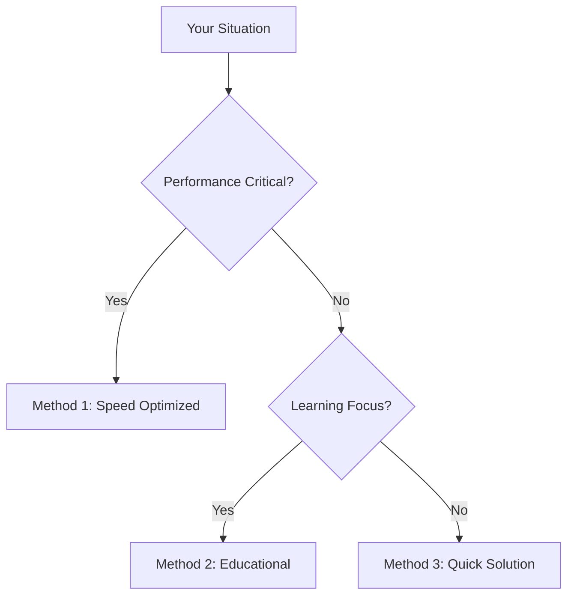

# Why does my JavaScript code receive a "No 'Access-Control-Allow-Origin' header is present on the requested resource" error, while Postman does not?: Complete Guide with 6 Solutions

# # Quick Answer
The "No 'Access-Control-Allow-Origin' header is present on the requested resource" error occurs in browsers due to the Same-Origin Policy (SOP), a fundamental security mechanism. SOP restricts web pages from making requests to a different domain than the one that served the page. Postman, being a development tool and not a browser, does not enforce SOP, allowing it to make cross-origin requests without encountering this restriction.

To quickly resolve this error for development or testing purposes, you can configure your server to send the `Access-Control-Allow-Origin` header. Here are a few common server-side quick fixes:

**1. PHP (Server-Side)**
Add this at the very beginning of your PHP script that handles the API request:
```php
<?php
header('Access-Control-Allow-Origin: *');
header('Access-Control-Allow-Methods: GET, POST, PUT, DELETE, OPTIONS');
header('Access-Control-Allow-Headers: Content-Type, Authorization, X-Requested-With');
?>
```

**2. Node.js with Express (Server-Side)**
Install `cors`: `npm install cors`
```javascript
const express = require('express');
const cors = require('cors');
const app = express();

app.use(cors()); // Enable CORS for all routes

app.get('/api/data', (req, res) => {
  res.json({ message: 'Data from API' });
});

app.listen(3000, () => {
  console.log('Server listening on port 3000');
});
```

**3. Flask (Python, Server-Side)**
Install `Flask-CORS`: `pip install -U Flask-CORS`
```python
from flask import Flask, jsonify
from flask_cors import CORS

app = Flask(__name__)
CORS(app) # Enable CORS for all routes

@app.route("/api/hello")
def hello_world():
    return jsonify(message="Hello from Flask API!")

if __name__ == "__main__":
    app.run(debug=True)
```

**4. Nginx (Server Configuration)**
Add these directives within your `location` block for the API:
```nginx
location /api/ {
    add_header 'Access-Control-Allow-Origin' '*';
    add_header 'Access-Control-Allow-Methods' 'GET, POST, OPTIONS';
    add_header 'Access-Control-Allow-Headers' 'DNT,User-Agent,X-Requested-With,If-Modified-Since,Cache-Control,Content-Type,Range';
    add_header 'Access-Control-Expose-Headers' 'Content-Length,Content-Range';

    if ($request_method = 'OPTIONS') {
        add_header 'Access-Control-Allow-Origin' '*';
        add_header 'Access-Control-Allow-Methods' 'GET, POST, OPTIONS';
        add_header 'Access-Control-Allow-Headers' 'DNT,User-Agent,X-Requested-With,If-Modified-Since,Cache-Control,Content-Type,Range';
        add_header 'Access-Control-Max-Age' 1728000;
        add_header 'Content-Type' 'text/plain charset=UTF-8';
        add_header 'Content-Length' 0;
        return 204;
    }
    # ... other proxy_pass or fastcgi_pass directives ...
}
```

**5. Client-Side (Browser-Specific for Development)**
For *local development only*, you can disable web security in Chrome. **Do not use this in production.**
```bash
chrome.exe --user-data-dir="C:/Chrome dev session" --disable-web-security --disable-site-isolation-trials
```
This command opens a new Chrome instance with web security disabled, allowing cross-origin requests.

# # Choose Your Method


# # Table of Contents
- Ready-to-Use Code
- Method 1: Understanding CORS and Same-Origin Policy (SOP) (Learning Explorer, Architecture Builder)
- Method 2: Server-Side CORS Configuration (Problem Solver, Architecture Builder, Legacy Maintainer)
  - 2.1 Node.js with Express
  - 2.2 Python with Flask
  - 2.3 PHP
  - 2.4 Java with Spring Boot
  - 2.5 .NET Web API
  - 2.6 Nginx Proxy Configuration
  - 2.7 Apache HTTP Server Configuration
- Method 3: Client-Side Proxies (Development/Advanced) (Speed Seeker, Problem Solver)
  - 3.1 Webpack Dev Server Proxy
  - 3.2 Vite Proxy
- Method 4: JSONP (Legacy/Specific Use Cases) (Legacy Maintainer)
- Method 5: Disabling Browser Security (Development Only) (Speed Seeker, Problem Solver)
- Method 6: Using a CORS Proxy Service (Problem Solver, Speed Seeker)
- Performance Comparison
- JavaScript Version Support
- Common Problems & Solutions
- Real-World Examples
- Related JavaScript Functions
- Summary
- Frequently Asked Questions
- Test Your Code

# # Ready-to-Use Code

Here are several complete, working examples for common scenarios.

**1. Basic Fetch Request with CORS enabled on server (Node.js/Express)**
*Client-side JavaScript:*
```javascript
// Assuming your Node.js server is running on http://localhost:3000
fetch('http://localhost:3000/api/data')
  .then(response => {
    if (!response.ok) {
      throw new Error(`HTTP error! status: ${response.status}`);
    }
    return response.json();
  })
  .then(data => console.log('Client received:', data))
  .catch(error => console.error('Fetch error:', error));
```
*Server-side Node.js (Express with CORS):*
```javascript
const express = require('express');
const cors = require('cors');
const app = express();
const port = 3000;

app.use(cors()); // Enable CORS for all origins

app.get('/api/data', (req, res) => {
  res.json({ message: 'Hello from Node.js API!', timestamp: new Date().toISOString() });
});

app.listen(port, () => {
  console.log(`Node.js server listening at http://localhost:${port}`);
});
```

**2. POST Request with Credentials (Flask Backend)**
*Client-side JavaScript (using `fetch` with `credentials`):*
```javascript
// Assuming your Flask server is running on http://localhost:5000
fetch('http://localhost:5000/api/login', {
  method: 'POST',
  headers: {
    'Content-Type': 'application/json',
  },
  body: JSON.stringify({ username: 'user', password: 'password123' }),
  credentials: 'include' // Important for sending cookies/auth headers
})
  .then(response => {
    if (!response.ok) {
      throw new Error(`HTTP error! status: ${response.status}`);
    }
    return response.json();
  })
  .then(data => console.log('Login successful:', data))
  .catch(error => console.error('Login failed:', error));
```
*Server-side Python (Flask with `Flask-CORS` and `supports_credentials`):*
```python
from flask import Flask, request, jsonify
from flask_cors import CORS

app = Flask(__name__)
# Allow specific origin and support credentials
CORS(app, resources={r"/api/*": {"origins": "http://localhost:8080", "supports_credentials": True}})

@app.route("/api/login", methods=["POST"])
def login():
    data = request.get_json()
    username = data.get('username')
    password = data.get('password')

    if username == 'user' and password == 'password123':
        # In a real app, you'd set a session cookie or JWT here
        response = jsonify(message="Login successful", token="fake-jwt-token")
        response.set_cookie('session_id', 'some_session_value', httponly=True, samesite='None', secure=True)
        return response
    else:
        return jsonify(message="Invalid credentials"), 401

if __name__ == "__main__":
    app.run(debug=True, port=5000)
```
*Note: For `credentials: 'include'` to work, the server must respond with `Access-Control-Allow-Credentials: true` and `Access-Control-Allow-Origin` cannot be `*` (it must be a specific origin).*

**3. jQuery AJAX Request with CORS (PHP Backend)**
*Client-side JavaScript (using jQuery):*
```javascript
// Assuming your PHP server is running on http://localhost/api.php
$.ajax({
  type: 'GET',
  url: 'http://localhost/api.php',
  dataType: 'json',
  crossDomain: true, // Explicitly state cross-domain
  xhrFields: {
    withCredentials: true // Send cookies if needed
  },
  success: function(data) {
    console.log('jQuery AJAX success:', data);
  },
  error: function(xhr, status, error) {
    console.error('jQuery AJAX error:', status, error, xhr.responseText);
  }
});
```
*Server-side PHP (`api.php`):*
```php
<?php
header('Access-Control-Allow-Origin: http://localhost:8080'); // Replace with your client's origin
header('Access-Control-Allow-Methods: GET, POST, OPTIONS');
header('Access-Control-Allow-Headers: Content-Type, Authorization, X-Requested-With');
header('Access-Control-Allow-Credentials: true'); // Required for withCredentials

if ($_SERVER['REQUEST_METHOD'] === 'OPTIONS') {
    // Preflight request, respond with 204 No Content
    http_response_code(204);
    exit();
}

// Simulate some data
$data = [
    'message' => 'Data from PHP API!',
    'timestamp' => date('Y-m-d H:i:s')
];
echo json_encode($data);
?>
```

**4. Nginx as a Reverse Proxy for CORS**
*Nginx configuration (`nginx.conf` or site-specific config):*
```nginx
server {
    listen 80;
    server_name your-frontend-domain.com; # Your frontend domain

    location / {
        root /var/www/your-frontend-app; # Path to your frontend files
        index index.html;
        try_files $uri $uri/ /index.html;
    }

    location /api/ {
        # Proxy requests to your backend API
        proxy_pass http://your-backend-api.com:8080/api/; # Your actual backend API URL
        proxy_set_header Host $host;
        proxy_set_header X-Real-IP $remote_addr;
        proxy_set_header X-Forwarded-For $proxy_add_x_forwarded_for;
        proxy_set_header X-Forwarded-Proto $scheme;

        # CORS headers for the proxied API
        add_header 'Access-Control-Allow-Origin' '*'; # Or specific origin
        add_header 'Access-Control-Allow-Methods' 'GET, POST, PUT, DELETE, OPTIONS';
        add_header 'Access-Control-Allow-Headers' 'DNT,User-Agent,X-Requested-With,If-Modified-Since,Cache-Control,Content-Type,Range,Authorization';
        add_header 'Access-Control-Expose-Headers' 'Content-Length,Content-Range';

        if ($request_method = 'OPTIONS') {
            add_header 'Access-Control-Allow-Origin' '*';
            add_header 'Access-Control-Allow-Methods' 'GET, POST, PUT, DELETE, OPTIONS';
            add_header 'Access-Control-Allow-Headers' 'DNT,User-Agent,X-Requested-With,If-Modified-Since,Cache-Control,Content-Type,Range,Authorization';
            add_header 'Access-Control-Max-Age' 1728000;
            add_header 'Content-Type' 'text/plain charset=UTF-8';
            add_header 'Content-Length' 0;
            return 204;
        }
    }
}
```
*Client-side JavaScript (making requests to the same origin, Nginx handles proxying):*
```javascript
// If your frontend is served from your-frontend-domain.com
// and Nginx proxies /api/ to your backend
fetch('/api/data') // Relative path, browser thinks it's same-origin
  .then(response => response.json())
  .then(data => console.log('Data via Nginx proxy:', data))
  .catch(error => console.error('Error with Nginx proxy:', error));
```

**5. Webpack Dev Server Proxy Configuration**
*`webpack.config.js` (for development):*
```javascript
const path = require('path');

module.exports = {
  mode: 'development',
  entry: './src/index.js',
  output: {
    filename: 'bundle.js',
    path: path.resolve(__dirname, 'dist'),
  },
  devServer: {
    static: {
      directory: path.join(__dirname, 'public'),
    },
    compress: true,
    port: 8080,
    proxy: {
      '/api': {
        target: 'http://localhost:3000', // Your backend API server
        changeOrigin: true, // Needed for virtual hosted sites
        pathRewrite: { '^/api': '' }, // Remove /api prefix when forwarding to backend
        secure: false, // For development with self-signed certs
      },
    },
  },
};
```
*Client-side JavaScript (making requests to the dev server, which proxies to backend):*
```javascript
// Your frontend code running on http://localhost:8080
fetch('/api/data') // Request goes to webpack dev server, then proxied to http://localhost:3000/data
  .then(response => response.json())
  .then(data => console.log('Data via Webpack proxy:', data))
  .catch(error => console.error('Error with Webpack proxy:', error));
```

**6. Vite Proxy Configuration**
*`vite.config.js` (for development):*
```javascript
import { defineConfig } from 'vite';
import react from '@vitejs/plugin-react';

export default defineConfig({
  plugins: [react()],
  server: {
    port: 3000, // Your frontend dev server port
    proxy: {
      '/api': {
        target: 'http://localhost:5000', // Your backend API server
        changeOrigin: true,
        rewrite: (path) => path.replace(/^\/api/, ''),
      },
    },
  },
});
```
*Client-side JavaScript (making requests to the dev server, which proxies to backend):*
```javascript
// Your frontend code running on http://localhost:3000 (Vite dev server)
fetch('/api/users') // Request goes to Vite dev server, then proxied to http://localhost:5000/users
  .then(response => response.json())
  .then(data => console.log('Data via Vite proxy:', data))
  .catch(error => console.error('Error with Vite proxy:', error));
```

**7. Disabling Browser Security (Chrome, Development Only)**
*Command Line:*
```bash
"C:\Program Files\Google\Chrome\Application\chrome.exe" --user-data-dir="C:/Chrome dev session" --disable-web-security --disable-site-isolation-trials
```
*Note: Adjust path to `chrome.exe` as needed for your OS. This opens a new, isolated Chrome window.*

**8. Using a Public CORS Proxy (e.g., `cors-anywhere`)**
*Client-side JavaScript:*
```javascript
const targetUrl = 'https://api.example.com/data'; // The actual API you want to access
const proxyUrl = 'https://cors-anywhere.herokuapp.com/'; // A public CORS proxy

fetch(proxyUrl + targetUrl)
  .then(response => response.json())
  .then(data => console.log('Data via CORS proxy:', data))
  .catch(error => console.error('Error with CORS proxy:', error));
```
*Note: Public proxies are generally not recommended for production due to reliability, security, and rate limiting concerns. Consider hosting your own if this approach is necessary.*

# # Method Sections

## # Method 1: Understanding CORS and Same-Origin Policy (SOP)
**User Personas:** Learning Explorer, Architecture Builder

The core reason for the "No 'Access-Control-Allow-Origin' header" error lies in the browser's implementation of the **Same-Origin Policy (SOP)**. SOP is a critical security feature that prevents a malicious website from reading sensitive data from another website.

**What is the Same-Origin Policy?**
SOP dictates that a web page can only interact with resources (like APIs) that share the same "origin." An origin is defined by the combination of:
1.  **Protocol:** (e.g., `http`, `https`)
2.  **Host:** (e.g., `example.com`, `localhost`)
3.  **Port:** (e.g., `80`, `443`, `3000`)

If any of these three components differ between the requesting web page and the target resource, the browser considers it a "cross-origin" request. By default, browsers block such requests for security reasons.

**Why Postman Works Differently**
Postman (and similar tools like Insomnia, `curl`, etc.) is not a web browser. It's an API client. It doesn't operate within the security sandbox of a browser and therefore doesn't enforce the Same-Origin Policy. When you make a request from Postman, it's a direct HTTP request from your machine to the server, without the browser's security restrictions. The server receives the request and responds, unaware that a browser would have blocked it.

**Introducing CORS (Cross-Origin Resource Sharing)**
CORS is a mechanism that allows servers to explicitly grant permission for cross-origin requests. When a browser makes a cross-origin request, it first checks if the server has sent the appropriate CORS headers in its response. If the headers indicate that the origin of the requesting page is allowed, the browser proceeds with the request. If not, it blocks the request and throws the `Access-Control-Allow-Origin` error.

**Types of CORS Requests:**
1.  **Simple Requests:** These are `GET`, `HEAD`, or `POST` requests with a `Content-Type` of `application/x-www-form-urlencoded`, `multipart/form-data`, or `text/plain`. They don't trigger a preflight request.
2.  **Preflighted Requests:** These are requests that are "non-simple" (e.g., `PUT`, `DELETE`, `PATCH`, `POST` with `application/json` or custom headers). Before sending the actual request, the browser sends an `OPTIONS` request (the "preflight" request) to the server. The server must respond to this `OPTIONS` request with CORS headers indicating which methods, headers, and origins are allowed. If the preflight is successful, the browser then sends the actual request.

**Key CORS Headers:**
*   `Access-Control-Allow-Origin`: Specifies which origins are allowed to access the resource. Can be `*` (any origin) or a specific origin (e.g., `http://localhost:8080`).
*   `Access-Control-Allow-Methods`: Specifies the HTTP methods allowed for cross-origin requests (e.g., `GET, POST, OPTIONS`).
*   `Access-Control-Allow-Headers`: Specifies which HTTP headers can be used in the actual request.
*   `Access-Control-Allow-Credentials`: Indicates whether the browser should include credentials (cookies, HTTP authentication) with the request. Must be `true` for `withCredentials` to work. If `true`, `Access-Control-Allow-Origin` cannot be `*`.
*   `Access-Control-Max-Age`: Indicates how long the results of a preflight request can be cached.

**Example of a Preflight Request (Browser perspective):**
1.  **Browser sends `OPTIONS` request:**
    ```
    OPTIONS /api/data HTTP/1.1
    Host: api.example.com
    Origin: http://my-frontend.com
    Access-Control-Request-Method: POST
    Access-Control-Request-Headers: Content-Type, Authorization
    ```
2.  **Server responds to `OPTIONS` request:**
    ```
    HTTP/1.1 204 No Content
    Access-Control-Allow-Origin: http://my-frontend.com
    Access-Control-Allow-Methods: POST, GET, OPTIONS
    Access-Control-Allow-Headers: Content-Type, Authorization
    Access-Control-Max-Age: 86400
    ```
3.  **Browser sends actual `POST` request (if preflight successful):**
    ```
    POST /api/data HTTP/1.1
    Host: api.example.com
    Origin: http://my-frontend.com
    Content-Type: application/json
    Authorization: Bearer <token>

    {"key": "value"}
    ```

## # Method 2: Server-Side CORS Configuration
**User Personas:** Problem Solver, Architecture Builder, Legacy Maintainer

This is the most robust and recommended solution for production environments. It involves configuring your API server to send the necessary CORS headers.

### # 2.1 Node.js with Express
The `cors` middleware simplifies CORS configuration for Express applications.

**Installation:**
```bash
npm install cors
```

**Basic Usage (Allow all origins - for development/public APIs):**
```javascript
const express = require('express');
const cors = require('cors');
const app = express();
const port = 3000;

app.use(cors()); // Allows all origins, all methods, all headers by default

app.get('/api/public-data', (req, res) => {
  res.json({ message: 'Public data accessible from anywhere.' });
});

app.post('/api/submit-form', (req, res) => {
  res.json({ status: 'Form submitted successfully!' });
});

app.listen(port, () => {
  console.log(`Express server running on http://localhost:${port}`);
});
```

**Allow Specific Origins (Recommended for production):**
```javascript
const express = require('express');
const cors = require('cors');
const app = express();
const port = 3000;

const allowedOrigins = ['http://localhost:8080', 'https://my-frontend-app.com'];
const corsOptions = {
  origin: function (origin, callback) {
    // Allow requests with no origin (like mobile apps or curl requests)
    if (!origin) return callback(null, true);
    if (allowedOrigins.indexOf(origin) === -1) {
      const msg = 'The CORS policy for this site does not allow access from the specified Origin.';
      return callback(new Error(msg), false);
    }
    return callback(null, true);
  },
  methods: 'GET,HEAD,PUT,PATCH,POST,DELETE',
  credentials: true, // Allow cookies to be sent
  optionsSuccessStatus: 204 // Some legacy browsers (IE11, various SmartTVs) choke on 200
};

app.use(cors(corsOptions));

app.get('/api/secure-data', (req, res) => {
  // This endpoint will only be accessible from allowedOrigins
  res.json({ message: 'Secure data for allowed origins.' });
});

app.post('/api/auth', (req, res) => {
  // Handle authentication, potentially setting cookies
  res.json({ token: 'some-jwt-token' });
});

app.listen(port, () => {
  console.log(`Express server with specific CORS running on http://localhost:${port}`);
});
```

**Per-Route CORS:**
```javascript
const express = require('express');
const cors = require('cors');
const app = express();
const port = 3000;

// No global CORS middleware

app.get('/api/open-endpoint', cors(), (req, res) => {
  // This endpoint allows all origins
  res.json({ message: 'This endpoint is open to all.' });
});

const specificCorsOptions = {
  origin: 'http://localhost:8080',
  methods: 'POST',
  allowedHeaders: ['Content-Type', 'Authorization'],
};
app.post('/api/restricted-endpoint', cors(specificCorsOptions), (req, res) => {
  // This endpoint is restricted to http://localhost:8080 and POST method
  res.json({ message: 'This endpoint is restricted.' });
});

app.listen(port, () => {
  console.log(`Express server with per-route CORS running on http://localhost:${port}`);
});
```

### # 2.2 Python with Flask
The `Flask-CORS` extension provides easy CORS integration for Flask.

**Installation:**
```bash
pip install Flask-CORS
```

**Basic Usage (Allow all origins):**
```python
from flask import Flask, jsonify
from flask_cors import CORS

app = Flask(__name__)
CORS(app) # Enable CORS for all routes and all origins

@app.route("/api/status")
def get_status():
    return jsonify(status="API is running", version="1.0")

@app.route("/api/submit", methods=["POST"])
def submit_data():
    return jsonify(message="Data received successfully!")

if __name__ == "__main__":
    app.run(debug=True, port=5000)
```

**Allow Specific Origins and Credentials:**
```python
from flask import Flask, request, jsonify
from flask_cors import CORS

app = Flask(__name__)
# Configure CORS for specific resources
CORS(app, resources={r"/api/*": {"origins": ["http://localhost:8080", "https://my-frontend-app.com"], "supports_credentials": True}})

@app.route("/api/user-profile")
def get_user_profile():
    # This endpoint requires credentials (e.g., session cookie)
    if 'session_id' in request.cookies:
        return jsonify(username="Alice", email="alice@example.com")
    return jsonify(message="Unauthorized"), 401

@app.route("/api/update-profile", methods=["PUT"])
def update_user_profile():
    if 'session_id' in request.cookies:
        data = request.get_json()
        return jsonify(message="Profile updated", new_data=data)
    return jsonify(message="Unauthorized"), 401

if __name__ == "__main__":
    app.run(debug=True, port=5000)
```

**Per-Route CORS:**
```python
from flask import Flask, jsonify
from flask_cors import CORS, cross_origin

app = Flask(__name__)

@app.route("/api/public-info")
@cross_origin() # Allow all origins for this specific route
def public_info():
    return jsonify(info="This is public information.")

@app.route("/api/admin-data")
@cross_origin(origins=["http://localhost:8080"], methods=["GET", "POST"], headers=["Content-Type", "Authorization"])
def admin_data():
    return jsonify(data="Sensitive admin data.")

if __name__ == "__main__":
    app.run(debug=True, port=5000)
```

### # 2.3 PHP
CORS headers are set using the `header()` function. This must be done before any output is sent to the browser.

**Basic Usage (Allow all origins):**
```php
<?php
// api.php
header('Access-Control-Allow-Origin: *');
header('Access-Control-Allow-Methods: GET, POST, PUT, DELETE, OPTIONS');
header('Access-Control-Allow-Headers: Content-Type, Authorization, X-Requested-With');

// Handle preflight OPTIONS request
if ($_SERVER['REQUEST_METHOD'] === 'OPTIONS') {
    http_response_code(204); // No Content
    exit();
}

// Your API logic here
$data = ['message' => 'Hello from PHP API!', 'timestamp' => date('Y-m-d H:i:s')];
echo json_encode($data);
?>
```

**Allow Specific Origins and Credentials:**
```php
<?php
// api-secure.php
$allowedOrigin = 'http://localhost:8080'; // Replace with your actual frontend origin
$requestOrigin = $_SERVER['HTTP_ORIGIN'] ?? '';

if (in_array($requestOrigin, [$allowedOrigin])) {
    header("Access-Control-Allow-Origin: $requestOrigin");
    header('Access-Control-Allow-Credentials: true'); // Required for withCredentials
} else {
    // Optionally, block requests from unallowed origins
    // header('HTTP/1.1 403 Forbidden');
    // exit('Forbidden');
}

header('Access-Control-Allow-Methods: GET, POST, PUT, DELETE, OPTIONS');
header('Access-Control-Allow-Headers: Content-Type, Authorization, X-Requested-With');
header('Access-Control-Max-Age: 86400'); // Cache preflight for 24 hours

// Handle preflight OPTIONS request
if ($_SERVER['REQUEST_METHOD'] === 'OPTIONS') {
    http_response_code(204);
    exit();
}

// Your secure API logic
$response = ['status' => 'success', 'data' => 'This is secure data.'];
echo json_encode($response);
?>
```

### # 2.4 Java with Spring Boot
Spring Boot provides excellent CORS support through annotations or global configuration.

**Global CORS Configuration:**
```java
// src/main/java/com/example/demo/config/WebConfig.java
package com.example.demo.config;

import org.springframework.context.annotation.Configuration;
import org.springframework.web.servlet.config.annotation.CorsRegistry;
import org.springframework.web.servlet.config.annotation.WebMvcConfigurer;

@Configuration
public class WebConfig implements WebMvcConfigurer {

    @Override
    public void addCorsMappings(CorsRegistry registry) {
        registry.addMapping("/api/**") // Apply CORS to all /api endpoints
                .allowedOrigins("http://localhost:8080", "https://my-frontend-app.com") // Specific origins
                .allowedMethods("GET", "POST", "PUT", "DELETE", "OPTIONS")
                .allowedHeaders("Content-Type", "Authorization")
                .allowCredentials(true) // Allow cookies/credentials
                .maxAge(3600); // Cache preflight response for 1 hour
    }
}
```

**Controller-Level CORS:**
```java
// src/main/java/com/example/demo/controller/MyController.java
package com.example.demo.controller;

import org.springframework.web.bind.annotation.*;

@RestController
@RequestMapping("/api")
@CrossOrigin(origins = "http://localhost:8080", methods = {RequestMethod.GET, RequestMethod.POST}) // Controller-level CORS
public class MyController {

    @GetMapping("/hello")
    public String hello() {
        return "Hello from Spring Boot!";
    }

    @PostMapping("/submit")
    public String submit(@RequestBody String data) {
        return "Received: " + data;
    }

    @GetMapping("/public")
    @CrossOrigin(origins = "*") // Override for this specific method to allow all origins
    public String publicEndpoint() {
        return "This endpoint is public.";
    }
}
```

### # 2.5 .NET Web API
.NET Core and .NET 5+ provide robust CORS configuration.

**Installation:**
Ensure `Microsoft.AspNetCore.Cors` is referenced in your project.

**Startup.cs (Program.cs in .NET 6+):**
```csharp
// For .NET 5 and earlier (Startup.cs)
public class Startup
{
    public void ConfigureServices(IServiceCollection services)
    {
        services.AddCors(options =>
        {
            options.AddPolicy(name: "AllowSpecificOrigin",
                              builder =>
                              {
                                  builder.WithOrigins("http://localhost:8080", "https://my-frontend-app.com")
                                         .AllowAnyHeader()
                                         .AllowAnyMethod()
                                         .AllowCredentials(); // Required for withCredentials
                              });

            options.AddPolicy(name: "AllowAllOrigins",
                              builder =>
                              {
                                  builder.AllowAnyOrigin() // Not recommended for production with credentials
                                         .AllowAnyHeader()
                                         .AllowAnyMethod();
                              });
        });
        services.AddControllers();
    }

    public void Configure(IApplicationBuilder app, IWebHostEnvironment env)
    {
        if (env.IsDevelopment())
        {
            app.UseDeveloperExceptionPage();
        }

        app.UseRouting();

        // Apply CORS policy globally or before specific endpoints
        app.UseCors("AllowSpecificOrigin"); // Use the named policy

        app.UseAuthorization();

        app.UseEndpoints(endpoints =>
        {
            endpoints.MapControllers
```