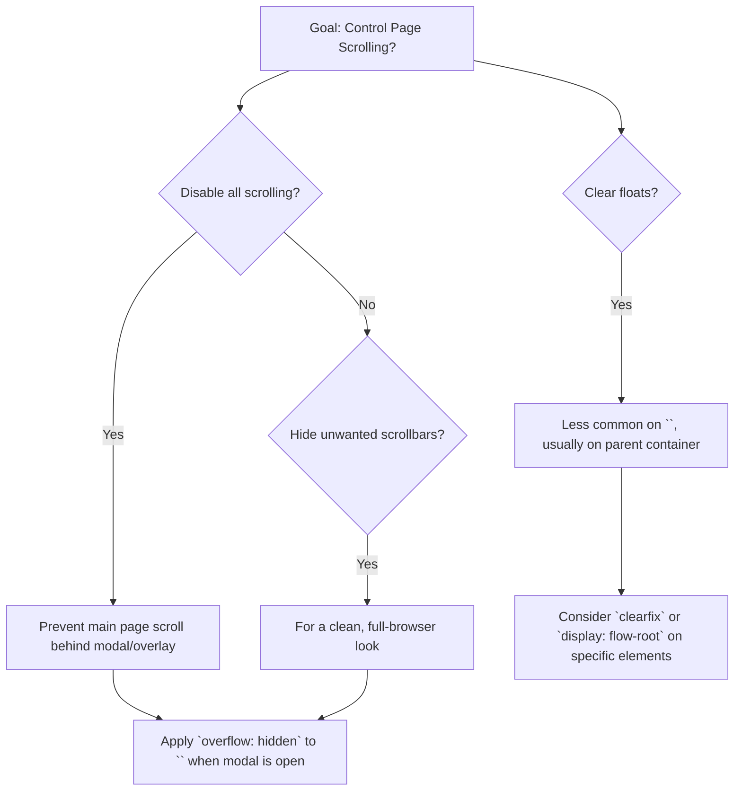

# Why Use `overflow: hidden` on the HTML Tag in CSS?

Applying `overflow: hidden` to the `<html>` tag might seem unusual at first glance, as it directly affects the entire document's scrolling behavior. However, it serves several specific and important purposes in web development, ranging from controlling page scrolling to handling layout issues.

## Quick Answer

Applying `overflow: hidden` to the `<html>` tag is primarily used to **disable all scrolling on the page**, often to prevent the main document from scrolling when an overlay or modal is active, or to **hide unwanted scrollbars** for a cleaner, full-browser look. It can also be used as a float-clearing mechanism, though less commonly directly on `<html>`.

## Choose Your Method

Deciding why and when to use `overflow: hidden` on the `<html>` tag depends on your specific goal.



## Table of Contents
1.  Disabling Page Scrolling for Modals/Overlays
2.  Hiding Unwanted Scrollbars
3.  Clearing Floats (Less Common on `<html>`)
4.  Common Problems & Solutions
5.  Real-World Use Cases
6.  Summary

## Disabling Page Scrolling for Modals/Overlays

One of the most common and practical reasons to apply `overflow: hidden` to the `<html>` tag is to prevent the main page from scrolling when a modal, overlay, or lightbox is active. When a user opens a modal, you typically want them to interact only with the modal content and not be able to scroll the content behind it.

By adding `overflow: hidden` to `<html>` (or `<body>`) when the modal is open, you effectively lock the background scroll. The modal itself would then have its own scrollable content if needed, often with `position: fixed` to stay in view.

**Example:**

```html
<!DOCTYPE html>
<html lang="en">
<head>
    <meta charset="UTF-8">
    <meta name="viewport" content="width=device-width, initial-scale=1.0">
    <title>Modal Example</title>
    <style>
        body {
            margin: 0;
            font-family: sans-serif;
            height: 200vh; /* Make content long enough to scroll */
            background-color: #f0f0f0;
        }
        .content {
            padding: 20px;
        }
        .modal-overlay {
            display: none; /* Hidden by default */
            position: fixed;
            top: 0;
            left: 0;
            width: 100%;
            height: 100%;
            background-color: rgba(0, 0, 0, 0.5);
            z-index: 1000;
            justify-content: center;
            align-items: center;
        }
        .modal-content {
            background-color: white;
            padding: 30px;
            border-radius: 8px;
            width: 80%;
            max-width: 500px;
            box-shadow: 0 4px 8px rgba(0, 0, 0, 0.2);
            max-height: 80vh;
            overflow-y: auto; /* Modal content can scroll */
        }
        .modal-overlay.active {
            display: flex;
        }
        /* Class added to HTML when modal is active */
        .no-scroll {
            overflow: hidden;
        }
    </style>
</head>
<body>
    <div class="content">
        <h1>Main Page Content</h1>
        <p>This is some content on the main page. Scroll down to see more.</p>
        <p>Lorem ipsum dolor sit amet, consectetur adipiscing elit. Sed do eiusmod tempor incididunt ut labore et dolore magna aliqua. Ut enim ad minim veniam, quis nostrud exercitation ullamco laboris nisi ut aliquip ex ea commodo consequat. Duis aute irure dolor in reprehenderit in voluptate velit esse cillum dolore eu fugiat nulla pariatur. Excepteur sint occaecat cupidatat non proident, sunt in culpa qui officia deserunt mollit anim id est laborum.</p>
        <button onclick="openModal()">Open Modal</button>
        <p>More content...</p>
        <!-- ... lots of content to make the page scrollable ... -->
        <p style="margin-top: 100vh;">End of main content.</p>
    </div>

    <div class="modal-overlay" id="myModal">
        <div class="modal-content">
            <h2>Modal Title</h2>
            <p>This is the content of the modal. You can scroll this content if it's long enough, but the background page should not scroll.</p>
            <p>Lorem ipsum dolor sit amet, consectetur adipiscing elit. Sed do eiusmod tempor incididunt ut labore et dolore magna aliqua. Ut enim ad minim veniam, quis nostrud exercitation ullamco laboris nisi ut aliquip ex ea commodo consequat. Duis aute irure dolor in reprehenderit in voluptate velit esse cillum dolore eu fugiat nulla pariatur. Excepteur sint occaecat cupidatat non proident, sunt in culpa qui officia deserunt mollit anim id est laborum.</p>
            <button onclick="closeModal()">Close Modal</button>
        </div>
    </div>

    <script>
        function openModal() {
            document.getElementById('myModal').classList.add('active');
            document.documentElement.classList.add('no-scroll'); // Add to html tag
        }

        function closeModal() {
            document.getElementById('myModal').classList.remove('active');
            document.documentElement.classList.remove('no-scroll'); // Remove from html tag
        }
    </script>
</body>
</html>
```
In this example, when `openModal()` is called, the `no-scroll` class is added to the `<html>` element, which contains `overflow: hidden`. This prevents the main page from scrolling while the modal is open.

## Hiding Unwanted Scrollbars

Another common use case is to hide scrollbars that might appear due to minor layout inconsistencies or when designing a page that is intended to fit perfectly within the viewport without any scrolling. This is often seen in "full-browser" or "single-page application" templates where the content is dynamically managed to fit the screen.

When `overflow: hidden` is applied to `<html>`, the browser interprets that there is no content that needs to be scrolled, thus removing both vertical and horizontal scrollbars. This can provide a cleaner aesthetic, especially if the design relies on custom scrollbar implementations or if scrolling is handled by specific internal elements rather than the entire document.

**Considerations:**
*   **Accessibility:** Be cautious when hiding scrollbars globally. Ensure that all content remains accessible, either by fitting within the viewport or by providing alternative scrolling mechanisms within specific containers.
*   **Content Truncation:** If content genuinely overflows the viewport, `overflow: hidden` will simply cut it off, making it inaccessible. This is why it's often paired with careful layout management.


## Clearing Floats (Less Common on `<html>`)

While `overflow: hidden` is a well-known technique for clearing floats, applying it directly to the `<html>` tag for this purpose is generally not recommended and rarely necessary. The float-clearing property works by establishing a new block formatting context (BFC), which contains floats within the element.

Typically, you would apply `overflow: hidden` to a parent container that directly encloses floated elements, not the `<html>` tag itself. The `<html>` tag is the root element, and if its direct child (`<body>`) contains floats, applying `overflow: hidden` to `<html>` would technically clear them. However, this is an overly broad application and can have unintended side effects like disabling page scrolling.

**Example of `overflow: hidden` for float clearing (on a wrapper, not `<html>`):**

```html
<!DOCTYPE html>
<html lang="en">
<head>
    <meta charset="UTF-8">
    <meta name="viewport" content="width=device-width, initial-scale=1.0">
    <title>Float Clear Example</title>
    <style>
        .wrapper {
            border: 1px solid blue;
            padding: 10px;
            background-color: lightblue;
            /* Uncomment the line below to clear floats */
            /* overflow: hidden; */
        }
        .floated-box {
            float: left;
            width: 100px;
            height: 100px;
            background-color: coral;
            margin: 10px;
        }
        .content-after-floats {
            background-color: lightgreen;
            padding: 10px;
            border: 1px solid green;
        }
    </style>
</head>
<body>
    <div class="wrapper">
        <div class="floated-box">Box 1</div>
        <div class="floated-box">Box 2</div>
        <!-- Without overflow: hidden on .wrapper, .content-after-floats would overlap -->
    </div>
    <div class="content-after-floats">
        This content comes after the floated boxes.
        If .wrapper doesn't clear floats, this box might appear under the floated boxes.
    </div>
</body>
</html>
```
If you uncomment `overflow: hidden;` in the `.wrapper` style, you'll see that the `.content-after-floats` element correctly positions itself below the floated boxes. This demonstrates float clearing, but it's applied to a specific container, not the entire `<html>` document.

## Common Problems & Solutions

### Problem: Content becomes inaccessible
**Issue:** When `overflow: hidden` is applied to `<html>`, any content that extends beyond the viewport will be cut off and cannot be scrolled to.
**Solution:** Ensure that all critical content fits within the viewport or that alternative, element-specific scrolling mechanisms are provided (e.g., `overflow-y: auto` on a specific `div`). This is especially important for responsive designs.

### Problem: Unexpected layout shifts
**Issue:** Removing scrollbars can sometimes cause a slight layout shift if the browser previously reserved space for them.
**Solution:** If this is an issue, consider using `overflow: scroll` instead of `overflow: hidden` to always show scrollbars (even if content doesn't overflow), or use a JavaScript solution to dynamically adjust padding/margin when scrollbars are removed.

### Problem: Conflicting with custom scrollbars
**Issue:** If you're using JavaScript or CSS to style custom scrollbars, `overflow: hidden` on `<html>` will override them.
**Solution:** Ensure your custom scrollbar solution is compatible with or replaces the `overflow: hidden` behavior, usually by applying `overflow: auto` to a specific container that you then style.

## Real-World Use Cases

*   **Modal Dialogs:** The most prevalent use case. When a user clicks a button to open a login form, image gallery, or information pop-up, `overflow: hidden` is applied to `<html>` to prevent the background page from scrolling.
*   **Full-Screen Experiences:** Websites or web applications designed to take up the entire browser window, such as interactive presentations, games, or single-page dashboards, might use `overflow: hidden` to ensure no native scrollbars appear, providing a cleaner, more controlled environment.
*   **Print Stylesheets:** In print stylesheets, `overflow: hidden` might be used to ensure content doesn't break across pages awkwardly due to browser-generated scrollbars, though `overflow: visible` is more common for print.

## Summary

Applying `overflow: hidden` to the `<html>` tag is a powerful CSS property that, when used judiciously, can significantly enhance user experience and design aesthetics. Its primary roles are to disable global page scrolling, particularly for modal interactions, and to hide unwanted scrollbars for a cleaner visual presentation. While it can technically clear floats, this is a less common and often less appropriate application for the root `<html>` element. Always consider accessibility and content visibility when implementing this property.

---

## Image Generation Prompts

**PLACEHOLDER-1:** A clean, minimalist web browser window displaying a webpage. The webpage content fills the entire viewport, and there are no visible scrollbars on the right side or bottom of the browser window. The browser's address bar and tabs are visible at the top, but the main content area is seamless. The content itself should be a simple, modern layout with text and perhaps a few abstract shapes, implying a full-screen experience.